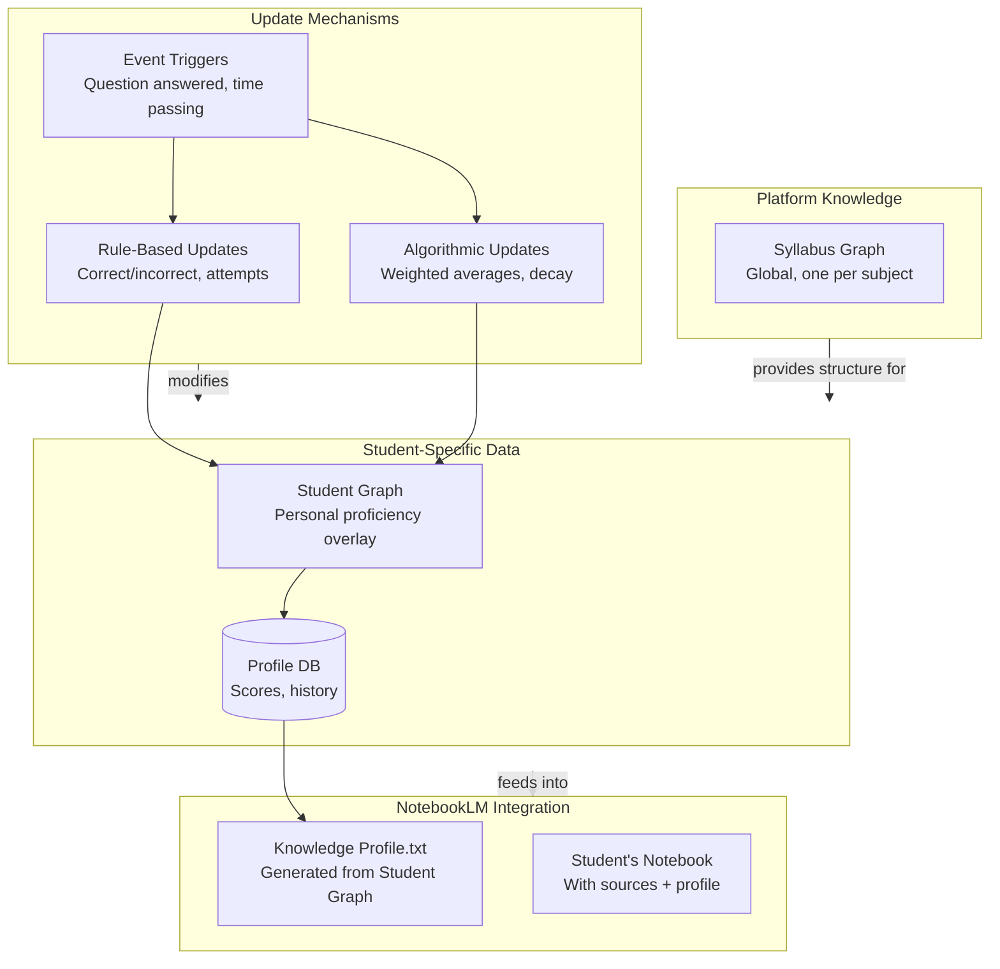

> **ARCHIVED 2026-09-15.** Founding product brainstorm (an "Edexcel and Cambridge AI LMS" feature manifesto written before the Master Spec existed), recovered from the repository root under the junk filename "document (2) (1).md" and moved here by the documentation audit reconciliation. Content is superseded by `MASTER_SPEC.md` and still describes the pre-ADR-019 IAL scope; retained for historical value.

## 1. Project Overview: "Edexcel & Cambridge AI LMS"

**Vision:** To create the single smartest revision ecosystem for IGCSE and International A-Level (IAL/GCE) students, moving beyond static content libraries to an interactive, AI-driven learning experience.


**Target Audience:**
- **Primary:** IGCSE and IAL students (Years 10-13) following Edexcel or Cambridge syllabi.
- **Secondary:** Private Tutors and International Schools (as a platform license).
- **Tertiary:** Homeschooling parents.

**Unique Selling Proposition (USP):** Not just a repository of past papers, but a system that *understands* the papers, the syllabi, and the student's own knowledge gaps.

---

## 2. Core Feature List (The "One-Stop Shop")

Here is a breakdown of features categorized by functionality.

### Phase 1: Foundational Features (The MVP)

1.  **Syllabus Breakdown Engine:**
    - For each subject (e.g., Edexcel IAL Chemistry), parse the official syllabus PDF.
    - Create a hierarchical structure: **Subject > Unit (e.g., Unit 4) > Topic (e.g., Kinetics) > Sub-topic (e.g., Order of Reaction)** .
    - Display clear learning objectives for each node.

2.  **Smart Past Paper Repository:**
    - **Filtering:** Papers filterable by Exam Board (Edexcel/Cambridge), Subject, Level (IGCSE/AS/A2), Year, Season (Jan/May/Oct), and Paper Variant.
    - **Integrated Viewing:** In-app PDF viewer for question papers.
    - **Dual-Mode Mark Schemes:**
        - *Standard Mode:* Display the official examiner's mark scheme PDF.
        - *Highlight Mode:* A parsed, clean text version of the mark scheme for easy reading.

3.  **Progress Tracking:**
    - Users can mark papers as "Completed," "Needs Review," or "Not Started."
    - Timer functionality to simulate exam conditions.

### Phase 2: Advanced AI Features (The Differentiator)

4.  **AI Chatbot - "The Past Paper Tutor" (RAG Architecture):**
    - **Input:** User asks a question (e.g., "Explain how to get the answer for question 3b on the June 2022 Edexcel Physics Unit 4 paper.").
    - **Process:** The chatbot performs a semantic search across a vector database containing all past papers and mark schemes.
    - **Output:** It retrieves the relevant text chunk and provides a step-by-step explanation, citing the source (e.g., "...according to the mark scheme, you get one mark for stating X...").
    - **Functionality:** It must be able to solve problems, explain mark scheme nuances, and point out common mistakes.

5.  **The Knowledge Graph:**
    - **Structure:** A dynamic map where each node is a sub-topic from the syllabus (e.g., "Electrolysis," "The Krebs Cycle," "Differentiation").
    - **Connections:** Prerequisite edges (e.g., "Algebraic Manipulation" is a prerequisite for "Calculus") and cross-curricular links.
    - **User Overlay:**
        - Nodes are color-coded based on the student's proficiency (e.g., Red = Weak, Amber = Revising, Green = Confident). Proficiency is gauged by the student's performance on past paper questions related to that node.
        - Clicking a node shows all relevant past paper questions related to that sub-topic.

6.  **Personalized Paper Generator:**
    - User selects a topic (e.g., "Redox Reactions").
    - AI scans the database, finds ALL questions ever asked on that specific sub-topic across all years, and compiles them into a custom practice paper.

### Phase 3: Community & Utility Features

7.  **Doubt-Sharing Forum:** Students can post tricky questions. Other students or tutors can answer. The best answers are upvoted.
8.  **Study Planner:** An integrated calendar that suggests a revision schedule based on the user's weak nodes identified by the Knowledge Graph.
9.  **Resource Library:** Uploads of approved textbooks, revision guides, and notes (ensuring copyright compliance).

---

## 3. Feasibility Analysis (Technical & Operational)

### Technical Feasibility

| Feature | Feasibility | Complexity | Key Technology Stack |
| :--- | :--- | :--- | :--- |
| **Syllabus Parsing** | **High.** Text extraction is standard. | Low | Python (BeautifulSoup, PyPDF2), Regex |
| **Paper Repository** | **High.** Standard file storage. | Low | Cloud Storage (AWS S3), Database (PostgreSQL) |
| **AI Chatbot (RAG)** | **High.** This is a solved problem with modern LLMs. | Medium | **LLM:** GPT-4 / Claude / Gemini<br>**Vector DB:** Pinecone / Weaviate<br>**Framework:** LangChain / LlamaIndex |
| **Knowledge Graph** | **High for Static, Medium for Dynamic.** | High | **Graph DB:** Neo4j<br>**Backend:** Node.js / Python (FastAPI)<br>**Frontend:** D3.js / Three.js for visualization |
| **Personalized Papers** | **High.** This is just a smart database query. | Medium | SQL/NoSQL queries combined with LLM for question grouping. |

**Key Challenges:**
- **Data Parsing:** Past papers are PDFs. Converting them to clean text while preserving tables, diagrams, and mathematical notation for the AI is difficult. You may need to use OCR and complex parsing logic.
- **Knowledge Graph Construction:** Manually mapping all prerequisites for every sub-topic is massive. You can use an LLM to suggest connections ("LLM-as-a-Judge" technique) and then have them verified by an admin/tutor.
- **Cost:** API calls to powerful LLMs (GPT-4) are expensive. You need to implement caching and consider fine-tuning a smaller, cheaper model (like Llama 3) for specific tasks.

### Operational Feasibility

- **Content Acquisition:** Past papers are freely available from the exam boards' websites. However, you cannot simply republish them behind a paywall without a license. You are likely safe if you are providing *links* to the papers on the official site, or if you are parsing them for educational transformation (fair use is grey area). **Consult a lawyer for this.**
- **Maintenance:** The syllabus changes every few years. You will need a system to update your database and knowledge graph when a new syllabus is released.
- **Accuracy:** AI can hallucinate. You need a feedback loop where users can report incorrect answers.

```meramid
gitGraph
    commit id: "Initial 2024 syllabus"
    branch 2026-update
    checkout 2026-update
    commit id: "Add new topics (e.g., NMR)"
    commit id: "Remove deprecated units"
    checkout main
    commit id: "Bug fixes on 2024 content"
    merge 2026-update tag: "v2.0 - 2026 spec"
    branch hotfix-errata
    commit id: "Fix mark scheme error"
    checkout main
    merge hotfix-errata
```

---

## 4. Comparison with Existing Products

| Product | Strengths | Weaknesses | Opportunity for Your LMS |
| :--- | :--- | :--- | :--- |
| **Physics & Maths Tutor (PMT)** | Massive, free repository. High traffic. | UI is dated (list-based). No personalization. Static. | **AI Integration.** PMT has the data but no AI layer. You have the AI layer. |
| **Save My Exams** | High-quality, exam-board-specific notes. Professional. | Subscription heavy. Focuses on their own notes, less on AI-driven past paper interaction. | **Knowledge Graph.** They have linear notes; you have a dynamic, interconnected map of knowledge. |
| **ZNotes** | Community-driven, free, popular with students. | Summaries are crowd-sourced (inconsistent). Lacks deep question-level analytics. | **Personalization.** ZNotes is one-size-fits-all; your system adapts to the student's weak areas. |
| **Kognity** | Interactive, digital textbooks. Very high quality content. | Expensive (sold to schools). Less focused on past paper drilling. | **Past Paper Focus.** Kognity is about learning the content; you are about applying it to pass the exam. |

## 5. Strategic Recommendations

1.  **Start with One Niche:** Do not try to build for all subjects at once. Start with a high-demand subject like **Edexcel IAL Mathematics** or **Cambridge IGCSE Biology**. Prove the concept works, then expand.
2.  **Focus on "Query-ability":** The biggest pain point for students is not finding the paper, but understanding *why* the mark scheme gives a specific answer. Your AI Chatbot must excel at this specific task.
3.  **Monetization Model:**
    - **Freemium:** Past paper access is free. AI Chatbot has a limited number of daily queries. Knowledge Graph is view-only.
    - **Premium:** Unlimited AI queries. Personalized paper generation. Full interactive Knowledge Graph with proficiency tracking.
4.  **Don't Build From Scratch:** Use low-code tools for the initial database UI (like Airtable or Baserow) while you focus engineering effort on the complex AI and Graph backend.
---


This comprehensive feature list is designed specifically for a **Edexcel & Cambridge IGCSE/IAL Learning Management System**. It goes beyond generic LMS capabilities to include the specialized tools needed to dominate the UK international curriculum market.

The features are organized into categories, distinguishing between standard LMS functionality and the exam-specific innovations that will make your platform a market leader.

---

## 1. Core LMS Foundations (The "One-Stop Shop" Basics)
*Every LMS needs these, but they must be optimized for the high-pressure, exam-focused IGCSE/IAL audience.*

**A. User & Access Management**
- **Multi-Profile Roles:** Granular permissions for **Students**, **Parents** (view-only progress), **Private Tutors**, and **Schools/Institutions** (admin, teacher, class manager) .
- **Bulk User Management:** Ability to upload entire school classes or tutoring center cohorts via CSV/Excel.
- **Single Sign-On (SSO):** Integration with Google Classroom, Microsoft Office 365, or school portals for frictionless access .

**B. Course & Content Architecture**

- **Syllabus-Aligned Structure:** A hierarchical course builder that mirrors the official exam board breakdowns (e.g., **Subject > Unit (e.g., IAL Chemistry Unit 4) > Topic (Kinetics) > Sub-topic (Order of Reaction)** ).
- **Centralized Resource Hub:** A repository for uploading and tagging resources (PDF notes, video lessons, flashcards) by syllabus code, topic, and difficulty.
- **Version Control:** Ability to manage syllabus updates (e.g., 2026 vs. 2028 spec) without deleting old content, allowing students to find the correct materials for their exam year .

**C. Communication & Collaboration**
- **Announcements & Messaging:** In-app system for tutors/schools to send reminders about exam dates or deadlines.
- **Doubt-Solving Forums:** Subject-specific discussion boards where students can post questions and peers or tutors can answer (with upvoting for best answers) .

---

## 2. Specialized Exam Preparation Engine (The Edexcel/Cambridge Differentiator)
*This section addresses the specific pain points of IGCSE/IAL students: past papers, mark schemes, and exam technique.*

**A. The Smart Past Paper Repository**
- **Multi-Dimensional Filtering:** Papers filterable by **Board (Edexcel/Cambridge)** , **Subject**, **Level (IGCSE/AS/A2)** , **Year**, **Season (Jan/May/Oct)** , and **Paper Variant (1F/2H, etc.)** .
- **Dual-Mode Mark Schemes:**
    - *PDF Mode:* Official examiner mark scheme for authenticity.
    - *Highlight Mode:* A parsed, clean-text version highlighting key terms and marking points.
- **Integrated PDF Viewer:** A high-performance viewer that allows students to read questions, attempt answers, and view mark schemes without leaving the platform.
- **"Timed Mode" Simulator:** A feature that replicates real exam conditions with on-screen timers and alarms.

**B. Examiner-Insight Tools**
- **Command Word Bank:** A database explaining exactly what examiners mean by "Analyze," "Evaluate," "Describe," or "State," specific to Cambridge vs. Edexcel (as they differ) .
- **Examiner Report Integration:** For each past paper, display the official "Examiner Report" highlighting where most students lost marks last year.
- **Topic-to-Question Mapping:** Every past paper question tagged with its specific syllabus sub-topic (e.g., "Question 3b → IGCSE Biology: 2.23B - Protein Synthesis"). This is the foundation of the Knowledge Graph .

---

## 3. Advanced AI & Personalization Layer (The "Smart" Ecosystem)
*Features that move beyond static content to dynamic, personalized learning.*

**A. AI Chatbot - "The Past Paper Tutor" (RAG Architecture)**
- **Mark Scheme Alignment:** AI trained specifically on Cambridge and Edexcel mark schemes to explain *why* an answer is worth marks, not just if it's right .
- **Contextual Querying:** Students can ask, "Explain question 4c on the June 2022 Physics paper," and the AI retrieves the specific question, mark scheme, and relevant syllabus point .
- **Step-by-Step Reasoning:** The AI should act as a tutor, walking through the working-out process (especially for Math and Science calculations).
- **Source Citation:** Every AI response should cite the source (e.g., "According to the 2022 mark scheme...").

**B. The Knowledge Graph & Skills Dashboard**
- **Visual Topic Map:** An interactive node graph where each sub-topic (e.g., "Electrolysis") is a node. Nodes are color-coded based on the student's proficiency (Red = Weak, Green = Confident) .
- **Prerequisite Mapping:** The graph shows connections (e.g., "Algebraic Manipulation" is a prerequisite for "Differentiation"). If a student is weak in Calculus, the system highlights they need to review Algebra first.
- **Granular Analytics:** Reports showing performance down to the specific syllabus point (e.g., "You have scored 65% on 'Mole Calculations' questions across 5 papers") .

**C. AI-Powered Personalization**
- **Personalized Paper Generator:** Students select a weak topic, and the AI compiles a custom practice paper consisting of *every* past paper question ever asked on that specific sub-topic across all years .
- **Smart Recommendations:** Based on performance and the Knowledge Graph, the system recommends specific past papers, video lessons, or revision notes to target weak areas .
- **Predicted Grade Engine:** Using historical performance data on past paper questions, the AI provides a data-driven predicted grade (e.g., "Based on your current progress, you are on track for a B") .

---

## 4. Assessment, Feedback & Progress Tracking
*Tools for measuring and improving student outcomes.*

**A. Auto-Graded & Human-Graded Assessments**
- **Varied Question Types:** Support for multiple-choice, short answer, and essay-style questions (though essays require human or AI-assisted marking).
- **Rubric-Based Marking:** For longer answers, teachers/tutors can use custom rubrics aligned to exam board mark schemes .
- **AI-Assisted Marking (for objective questions):** Instant grading of multiple-choice and numerical answer questions.

**B. Detailed Feedback Mechanisms**
- **Gap Analysis Reports:** For every completed paper, a report shows not just a score, but a list of specific sub-topics where marks were lost .
- **Model Answer Comparison:** For subjective questions, students can compare their answers to official A* model answers (or high-quality AI-generated examples) .

**C. Progress Monitoring**
- **Individual Student Dashboard:** Tracks time spent, papers completed, and topic-level proficiency over time.
- **Parent/Teacher Reports:** Automated reports summarizing a student's "Exam Readiness" and identifying areas where they need intervention .
- **Class Analytics (for Schools):** A teacher dashboard showing aggregate class performance, common wrong answers, and topic areas where the entire cohort is struggling .

---

## 5. Community & Engagement Features
*Keeping students motivated and connected.*

- **Gamification:** Award badges for completing papers on specific topics, mastering weak areas, or achieving high scores. Leaderboards for friendly competition .
- **Study Groups:** Students can form private groups to share notes, discuss papers, and motivate each other.
- **Public Leaderboards (Opt-in):** Celebrate top-performing students (anonymized or by username) for specific subjects.

---

## 6. Administrative & Business Tools
*For managing the platform, whether for a school or a direct-to-consumer business.*

**A. School & Institution Management**
- **Teacher Dashboard:** Allows teachers to assign specific papers, monitor student progress in real-time, and set up class-specific forums .
- **Curriculum Alignment Tools:** Tools for schools to map the platform's content to their specific teaching schedule (Scheme of Work).
- **White-Labeling:** Option for schools to brand the platform with their own logo and colors .

**B. Monetization & E-commerce**
- **Flexible Pricing Models:** Support for subscriptions (monthly/yearly), one-time payments, or school licenses.
- **Content Gating:** Restrict advanced features (AI queries, personalized papers) to premium users while keeping the basic repository free (Freemium model).
- **Promo Codes & Discounts:** Tools for marketing campaigns.

---

## 7. Technical & Platform Considerations
*The non-negotiable backend requirements.*

- **Mobile Responsiveness:** The platform must work flawlessly on phones and tablets, as students often study on the go .
- **Offline Access:** Ability to download past papers and notes for offline study (crucial for students with unreliable internet) .
- **SCORM/xAPI Compliance:** If you plan to sell interactive content from third-party publishers, you must support these standards .
- **Data Security & Privacy:** Full compliance with **GDPR** (essential for UK/European students) and data encryption .
- **API-First Architecture:** Allows for future integrations with other tools (CRMs, HR systems, advanced analytics platforms) .


---

## 🎯 True Differentiators for Edexcel & Cambridge Students

The most impactful features are those that directly tackle the high-stakes nature of these exams. They focus on the "how" and "why" of mark schemes, not just the "what."

### 1. Examiner-Emulated Feedback & Marking

Generic feedback like "incorrect" or "partially correct" is of little use to a student trying to secure an A*. Your platform's AI should be trained to think like an examiner.

- **Marking Scheme-Integrated AI Feedback:** The AI must be trained specifically on official Cambridge and Edexcel mark schemes and examiner reports . When a student answers a question, the feedback should not just state if they were right, but allocate marks based on the official scheme, explaining *why* specific keywords or steps are required to earn each point .
- **Command Word Decoder:** Examiners use specific command words like "Analyze," "Evaluate," or "Describe." Create a built-in glossary and AI tool that explains exactly what these words mean in the context of each specific exam board, as their interpretations can differ .
- **Model Answer Comparison:** After a student completes an essay-based question (e.g., for History or English Literature), the AI should provide a high-quality, annotated model answer (e.g., an A* response) and facilitate a side-by-side comparison. This allows the student to self-identify gaps in their structure, argumentation, or use of evidence .

### 2. Predictive & Prescriptive Analytics

Data should be used proactively to guide the student's next steps and provide confidence (or a wake-up call) about their exam readiness.

- **Predicted Grade Engine:** Leverage the student's performance data on past paper questions to generate a data-driven predicted grade (e.g., "Based on your current performance, you are on track for a B"). This is a powerful motivational tool and a key differentiator found in specialized platforms .
- **Exam Readiness Indicator:** A clear, at-a-glance metric or dashboard that synthesizes a student's progress, topic mastery, and time spent revising to show their overall "readiness" for a specific exam paper .
- **Early Intervention Alerts:** Use predictive analytics to identify students who are "at risk" of falling behind or underperforming based on their engagement and quiz scores. The system can then trigger automatic recommendations for specific resources or notify a tutor/parent .

### 3. Hyper-Personalized Learning Pathways

This moves beyond simple recommendations to dynamically adapting the curriculum to the student's needs.

- **AI-Generated Personalized Practice Papers:** This goes a step further than just filtering questions. A student struggling with "Redox Reactions" should be able to click a button and have the AI instantly compile a custom practice paper consisting of *every* past paper question ever asked on that specific sub-topic, from both exam boards, across all years.
- **Adaptive Prerequisite Learning Paths:** Integrated with your knowledge graph, the system should dynamically reorder a student's learning plan. If a student is failing "Differentiation" questions, the AI detects this and automatically inserts a "prerequisite refresher module" on "Algebraic Manipulation" into their dashboard before letting them continue with Calculus.

## ✨ Enhanced Engagement & Accessibility Features

Beyond core academics, features that reduce friction and support diverse learner needs can significantly boost a platform's appeal and effectiveness.

### 4. Seamless Multi-Modal & Accessibility Support

- **Real-Time Multilingual Support:** With a large international student base, integrate an AI-powered, real-time translation system. This could translate question prompts, AI feedback, or even lecture subtitles, making the platform more accessible for non-native English speakers .
- **Accessibility-First Design:** Go beyond standard compliance. Integrate tools like an automated accessibility checker for all uploaded content and a high-quality text-to-speech reader for past paper questions and model answers. This supports students with visual impairments or learning differences like dyslexia .
- **True Offline Mobile Access:** Many students revise on the go (commutes, study spaces with poor WiFi). The mobile app should allow users to download specific past papers, notes, and even AI tutoring sessions for full offline access, syncing progress once they are back online .

### 5. Fostering Collaboration and Community

Learning is often social. Features that connect students can increase engagement and provide peer support.

- **Structured Doubt-Sharing Forums with AI Summaries:** Create subject-specific forums. Crucially, add an AI layer that can summarize long discussion threads into a clear "best answer," or flag unanswered questions to tutors. This prevents students from feeling ignored and provides a searchable knowledge base .
- **Gamified Study Groups:** Allow students to form private study groups. Within the group, they can share notes, challenge each other with topic-based quizzes, and have a shared leaderboard to track progress and foster friendly competition.
- **Public Leaderboards (Opt-in):** For highly motivated students, create optional, anonymized public leaderboards for specific subjects or papers, celebrating top performance and encouraging a sense of community achievement.

## 💡 Next-Generation AI & Content Features

These features represent the cutting edge of what's possible, turning your platform from a tool into a creative and strategic partner in the student's learning journey.

### 6. Intelligent Content Creation & Discovery

- **AI Course Creator for Educators:** For schools and tutors using your platform, provide an AI-powered authoring tool. They could input a topic like "The Cold War" or a simple document, and the AI would help generate a structured mini-course with learning objectives, summaries, and interactive quiz questions .
- **Conversational AI Course Discovery:** Instead of using complex filters, students should be able to find resources through natural conversation. For example, a student could ask the chatbot, "Find me Edexcel IAL Chemistry papers on Kinetics that I haven't done yet," and the AI would understand the intent and serve the results .
- **AI-Powered Content Summarization & Translation:** For long textbook chapters or complex examiner reports, offer an AI tool that can generate concise summaries or translate the text into multiple languages to aid comprehension .

### 7. Specialized Tools for Academic Integrity & Efficiency

- **AI-Powered Plagiarism Detection:** For longer-form answers and coursework components, integrate a tool like Turnitin directly into the assignment workflow. This educates students on proper citation and helps maintain academic integrity .
- **Automated Grading with AI Grouping:** For school accounts, use an AI-assisted grading tool. For subjective questions, the AI can attempt to group similar student answers together, allowing a teacher to grade all similar responses in one go, dramatically speeding up the marking process .
- **Digital Badges & Certificates:** Allow students to earn verified digital badges or certificates for mastering a topic or completing a course. These could be shared on platforms like LinkedIn to bolster university or job applications .


---

## The Architecture: One Engine, Two Interfaces

Think of your core LMS as a powerful engine. It contains the content (notes, videos), the AI (RAG Chatbot), and the data (Knowledge Graph).

- **Mode A (Student App):** A simplified, gamified, "self-serve" interface.

- **Mode B (School/Teacher Hub):** A management, oversight, and assignment interface.

---

## Mode A: The Student App (B2C - Direct to Consumer)
**Goal:** Replace tutors, PMT, and Save My Exams. Focus on *automation* and *self-study*.

| Feature Category | Specific Features in Student Mode | Why it works for Students |
| :--- | :--- | :--- |
| **Learning Content** | Access to all Edexcel & Cambridge notes, video lessons, and topical questions (as you mentioned). | One-stop shop. No need to google for resources. |
| **AI Tutor (RAG)** | Unlimited (or tiered) access to the "Past Paper Tutor" chatbot. Can ask "Explain this question." | 24/7 homework help. Replaces the need for an expensive private tutor for simple doubts. |
| **Knowledge Graph** | The visual, color-coded node map. Students click a weak node (Red) and are shown resources to fix it. | Gamifies learning. Makes progress visual and addictive. |
| **Quiz Creator** | Student generates a quiz on "Rates of Reaction" for themselves. | Personalized practice. They control their own revision. |
| **Past Paper Repository** | Filter, download, and take past papers with timers. | Exam practice. The core of revision. |
| **Progress Dashboard** | "You have mastered 45% of IGCSE Bio. Predicted Grade: A." | Motivational. Provides a sense of direction. |

**Student Mode Vibe:** "Netflix for Revision." It’s sleek, personal, and the AI works *for* the student.

---

## Mode B: The School/Teacher Hub (B2B - Business to Business)
**Goal:** Replace Google Classroom and Microsoft Teams for *specific* exam preparation. Focus on *orchestration* and *oversight*.

**Important Distinction:** Teachers don't just need access to your content. They need to **assign** your content to students and **see** the results.

| Feature Category | Specific Features in Teacher Mode | Why it works for Schools |
| :--- | :--- | :--- |
| **Classroom Management** | **Roster Creation:** Upload CSV of students. Create classes (e.g., "11A IAL Chemistry"). | Replaces the administrative headache of Google Classroom. |
| **Assignment Engine** | Teacher browses your library and clicks "Assign as Homework." They can assign a specific past paper, a topical worksheet, or a video lesson. | Saves teachers hours of photocopying and searching for resources. |
| **Announcements** | Teacher sends a message: "Reminder: Test on Organic Chem next week. Complete the assigned quiz." | Keeps the class on track within the ecosystem. |
| **Marking & Feedback Tools** | Teacher views student submissions. For auto-graded questions, results are automatic. For long answers, teacher can leave comments/feedback. | Streamlines the marking workflow. |
| **The "Oversight" Feature** | **The Teacher Knowledge Graph:** The teacher sees a graph of the *entire class*. They can see that 80% of the class is "Red" (weak) on "Differentiation." | **This is the USP for schools.** Teachers can instantly identify what they need to re-teach in tomorrow's lesson. Data-driven teaching. |
| **School Analytics** | Reports on student engagement, time spent, predicted grades across the year group. | Heads of Department can track progress without asking teachers for manual spreadsheets. |

**Teacher Mode Vibe:** "Command Center for Exams." It’s functional, data-rich, and gives teachers back their time.

---

## The Critical Differences & How to Handle Them

While the *content* (notes, videos) is shared, the *user experience* and *logic* must differ significantly.

### 1. The Knowledge Graph: Private vs. Shared
- **Student App:** The graph is private. It shows "My Progress."
- **Teacher Hub:** The graph is shared. It shows "My Class's Progress." The teacher needs to see an aggregated view (e.g., a heatmap of the class).

### 2. The AI Chatbot: Personal vs. Auditable
- **Student App:** The chatbot is a private tutor. Students can ask anything without judgment.
- **Teacher Hub:** Teachers might need a different version. Perhaps a "Teaching Assistant Bot" that helps them generate lesson plans or find resources. They likely won't use the student chatbot.

### 3. The Quiz Creator: Self-Study vs. Assessment
- **Student App:** Student generates a quiz for themselves. The results are private.
- **Teacher Hub:** Teacher generates a quiz to assign as a formal assessment. The results go into the teacher's gradebook.

### 4. Data Privacy
- **Student App:** Simple privacy policy (GDPR for the individual).
- **Teacher Hub:** **Strict data protection.** You are now handling student data on behalf of the school. You need compliance with UK GDPR for education, potentially DfE (Department for Education) standards. You need robust admin controls to add/remove students.

---

## Why This Model is a Market Winner

1.  **The "Trojan Horse" Strategy:** Students discover and love your app (Mode A). They tell their teachers. The teacher investigates, realizes they can manage the whole class (Mode B), and convinces the school to buy a license. **Your users (students) become your salespeople.**
2.  **Higher Revenue (B2B):** While you charge students $10/mo, you can charge schools thousands of dollars per year for a site license covering all students and teachers. It's a more stable revenue model.
3.  **Sticky Ecosystem:** If a school adopts Mode B, all the students in that school *must* use the platform. You instantly acquire hundreds of users at once.

---

Based on the project blueprint we've developed, here is a comprehensive, detailed breakdown of how the **RAG AI Chatbot** and the **Knowledge Graph** will function, their architectures, and the full scope of what students and teachers can accomplish with them. This information synthesizes current research and best practices in educational technology .

---

## Part 1: The RAG AI Chatbot - "The Past Paper Tutor"

This is not a generic chatbot like ChatGPT. It is a **Retrieval-Augmented Generation (RAG)** system, meaning it does not rely on its internal memory to answer questions. Instead, it first *retrieves* relevant, verified information from your database of past papers and mark schemes, and then it *generates* a precise answer based *only* on that retrieved context . This grounds the AI in fact, virtually eliminating hallucinations and ensuring every answer is traceable to an official source.

### 1.1. How It Works: The Technical Architecture

The process can be broken down into three core phases: **Ingestion, Retrieval, and Generation.**

**Phase A: Ingestion (Building the Brain)**
Before the chatbot can answer anything, it needs a structured memory. This involves processing thousands of PDFs.

1.  **Data Extraction:** For every past paper and mark scheme (Edexcel & Cambridge, IGCSE & IAL), the system extracts text. This is complex due to mathematical notation (`LaTeX`), tables, and diagrams. Tools like `PyPDF2`, `pdfplumber`, and `Unstructured.io` are used, with OCR (Optical Character Recognition) like `PaddleOCR` for scanned diagrams .
2.  **Chunking:** The extracted text is broken into small, semantically meaningful chunks (e.g., "Question 3b and its corresponding mark scheme"). Overlap is added between chunks to preserve context .
3.  **Embedding & Vector Storage:** Each chunk is converted into a mathematical vector (a list of numbers) using an "embedding model." This vector represents the *meaning* of the text. These vectors are then stored in a **Vector Database** (like Pinecone, Weaviate, or FAISS) . This database is optimized for finding "similar meanings" at lightning speed.

**Phase B: Retrieval (Finding the Evidence)**
When a student asks a question, the retrieval process begins.

1.  **Query Embedding:** The student's question (e.g., "Explain Q3b on the June 2022 Physics paper") is instantly converted into a vector using the *same* embedding model.
2.  **Semantic Search:** The system performs a similarity search in the vector database, finding the text chunks whose vectors are most "similar" (closest in distance) to the query's vector .
3.  **Context Assembly:** The top 3-5 most relevant chunks (e.g., the exact text of Q3b, the relevant part of the mark scheme, and maybe a section from the syllabus on that topic) are retrieved and assembled into a prompt for the LLM .

**Phase C: Generation (Crafting the Answer)**
This is where the magic happens.

1.  **The Prompt:** The system constructs a detailed prompt for the Large Language Model (LLM) like GPT-4, Claude, or a fine-tuned Llama model . The prompt contains strict instructions:
    > "You are an expert Edexcel/Cambridge tutor. Answer the student's question using **only** the context provided below. If the context does not contain the answer, say you don't know. Cite the source document (e.g., 'Mark Scheme June 2022') at the end of your explanation. Be step-by-step and encouraging."
2.  **LLM Generation:** The LLM processes the query *and* the provided context to generate a natural, conversational, and accurate answer .
3.  **Response & Citation:** The answer is returned to the student, complete with citations. This process typically takes **2-3 seconds** .

### 1.2. The Main Uses & Scope of the RAG Chatbot

Here is a categorized list of everything the chatbot can do for Edexcel/Cambridge IGCSE/IAL students.

### For Students (The "24/7 Personal Tutor")

**A. Question-Specific Explanation**
- **Scope:** Student asks, "I don't understand question 4c on the 2023 Edexcel IAL Chemistry Unit 4 paper."
- **Action:** The bot retrieves the question, the mark scheme, and the relevant syllabus point. It provides a step-by-step breakdown of *how* to arrive at the answer and *why* each step earns marks.
- **Value:** Replaces the need to find a human tutor for every single doubt .

**B. Step-by-Step Problem Solving (Maths & Sciences)**
- **Scope:** Student asks, "Walk me through solving this differential equation: `dy/dx = 2x/y`."
- **Action:** The bot retrieves relevant worked examples from past papers or the syllabus guide and provides a line-by-line solution, explaining each algebraic manipulation.
- **Value:** Acts as a virtual "worked solutions" guide for every type of problem .

**C. Exam Technique & Command Word Training**
- **Scope:** Student asks, "What does 'Evaluate' mean in a Cambridge IGCSE Business Studies essay?"
- **Action:** The bot retrieves the official glossary or examiner reports and explains the specific expectations for that command word, perhaps giving an example of an 'Evaluate' vs. a 'Describe' answer.
- **Value:** Teaches students the subtle art of answering the question exactly as the examiner intends.

**D. Mark Scheme Comparison**
- **Scope:** Student asks, "Compare the mark schemes for 'Rates of Reaction' between Edexcel IGCSE and Cambridge IGCSE."
- **Action:** The bot retrieves both relevant sections and creates a comparison table highlighting differences in key terminology or required depth.
- **Value:** Invaluable for students or tutors working across both boards.

**E. Weak Topic Identification**
- **Scope:** Student asks, "Based on the last 5 Biology papers I've done, what topics am I weakest in?"
- **Action:** (This requires integration with the student's progress data). The bot can query the user's performance database, identify low-scoring topics, and explain, "You've consistently lost marks on 'Protein Synthesis' questions. Would you like me to explain that topic or find you practice questions?"
- **Value:** Proactive, data-driven tutoring .

### For Teachers (The "Teaching Assistant")

**F. Resource Discovery**
- **Scope:** Teacher asks, "Find me all Cambridge IAL Physics questions on 'Magnetic Fields' from the last 5 years."
- **Action:** The bot retrieves and lists links to every relevant question, saving hours of manual searching through PDFs.

**G. Generating Model Answers**
- **Scope:** Teacher asks, "Generate a model A* answer for this History essay question on the causes of the Cold War."
- **Action:** The bot retrieves relevant context from approved textbooks and past paper mark schemes to draft a high-quality model answer that the teacher can then review and refine .

**H. Lesson Planning Support**
- **Scope:** Teacher asks, "What are the most common student mistakes in Edexcel IAL Economics Unit 3?"
- **Action:** The bot retrieves information from multiple examiner reports across different years, summarizing the key pitfalls that students repeatedly fall into.

---

## Part 2: The Knowledge Graph - The "Smart Learning Map"

The Knowledge Graph is fundamentally different from the RAG chatbot. While the chatbot is a conversational interface for *answering questions*, the Knowledge Graph is a structured database for *mapping relationships* and *powering personalization* .

Think of it as a dynamic, interactive map of your entire syllabus. Each topic is a "node" connected by "edges" that represent relationships (e.g., "prerequisite of," "part of," "related to").

### 2.1. How It Works: The Technical Architecture

**Phase A: Ontology Definition & Knowledge Extraction**
First, you must define the structure of knowledge.

1.  **Syllabus Parsing:** You parse the official syllabus PDFs for every subject. This creates the hierarchical backbone: **Subject > Unit > Topic > Sub-topic**.
2.  **Entity & Relationship Extraction:** This is the most complex part. You need to identify the "entities" (e.g., "Photosynthesis," "Differentiation," "World War I") and the relationships between them. Modern approaches use NLP and machine learning to automate this . For example, an LLM can be prompted: "Analyze this syllabus text. List all the key concepts and identify the prerequisite relationships." The output is a list of triples:
    - (Differentiation, *requires prerequisite*, Algebraic Manipulation)
    - (Photosynthesis, *is part of*, Plant Biology)
    - (Treaty of Versailles, *is a consequence of*, World War I)

**Phase B: Storage in a Graph Database**
These triples are stored in a specialized **Graph Database** like Neo4j. This database is optimized for storing interconnected data and traversing those connections at high speed. Unlike a SQL database (which uses tables), a graph database uses **nodes** (entities) and **edges** (relationships) .

**Phase C: User Data Overlay (The "Student Layer")**
This is what makes it a powerful learning tool. As the student interacts with the platform (answering topical questions, taking past papers), the system records their performance.
- Every question is tagged with the specific Knowledge Graph node(s) it tests.
- The system calculates a "proficiency score" for each node based on the student's performance.
- This proficiency score is then overlaid onto the graph. The student's view now shows a color-coded map: Green (Confident), Amber (Needs Review), Red (Weak) .

### 2.2. The Main Uses & Scope of the Knowledge Graph

### For Students (The "Personalized GPS for Learning")

**A. Visual Progress Tracking**
- **Scope:** The student logs in and sees a visual, interactive map of their entire syllabus. They can instantly see which areas are mastered (green) and which are weak (red).
- **Value:** Provides instant, motivating clarity on where to focus their revision efforts. It turns an abstract syllabus into a tangible, conquerable map.

**B. Prerequisite-Aware Learning Paths**
- **Scope:** A student clicks on a "red" node (e.g., "Integration"). The system doesn't just throw resources at them. It checks the graph and says, "To understand Integration, you first need to be confident in 'Algebraic Manipulation' and 'Differentiation.' You are currently 'Amber' in Differentiation. Should we review that first?"
- **Value:** Prevents students from wasting time on advanced topics when they have foundational gaps. It ensures a logical, efficient learning sequence .

**C. Smart Resource Recommendations**
- **Scope:** The system looks at the student's "red" nodes. It then queries the graph to find all resources (past paper questions, video lessons, notes) attached to those specific nodes.
- **Value:** Creates a personalized "revision playlist" for every student, targeting their exact weaknesses.

**D. "What-If" Scenario Planning**
- **Scope:** A student selects a topic they haven't studied yet (e.g., "Organic Synthesis"). The graph can show all the prerequisite nodes they need to master first, giving them a clear roadmap of the work ahead.

### For Teachers (The "Classroom Diagnostic Tool")

**E. Class Heatmap**
- **Scope:** A teacher logs into their dashboard and sees a Knowledge Graph for their entire class. Each node is color-coded based on the *aggregate performance of all students* (e.g., a node turns red if 70% of the class is weak on it).
- **Value:** This is the ultimate tool for data-driven teaching. The teacher can instantly see that the whole class is struggling with "Mole Calculations" and decide to re-teach that topic in the next lesson. It identifies systemic problems, not just individual ones .

**F. Identifying At-Risk Students**
- **Scope:** The teacher can click on a student and see their individual graph. If a student has many "red" nodes in foundational topics, the system can flag them as "at-risk" and prompt the teacher to intervene early.
- **Value:** Enables proactive, personalized support at scale.

**G. Curriculum Gap Analysis**
- **Scope:** A Head of Department reviews the Knowledge Graph for the entire two-year A-Level course. They might notice that the resources for a particular topic are sparse or that there's a logical jump in the prerequisites.
- **Value:** Helps improve the curriculum design and resource allocation.

---

## Part 3: The Ultimate Synergy - How They Work Together

The RAG Chatbot and the Knowledge Graph are not separate; they are two sides of the same intelligent coin. The **Knowledge Graph provides the structure**, and the **RAG Chatbot provides the conversation**.

Here is how they interact to create a seamless, intelligent learning experience:

| Scenario | The Knowledge Graph's Role (Structure) | The RAG Chatbot's Role (Interaction) |
| :--- | :--- | :--- |
| **Student identifies a weakness.** | The graph highlights that the student is "Red" (weak) on the node **"Electrolysis."** | The student clicks the node and asks the chatbot, "Explain electrolysis for my Edexcel IGCSE." The bot retrieves the syllabus definition, key concepts, and relevant past paper questions. |
| **Teacher plans a lesson.** | The teacher views the Class Heatmap and sees the node **"Differentiation"** is red for 80% of the class. | The teacher asks the chatbot, "Generate 5 differentiation questions of varying difficulty for a starter activity." The bot retrieves questions tagged with the "Differentiation" node. |
| **Student does a practice paper.** | The student's performance on questions updates their proficiency scores for multiple nodes in the graph. | Afterwards, the student asks the chatbot, "Based on my last paper, where should I focus?" The bot queries the updated graph data and responds, "Focus on 'Redox Reactions' and 'Organic Nomenclature'." |
| **Advanced Search & Discovery.** | The graph understands that "Photosynthesis" is related to "Plant Biology" and "Calvin Cycle."  | A student asks, "Find resources related to photosynthesis." The system uses the graph to also recommend resources on the Calvin Cycle, even if the query didn't explicitly ask for it. |

This integration of a structured Knowledge Graph for reasoning and a RAG system for flexible, generative responses represents the cutting edge of educational technology, often referred to as **KA-RAG (Knowledge Augmented RAG)** . It provides the accuracy and interpretability needed for high-stakes exam preparation, positioning your platform as a true market leader.

This is an excellent strategic question. Based on your project specifications and the current market research, I've prepared a comprehensive analysis covering feasibility, competitive benchmarking, and SWOT to guide your decision-making.

---

## 1. Comprehensive Feasibility Analysis

### 1.1 Technical Feasibility

**Architecture Requirements**
Your platform requires a **cloud-native, API-first architecture** to handle the complexity of AI features and scale effectively . The system must support:

| Component | Technology Options | Feasibility Assessment |
|:---|:---|:---|
| **Core LMS Backend** | Node.js/Python (FastAPI), PostgreSQL, MongoDB | **High** - Mature ecosystem |
| **Vector Database** | Pinecone, Weaviate, FAISS | **High** - Production-ready solutions exist |
| **Graph Database** | Neo4j, Amazon Neptune | **High** - Well-documented for knowledge graphs |
| **LLM Integration** | GPT-4, Claude, fine-tuned Llama | **Medium** - Cost management required |
| **PDF Parsing** | PyPDF2, pdfplumber, Unstructured.io, OCR tools | **Medium** - Math notation extraction is complex |
| **Mobile Development** | React Native, Flutter, or PWA | **High** - Cross-platform tools mature  |

**AI Feature Implementation**
- **RAG Chatbot**: Highly feasible with modern frameworks (LangChain, LlamaIndex). The key challenge is optimizing for cost—GPT-4 API calls can become expensive. Consider caching responses and using smaller models for routine queries .
- **Knowledge Graph**: Static syllabus mapping is highly feasible. Dynamic proficiency tracking requires careful database design but is achievable with Neo4j .
- **Personalized Paper Generator**: Essentially a smart database query combined with LLM for question grouping—medium complexity.

**Development Timeline Estimate**
- **MVP (Phase 1 - Foundational)**: 4-6 months
- **AI Features (Phase 2)**: 3-4 months additional
- **Teacher Hub (Phase 3)**: 2-3 months additional

### 1.2 Operational Feasibility

**Content Acquisition & Legal Considerations**

This is your most significant operational risk. Past papers are freely available from exam board websites, but republishing them behind a paywall requires careful legal consideration .

| Approach | Risk Level | Considerations |
|:---|:---|:---|
| **Direct hosting of PDFs** | **High** | May require licensing agreements with Cambridge/Edexcel |
| **Links to official sites** | **Low** | Poor user experience, loss of engagement |
| **Parsed text with attribution** | **Medium** | "Educational transformation" argument, but legal grey area |
| **Partnership/licensing** | **Low (if approved)** | Ideal but requires negotiation with exam boards |

**Recommendation**: Consult an education law specialist early. Consider approaching Cambridge and Edexcel for partnership discussions—they may be interested in official digital distribution channels.

**Content Maintenance**
- Syllabus updates occur every 2-3 years. You need a system to archive old nodes and add new ones without breaking student progress history .
- Requires a content management workflow with version control.

**Teacher Training & Adoption**
For the B2B model, schools need support. Successful LMS implementations include teacher training and change management . Plan for onboarding resources and customer success staff.

### 1.3 Financial Feasibility

**Cost Components**

| Cost Category | Estimated Range (Initial) | Notes |
|:---|:---|:---|
| **Development (MVP)** | $80,000 - $150,000 | Depends on team location and complexity |
| **Cloud Infrastructure** | $2,000 - $5,000/month | Scales with users; AI API costs variable |
| **Content Acquisition/Legal** | $5,000 - $20,000 | Legal consultation, potential licensing |
| **Marketing & Sales** | $10,000 - $30,000/month | Digital marketing, content creation |
| **Ongoing Maintenance** | 15-20% of dev cost annually | Updates, security, support |

**AI-Specific Cost Considerations**
- LLM API costs: Estimate $0.01-0.03 per chat query with optimization
- For 10,000 active users with 20 queries/month: $2,000-6,000/month in AI costs
- Mitigation: Implement query limits in freemium tier, cache common questions, fine-tune smaller models for specific tasks

**Revenue Potential**
- **B2C Freemium**: Free basic access, $10-15/month premium (unlimited AI, knowledge graph)
- **B2B School Licenses**: $1,000-5,000 per school annually (depending on size)
- **Profit margins**: E-learning ventures can achieve 30-55% margins after reaching scale 
- **Break-even**: Typically 1-3 years with effective marketing 

**Investment Requirements**
A mid-scale e-learning platform in India requires approximately ₹15-50 lakhs ($18,000-60,000) . For a UK-focused platform with advanced AI, plan for £100,000-250,000 initial investment.

### 1.4 Market Feasibility

**Market Size & Growth**
- Global EdTech sector projected to grow at **14.7% CAGR** through 2031 
- India's LMS market alone expected to reach **$3.02 billion by 2033** (16.7% CAGR) 
- Strong demand in Southeast Asia, Africa, and Middle East for Cambridge/Edexcel curricula

**Target Market Validation**
- IGCSE/IAL student population is substantial and growing internationally
- Current solutions (PMT, Save My Exams) have proven demand but lack AI personalization
- Schools increasingly adopting hybrid learning models 

---

## 2. Benchmark Analysis

### 2.1 Key Competitors Comparison

| Competitor | Strengths | Weaknesses | Your Opportunity |
|:---|:---|:---|:---|
| **Physics & Maths Tutor (PMT)** | Massive free repository, high traffic, established brand | Dated UI, no personalization, static content, relies on donations | AI layer on top of similar content model |
| **Save My Exams** | High-quality exam-specific notes, professional content, strong SEO | Subscription-heavy, focuses on their own notes, no AI-driven interaction | Knowledge Graph + AI tutor differentiation |
| **ZNotes** | Community-driven, free, popular with students | Inconsistent quality, lacks deep analytics, no personalization | Structured, AI-verified content + proficiency tracking |
| **Kognity** | Interactive digital textbooks, high-quality content, school-focused | Expensive, less focus on past paper drilling | Past paper-centric approach with AI tutoring |
| **Docebo** (Enterprise) | AI-powered, strong enterprise features  | Corporate-focused, not exam-specific | Niche focus on IGCSE/IAL curricula |
| **Extramarks** (India) | Strong in Indian market, multilingual support  | Primarily Indian curriculum focus | UK curriculum specialization |

### 2.2 Feature Benchmark Matrix

| Feature | PMT | Save My Exams | ZNotes | Kognity | Your Platform |
|:---|:---|:---|:---|:---|:---|
| Past Paper Repository | ✅ Free | ✅ Paid | ❌ | ❌ | ✅ Freemium |
| Syllabus-Aligned Notes | ✅ | ✅ | ✅ | ✅ | ✅ |
| AI Chatbot/Tutor | ❌ | ❌ | ❌ | ❌ | ✅ (USP) |
| Knowledge Graph | ❌ | ❌ | ❌ | ❌ | ✅ (USP) |
| Personalized Practice | ❌ | Limited | ❌ | Limited | ✅ |
| Progress Tracking | ❌ | Basic | ❌ | ✅ | ✅ Advanced |
| Teacher Dashboard | ❌ | ❌ | ❌ | ✅ | ✅ |
| Mobile Experience | Poor | Good | Basic | Good | ✅ Mobile-first  |
| Pricing Model | Free/Donation | Subscription | Free | School License | Freemium + School |

### 2.3 Market Positioning Opportunity

The LMS market is experiencing a confidence crisis—only **47% of learning professionals believe the LMS will remain central to learning ecosystems by 2028** . This creates opportunity for specialized, AI-integrated platforms that deliver measurable outcomes rather than just content management.

Your platform addresses the emerging demand for:
- **AI-powered personalization** (19% expect AI to live in LMS) 
- **Measurable learning outcomes** rather than just content delivery
- **Exam-specific intelligence** rather than generic course management

---

## 3. SWOT Analysis

### 3.1 Strengths (Internal)

| Strength | Description | Strategic Advantage |
|:---|:---|:---|
| **Specialized Niche Focus** | Exclusive focus on Edexcel & Cambridge IGCSE/IAL curricula | Clear positioning vs. generic LMS platforms |
| **AI-First Architecture** | RAG chatbot and Knowledge Graph built from ground up | Technical differentiation from incumbents  |
| **Dual B2C/B2B Model** | Student app + Teacher hub on same engine | Multiple revenue streams, viral adoption potential |
| **Personalization Engine** | Adaptive learning paths based on performance data | Improves outcomes, increases stickiness  |
| **Mobile-First Design** | Optimized for 70%+ learning interactions on mobile  | Catches students where they actually study |

### 3.2 Weaknesses (Internal)

| Weakness | Description | Mitigation Strategy |
|:---|:---|:---|
| **Content Legal Risk** | Past paper usage may require licensing | Consult lawyer early; consider partnership approach |
| **High Initial Development Cost** | AI features require significant investment | Start with MVP for one subject; phased rollout  |
| **AI Dependency** | Core value relies on LLM accuracy and cost | Implement caching, fine-tune smaller models, human feedback loop |
| **Brand New Entrant** | No established user base or trust | Focus on one subject/country initially; build case studies |
| **Content Maintenance** | Syllabus updates require ongoing effort | Build versioning into architecture from day one  |

### 3.3 Opportunities (External)

| Opportunity | Description | Potential Impact |
|:---|:---|:---|
| **Market Growth** | EdTech CAGR 14.7% through 2031  | Expanding addressable market |
| **Incumbent Weakness** | PMT has dated UI, Save My Exams lacks AI | Clear differentiation path |
| **School Digital Transformation** | NEP 2020 in India, global hybrid learning adoption  | B2B sales opportunities |
| **AI Integration Demand** | 53% of L&D professionals uncertain about current LMS future  | Openness to new solutions |
| **International Expansion** | Cambridge/Edexcel used in 150+ countries | Global scalability |
| **Teacher Workload Crisis** | AI can automate administrative tasks, reducing teacher burden  | Strong B2B value proposition |

### 3.4 Threats (External)

| Threat | Description | Mitigation Strategy |
|:---|:---|:---|
| **Competitor AI Integration** | PMT or Save My Exams could add AI features | First-mover advantage; build deep exam-specific training |
| **Productivity Suite Competition** | Microsoft 365 Copilot, Google Gemini embedded in tools students already use  | Focus on exam-specific intelligence they can't replicate |
| **Legal/Regulatory Changes** | Stricter copyright enforcement for educational content | Proactive licensing discussions |
| **LLM Cost Increases** | API pricing changes could impact margins | Architect for model flexibility; consider open-source fine-tuning |
| **Data Privacy Regulations** | GDPR compliance critical for UK/European users  | Build privacy-first from day one |
| **Economic Downturn** | Reduced education spending by families/schools | Freemium model maintains accessibility |

---

## 4. Strategic Recommendations

### 4.1 Immediate Next Steps (0-3 Months)

1. **Legal Consultation**: Engage an education law specialist to clarify past paper usage rights and develop compliance strategy
2. **Niche Selection**: Choose ONE high-demand subject (e.g., Edexcel IAL Mathematics) for MVP focus
3. **User Interviews**: Speak with 10-15 IGCSE/IAL students to validate pain points and willingness to pay
4. **Technical Prototype**: Build a minimal RAG chatbot with 50 papers to test accuracy and cost
5. **Partnership Exploration**: Initiate informal discussions with Cambridge/Edexcel about potential collaboration

### 4.2 Phased Development Roadmap

| Phase | Timeline | Focus | Success Metrics |
|:---|:---|:---|:---|
| **Phase 1: MVP** | Months 4-9 | One subject, past paper repository, basic RAG chatbot | 1,000 users, 70% retention |
| **Phase 2: AI Enhancement** | Months 10-15 | Full Knowledge Graph, personalized papers, 3 subjects | 5,000 users, 10% premium conversion |
| **Phase 3: Teacher Hub** | Months 16-21 | School dashboard, class analytics, assignment tools | 10 schools piloted |
| **Phase 4: Expansion** | Months 22-30 | All core subjects, international marketing | 50,000 users, 100 schools |

### 4.3 Critical Success Factors

1. **AI Accuracy**: The chatbot must be demonstrably reliable for exam answers—hallucinations will destroy trust
2. **User Experience**: Must match consumer app quality, not "educational software" feel 
3. **Teacher Buy-In**: For B2B success, teachers must see tangible workload reduction 
4. **Data Privacy**: GDPR compliance is non-negotiable for UK/European markets
5. **Content Quality**: Notes and resources must match or exceed Save My Exams quality

### 4.4 Risk Mitigation Summary

| Risk | Mitigation | Owner |
|:---|:---|:---|
| Copyright infringement | Legal counsel; pursue licensing | Founder |
| AI cost overruns | Caching; fine-tuned smaller models | CTO |
| Low adoption | Focused niche; influencer marketing | Marketing lead |
| Teacher resistance | Co-design with pilot teachers | Product manager |
| Competitor response | Speed to market; patent unique methods | Strategy lead |

---

## 5. Conclusion

Your Edexcel & Cambridge AI LMS concept is **technically feasible** and addresses a genuine market gap. The combination of RAG chatbot and Knowledge Graph creates defensible differentiation from existing players like PMT and Save My Exams.

The dual B2C/B2B model is strategically sound—students drive organic growth, while schools provide stable, high-value revenue. However, success depends critically on:

1. **Navigating content legal issues** proactively
2. **Delivering exceptional AI accuracy** for exam-specific queries
3. **Phased rollout** to manage development complexity and cost

The EdTech market in 2026 is ready for AI-native learning platforms . With careful execution, your platform can become the "smartest revision ecosystem" for IGCSE and IAL students globally.

---

## 1. Cognitive & Behavioral Analytics

### 1.1 Confusion Detection & Memory Support
Real-time AI systems can now detect when a student is confused or disengaged during learning, and provide immediate interventions.

- **How it works**: AI analyzes interaction patterns—hesitation, repeated attempts, time spent—to predict confusion states
- **Application for your platform**: When a student struggles with a past paper question, the system can automatically trigger simpler prerequisite explanations before they give up
- **Example**: The SATHEE platform includes "Confusion Detection and Memory Support tools" that help students stay on track

### 1.2 Cognitive Learning Scoring Models
This goes beyond simple right/wrong grading to assess *how* students solve problems.

- **How it works**: Machine learning models (like DistilBERT-based regression) trained on thousands of learner interactions predict engagement and effectiveness across parameters such as promptness, tool use, problem-solving approach, and AI interaction patterns
- **Application for your platform**: Instead of just "you got 70%," the system tells students: "Your problem-solving approach was inefficient—you spent too long on prerequisite steps before attempting the calculus"
- **Example**: VisionTutor's Cognitive Learning Scoring Model achieves an R² measure of 0.9856, indicating extremely high predictive reliability

### 1.3 Predictive Analytics for At-Risk Identification
AI can forecast which students are likely to fall behind or drop out, enabling early intervention.

- **Application for your platform**: Teachers receive alerts when students show declining engagement or performance patterns, with specific recommendations for intervention
- **Technical foundation**: Big data analytics platforms like Tencent Cloud EMR can process attendance, engagement, and test score data to generate these predictions

---

## 2. Advanced Tutoring Paradigms

### 2.1 Multimodal AI Tutors
Next-generation tutors don't just process text—they understand screens, speech, and visual inputs simultaneously.

- **How it works**: Systems like **UniEDU** combine language and vision understanding to process educational materials that contain both text and images—diagrams, graphs, chemical structures, mathematical notation
- **Application for your platform**: A student can share their screen showing a partially solved physics problem, speak a question, and the AI understands both the visual context and the verbal query to provide integrated help
- **Example**: VisionTutor enables "live screen viewing, speech interaction, and multimodal input comprehension" for STEM tutoring

### 2.2 Multi-Agent Tutoring Systems
Instead of a single chatbot, imagine an ecosystem of specialized AI agents working together.

- **How it works**: Different AI agents take on distinct roles—tutor, challenger, assessor, collaborator—creating a rich, dialog-driven learning environment
- **Application for your platform**: 
  - A **Tutor Agent** explains concepts
  - A **Challenger Agent** poses counterarguments to deepen critical thinking
  - An **Assessor Agent** continuously evaluates understanding
  - A **Collaborator Agent** works alongside the student on problems
- **Example**: EON FlowTutor uses 30+ specialized AI agents to create dynamic, Socratic tutoring experiences

### 2.3 Socratic Questioning & Scaffolded Guidance
Advanced educational AI doesn't just give answers—it guides students to discover them independently.

- **How it works**: AI agents probe understanding with targeted questions, provide scaffolded hints, and gradually release responsibility as competence grows
- **Application for your platform**: When a student asks for help on a past paper question, the AI first asks guiding questions rather than revealing the answer
- **Research basis**: The OECD emphasizes that educational GenAI tools designed with pedagogical intent lead to sustained learning improvements, unlike general-purpose chatbots that can enable "metacognitive laziness"

---

## 3. Personalization & Adaptation Technologies

### 3.1 Adaptive Learning Paths with Real-Time Adjustment
Content difficulty and sequence adjust dynamically based on moment-by-moment performance.

- **How it works**: Systems analyze real-time student responses to modify what comes next—skipping mastered content, drilling weak areas, adjusting explanation complexity
- **Application for your platform**: A student working through Edexcel IAL Chemistry receives dynamically generated problem sets that target exactly their current zone of proximal development
- **Example**: SATHEE provides "Personalized Study Plans and Adaptive Learning Paths" that evolve with student progress

### 3.2 Memory-Based Personalization
Systems that remember individual students' learning histories, preferences, and persistent misconceptions.

- **How it works**: The AI maintains a longitudinal profile of each learner, including which explanations worked best for them in the past and which misconceptions they tend to repeat
- **Application for your platform**: "Last month you struggled with redox reactions. I notice you're making a similar error here—remember the mnemonic we used?"

### 3.3 Cutoff Prediction & Career Guidance
AI can predict likely exam outcomes and connect them to future pathways.

- **How it works**: Based on performance patterns, the system predicts probable grade ranges and maps these to university/career options
- **Application for your platform**: "Based on your current trajectory, you're on track for a B in IAL Physics. To reach an A, you need to improve your performance on nuclear physics questions by 20%."

---

## 4. Assessment & Content Generation Technologies

### 4.1 AI-Generated Assessments & Smart Quizzes
Dynamic quiz generation that creates varied, pedagogically sound assessments on demand.

- **How it works**: AI analyzes curriculum requirements and generates questions at appropriate difficulty levels, with answer keys and rubrics
- **Application for your platform**: Teachers can instantly generate topic-specific assessments with a mix of MCQ, short answer, and extended response questions
- **Example**: The SGPA platform includes quiz generation, solving, and evaluation modes within a unified interface

### 4.2 Automated Answer Evaluation with Feedback
Beyond multiple-choice grading, AI can evaluate extended responses and provide detailed feedback.

- **How it works**: NLP models assess essays and constructed responses for content accuracy, structure, argumentation, and alignment with mark schemes
- **Application for your platform**: Students receive mark-scheme-aligned feedback on practice questions before submitting to teachers
- **Example**: SGPA's "Evaluate Answers" mode provides detailed feedback, correction, and scoring

### 4.3 Visual Problem Solving
AI that can interpret and solve problems involving diagrams, graphs, and visual representations.

- **How it works**: Computer vision combined with reasoning engines processes visual elements alongside text
- **Application for your platform**: Students can upload diagrams of circuit problems or biological structures and receive step-by-step solutions

### 4.4 Smart Summaries for Efficient Revision
AI-generated condensed summaries of lengthy content, optimized for exam preparation.

- **How it works**: LLMs analyze textbooks, notes, or syllabus documents to generate concise, exam-focused summaries with key points highlighted
- **Application for your platform**: Students can upload entire textbook chapters and receive 2-page revision summaries with practice questions

---

## 5. Immersive & Extended Reality Learning

### 5.1 VR/AR Educational Experiences
Immersive simulations that bring abstract concepts to life.

- **How it works**: AI-driven VR/AR environments allow students to explore 3D models, conduct virtual experiments, and interact with historical or scientific scenarios
- **Application for your platform**: 
  - **Chemistry**: Explore 3D molecular structures in AR
  - **Physics**: Manipulate virtual circuits
  - **Biology**: Dissect virtual specimens
  - **History**: Walk through historically accurate environments
- **Example**: EON FlowTutor combines VR with multi-agent AI tutoring for fully immersive learning experiences

### 5.2 Flow-Based Immersive Learning
Dynamic learning environments that fluidly transition between teaching, engagement, and assessment phases.

- **How it works**: Unlike rigid lesson structures, flow-based learning adapts moment-to-moment to learner needs
- **Application for your platform**: A student might start with a VR simulation, receive targeted questions from an AI agent, review concepts, and be assessed—all in one seamless session

---

## 6. Teacher-Facing Intelligence

### 6.1 AI Teaching Assistants
Tools that reduce teacher workload and enhance instructional capacity.

- **How it works**: AI handles routine tasks—answering common questions, providing resource recommendations, generating lesson materials—freeing teachers for high-value interaction
- **Application for your platform**: Teachers can query: "Find me all past paper questions on photosynthesis from the last 5 years and generate a marking rubric"

### 6.2 Co-Design Tools for Educators
Systems designed *with* teachers that amplify their expertise rather than replacing it.

- **How it works**: AI tools built through teacher collaboration ensure pedagogical soundness and practical classroom utility
- **Research basis**: The OECD emphasizes that co-designing GenAI tools with teachers delivers benefits exceeding what either teachers or AI can achieve independently

### 6.3 Learning Science-Grounded Analytics
Analytics mapped to established educational frameworks.

- **How it works**: Technical behavior indicators are mapped to learning science constructs (ICAP framework, Self-Regulated Learning)
- **Application for your platform**: Reports tell teachers not just "student struggled" but "student was passively consuming rather than actively constructing knowledge"

---

## 7. Integration Technologies & Architectures

### 7.1 The "AI Brain" Convergence
The frontier where knowledge graphs and LLMs merge into unified intelligent systems.

- **How it works**: Knowledge graphs provide structured, verifiable relationships; LLMs provide natural language understanding and generation. Their integration creates systems that can both *know* and *converse*
- **Application for your platform**: When a student asks about "factors affecting reaction rates," the system:
  1. Uses the knowledge graph to identify all related concepts (catalysts, temperature, concentration, surface area)
  2. Retrieves relevant past paper questions from the vector database
  3. Generates a conversational explanation that cites specific mark schemes
  4. Recommends a learning path based on graph-traversed prerequisites
- **Research frontier**: Methods like **DemoGraph** use black-box LLMs to generate latent knowledge graphs, enhancing sparse educational data with AI-suggested relationships

### 7.2 No-Code Knowledge Engineering
Tools that make advanced AI accessible to educators without programming expertise.

- **How it works**: Visual interfaces and natural language prompts allow teachers to build and customize knowledge graphs
- **Example**: The free Neo4j LLM Knowledge Graph Builder enables educators to create sophisticated knowledge structures from their own materials

### 7.3 Hybrid Automation Workflows
Combining AI with automation tools for powerful integrations.

- **How it works**: Platforms like n8n connect AI services, databases, and external tools into automated workflows
- **Application for your platform**: When a student completes a practice paper, an automated workflow could:
  1. Grade objective questions
  2. Update their knowledge graph proficiency scores
  3. Generate a personalized revision playlist
  4. Send a progress report to their teacher
  5. Schedule a reminder for spaced repetition practice

---

## 8. Summary: Building Your Complete AI Ecosystem

Based on this research, here's how these technologies map to your platform's needs:

| Technology Category | Edexcel/Cambridge Application | Priority for Your Platform |
|:---|:---|:---|
| **RAG Chatbot** | Past paper Q&A, mark scheme explanation | Core (Phase 1) |
| **Knowledge Graph** | Syllabus mapping, prerequisite visualization | Core (Phase 1) |
| **Confusion Detection** | Real-time intervention when students struggle | Phase 2 |
| **Cognitive Scoring** | Deep learning analytics beyond grades | Phase 2 |
| **Multimodal Understanding** | Processing diagrams, equations, scanned papers | Phase 2 (critical for STEM) |
| **Multi-Agent Tutoring** | Socratic dialogue, differentiated instruction | Phase 3 |
| **VR/AR Immersion** | Virtual labs, 3D concept visualization | Phase 3 (differentiator) |
| **AI Teaching Assistant** | Teacher workload reduction | Phase 2 (B2B priority) |
| **Predictive Analytics** | At-risk identification, early intervention | Phase 2 |
| **Automated Assessment** | Quiz generation, answer evaluation | Phase 1 (Quizzer mode) |

## The Ultimate Vision: KA-RAG (Knowledge-Augmented RAG)

The most advanced systems integrate these technologies into what researchers call **KA-RAG**—where the Knowledge Graph provides structured, verifiable relationships, and RAG provides flexible, conversational access to content. This integration ensures that every AI response is both *contextually appropriate* (from RAG) and *pedagogically sound* (from the knowledge graph's understanding of learning progression).

Your platform has the opportunity to build this integrated intelligence from the ground up, positioning it at the forefront of educational AI innovation.

---
## Direct Revision Resource Competitors

## Physics and Maths Tutor (PMT)

**Overview:** PMT is a free revision website founded in 2013 by Görkem Çavlı, an Oxford Physics graduate. It has grown into one of the UK's most popular revision resources, trusted by thousands of students and teachers .

**Key Features:**
- **Past Paper Library:** Extensive collection of past papers and mark schemes for GCSE, IGCSE, AS, A Level, and IAL across multiple exam boards (AQA, CAIE, Edexcel, Eduqas, OCR, WJEC) 
- **Questions by Topic (QBTs):** Past paper questions organized into topic sets for targeted revision 
- **Revision Materials:** Notes, flashcards, mind maps, glossaries, formula sheets, and cheat sheets 
- **Video Walkthroughs:** Model solutions and video content for selected subjects 
- **Examiner Reports:** Insights into common mistakes and mark maximization strategies 
- **University Admissions:** Preparation resources for admissions tests 

**USPs:**
- **Completely free:** No account or sign-in required, making revision accessible for everyone 
- **Exam-board specific content:** Resources tailored to specific specifications 
- **Community trust:** Built by experienced tutors and resource creators over a decade 
- **Wide subject coverage:** Despite the name, covers Maths, Physics, Chemistry, Biology, English, Geography, Economics, Psychology, Computer Science 

**Weaknesses:**
- Dated user interface (described as "list-based") 
- No personalization or AI-driven features
- Static content without adaptive learning
- Relies on donations/freemium model

## Save My Exams

**Overview:** A subscription-based revision platform trusted by over 3 million users, offering exam-board aligned resources with a strong focus on teacher-created content .

**Key Features:**
- **Exam Questions Tool:** Thousands of examiner-written, exam-board-aligned practice questions organized by topic and difficulty (easy, medium, hard) 
- **Smart Mark AI:** AI-powered exam-specific feedback showing exactly where students went wrong with guidance to improve 
- **Revision Notes:** Concise topic summaries and revision guides 
- **Flashcards:** For short-burst active recall of key dates, quotes, facts, and formulae 
- **Tutorial Videos:** High-quality, step-by-step videos created by in-house teachers and examiners 
- **Illustrations:** Vibrant, topic-specific illustrations to visualize key concepts 
- **PDF Downloads:** Easily shareable and printable test questions 
- **Strengths and Weaknesses Tool:** Analyzes performance on exam questions to identify improvement areas 

**USPs:**
- **Teacher-created content:** Over 400 years of combined classroom experience behind their resources 
- **Scaffolded difficulty:** Questions organized from easy to hard, enabling progressive learning 
- **Time-saving for teachers:** Average user reports saving 4 hours 51 minutes per week 
- **Smart Mark AI:** Differentiated AI feedback aligned to exam specifications 
- **Comprehensive library:** 150,000+ resources available 

**Weaknesses:**
- Subscription-based (limited free access)
- Focuses primarily on their own notes rather than AI-driven past paper interaction
- Less emphasis on knowledge graphing and adaptive pathways

## Cognito

**Overview:** A mobile and web e-learning platform founded in 2018, based in California, built around creating an open marketplace for interactive learning material .

**Key Features:**
- **Marketplace Model:** Users can create and sell educational content on the platform 
- **Interactive Learning:** Focus on interaction with material, between educators and students, and between students 
- **Multi-stakeholder Platform:** Serves students, teachers, organizations, and individuals 
- **Reward System:** "It Pays to Study" - students and educators rewarded for learning material they create 

**USPs:**
- **Creator economy approach:** Users can monetize their educational content 
- **Interactivity focus:** Four aspects—interaction with material, communication, feedback, and data 
- **Motivation through rewards:** Increases learner engagement by offering compensation 

**Weaknesses:**
- Smaller user base (1-10 employees according to company data) 
- Less established in UK curriculum space
- Limited information on specific exam board coverage

## LMS Platform Competitors

## Moodle

**Overview:** The world's most widely used open-source learning management system, deployed by hundreds of millions of users across thousands of organizations globally .

**Key Features:**
- **Content Management:** Course information, presentations, activities, and resource sharing 
- **Assessment Tools:** Tests, quizzes, assignments with performance evaluation 
- **Communication:** One-to-one and many-to-many communication tools, class discussions 
- **Grade Management:** Academic course administration and grade tracking 
- **Multi-tenancy:** Each division or department can have its own full LMS platform with custom users, roles, and permissions 
- **Report Builder:** Drag-and-drop interface for generating reports with filtering and aggregation 
- **Certifications:** Create recurring certifications with defined validity periods 
- **Dynamic Rules:** Automate processes like enrollments, certification allocations, and messaging 
- **Personalized Learning Paths:** Group courses and content into programs 
- **Software Integrations:** Connect with existing systems 
- **Deployment Flexibility:** SaaS offering or self-hosted options 
- **2,000+ Plugins:** Extensive ecosystem of open-source extensions 

**USPs:**
- **Open-source core:** Highly customizable down to code level, reduced vendor lock-in 
- **Enterprise-scale security:** SOC 2 Type 2 compliance, used by US Air Force (1M+ users), Army (1M+), Marine Corps, Coast Guard 
- **Cost-effective:** Scalable with no licensing fees for the core platform
- **Massive community:** Hundreds of millions of users globally 
- **Full control:** Organizations own their data and infrastructure 

**Weaknesses:**
- Steeper learning curve for advanced features
- Requires technical expertise for customization
- User interface less polished than commercial alternatives
- Support varies by implementation partner

## Canvas by Instructure

**Overview:** A leading all-in-one LMS founded in 2008, serving K-12 schools, colleges, universities, and corporate organizations. Hosted on AWS for reliability .

**Key Features:**
- **Course Creation:** Build courses, enroll students, manage assignments 
- **SpeedGrader:** Exclusive assessment hub with inline comments and multimedia feedback 
- **Learning Mastery Gradebook:** Color-coded student performance indicators at a glance 
- **Canvas Studio:** Mix written lessons with multimedia, capture webcam and screen recordings 
- **Course Analytics:** View engagement metrics to identify struggling learners 
- **Rubrics & Outcomes:** Tie learning outcomes to assignments and assessments 
- **Mobile Apps:** Separate apps for instructors, learners, and parents with role-specific interfaces 
- **Dashboard:** Integrated calendar, course views, grade checks, notifications 
- **Assignments:** Rich-text editor, peer review options, differentiated deadlines 
- **Collaboration Tools:** Discussion boards, file sharing, announcements, annotations 
- **Integrations:** Edu App Center, Google Workspace, Microsoft 365, Turnitin 
- **Link Validator:** Automatically flags dead links in courses 
- **AI-powered Accessibility Checker:** Proactively scans content for readability issues 

**USPs:**
- **User experience:** 91% user satisfaction rating, praised for intuitive interface 
- **Collaboration capabilities:** Scored perfect 100 in SelectHub analysis for collaboration tools 
- **Learner engagement:** Top score of 100 for engagement tools (interactive quizzes, multiple question types) 
- **Compliance:** FERPA, COPPA, LTI, SCORM, Tin Can API compliant 
- **Role-specific mobile apps:** Differentiated experiences for instructors, students, parents 
- **Canvas Commons:** Reusable content library so instructors don't start from scratch 

**Weaknesses:**
- Supports only 75% of core LMS features out of the box (remaining via integrations) 
- Technical glitches and bugs reported by ~40% of users 
- Steep learning curve for advanced features 
- Rigid due date policies challenging for late submissions 
- Reporting customization could be more seamless 
- Grade statistics missing (some users resort to Excel for large classes) 

## Google Classroom

**Overview:** Google's free (or tiered) LMS integrated with Google Workspace for Education, designed for streamlined classroom management .

**Key Features:**
- **Tiered Editions:** Education Fundamentals (free), Education Standard, Teaching and Learning Upgrade, Education Plus 
- **Enhanced Feedback Tools:** Rubrics displayed alongside student assignments, customizable comment banks 
- **Grade Management:** Export grades to Student Information Systems (SIS), customize grading periods and scales 
- **Originality Reports:** Students can check assignments for recommended citations (3 checks per student); teachers can scan assignments with unlimited inter-student comparison in higher tiers 
- **Personalized Learning:** Customizable student accessibility settings with multilingual support 
- **Automated Organization:** Calendar reminders, assignment templates, student task pages 
- **Analytics (higher tiers):** Classroom log audits in console, event investigation, BigQuery export 
- **Security:** Unique logins, class access restricted to members, encrypted global network, 99.9% uptime guarantee, no ads 
- **Privacy:** Meets global education standards, audited by third parties 

**USPs:**
- **Free foundational tier:** Available at no cost for qualified institutions 
- **Google ecosystem integration:** Seamless Workspace integration 
- **Originality checking:** Built-in plagiarism detection (tier-dependent) 
- **Enterprise-grade security:** Multi-layered security with global infrastructure 
- **Scalability:** From individual classrooms to entire districts 

**Weaknesses:**
- Less sophisticated than dedicated LMS platforms for advanced course design
- Limited AI capabilities compared to specialized tools
- Primarily classroom-focused rather than exam-specific
- Advanced features require paid tiers

## Competitive Analysis Summary

| Competitor | Primary Focus | Business Model | Key Strengths | Key Weaknesses |
|:---|:---|:---|:---|:---|
| **PMT** | Exam revision | Free / Donation | Massive free repository, trusted brand, wide subject coverage | Dated UI, no personalization, static content |
| **Save My Exams** | Exam revision | Subscription | Teacher-created quality, scaffolded difficulty, Smart Mark AI | Subscription cost, less focus on AI-driven interaction |
| **Cognito** | Marketplace learning | Marketplace | Creator monetization, interactivity focus | Small user base, unproven in UK market |
| **Moodle** | Institutional LMS | Open-source | Highly customizable, enterprise security, massive community | Technical expertise required, UI less polished |
| **Canvas** | Institutional LMS | Paid (tiered) | Excellent UX, collaboration tools, mobile apps | Integration-dependent, technical glitches |
| **Google Classroom** | Classroom management | Freemium | Free tier, ecosystem integration, originality reports | Less sophisticated for exam prep |

## Key Opportunity Areas for Your Platform

Based on this competitive analysis, your Edexcel & Cambridge AI LMS can differentiate by:

1. **AI-First Architecture:** While Save My Exams has "Smart Mark" AI, no competitor offers integrated RAG chatbot + Knowledge Graph specifically for exam preparation

2. **Dual B2C/B2B Model:** Revision platforms focus on students; LMS platforms focus on institutions. You can bridge both with a unified platform

3. **Exam-Specific Intelligence:** Generic LMS platforms lack exam-board specific features. Your focus on Edexcel/Cambridge creates deep specialization

4. **Knowledge Graph Visualization:** No competitor offers visual topic mapping with proficiency tracking and prerequisite awareness

5. **Personalized Paper Generation:** Beyond static question banks, AI-generated custom practice papers targeting weak topics

---

This is a comprehensive list of all the advanced features offered by Save My Exams, based on the links you provided. It includes their core student tools, their newest AI-powered features, and their teacher-specific resources.

## 📚 Core Study Tools
These are the foundational resources that form the basis of their platform.

*   **Revision Notes:** Notes organized by exam specification, covering every topic. They include examples, exam tips, diagrams, and videos, designed to be concise and syllabus-focused.
*   **Exam Questions:** A large bank of questions written by teachers and examiners to match the syllabus. They are organized by topic and difficulty (Easy, Medium, Hard, Very Hard) and come with clear, step-by-step mark schemes.
*   **Past Papers:** A repository of official past papers and mark schemes from all main exam boards, organized by year and difficulty for students to practice under real exam conditions.

## 🤖 AI-Powered & Personalised Tools
These are their advanced, differentiating features that leverage AI and data to provide a personalized learning experience.

*   **Smart Mark (AI Marking Tool):**
    *   **Function:** Provides instant, exam-specific feedback on student answers.
    *   **Differentiator:** It is trained on official mark schemes and validated by real teachers/examiners, claiming to be "69% more accurate than ChatGPT."
    *   **Features:** Offers hints and step-by-step question breakdowns before answering, and after submission, shows exactly how an examiner would award marks with detailed feedback on how to improve.
*   **Strengths & Weaknesses Tool:**
    *   **Function:** Analyzes student performance across questions, tests, and mocks to create a visual breakdown of proficiency by topic and subtopic.
    *   **Differentiator:** It requires a minimum of 10 answered questions in a topic to generate a reliable "strength score." It then links weak areas directly to targeted revision resources.
*   **Target Test:**
    *   **Function:** Creates highly personalized, custom practice tests.
    *   **Differentiator:** Students can choose specific topics, difficulty levels, question types, and time limits. After the test, Smart Mark provides feedback and the tool recommends exactly what to study next based on the results.
*   **Mock Exams:**
    *   **Function:** Full-length practice papers designed by experts to align with specific exam specifications.
    *   **Differentiator:** They go beyond past papers by offering a broader spread of questions, instant feedback with Smart Mark, and a baseline grade prediction to help students track progress.

## ⏱️ Limited-Time & Event-Based Tools
These are unique, time-sensitive features designed to create urgency and provide a high-stakes practice experience.

*   **Mock Drop:**
    *   **Concept:** A limited-time event (e.g., 2 weeks) where students can sit brand-new, unseen mock exams.
    *   **Process:** Students complete the unseen mocks, mark them using Smart Mark or mark schemes, and then receive an **expected grade** calculated by real examiners using past grade boundaries. This combines the freshness of new questions with the validation of human grading.

## 👩‍🏫 Teacher-Specific Tools
These features are designed to save teachers time and help them create resources for their classes.

*   **Test Builder (Teacher Tool):**
    *   **Function:** Allows teachers to create custom, exam board-aligned tests in minutes.
    *   **Features:** Teachers can filter questions by topic and difficulty, add "Teacher-Only Questions" that students can't see, and instantly download the final test as a print-ready PDF for in-class use, homework, or formal mocks.

## 🧠 Foundational Learning Tools
Simple but effective tools for building core knowledge.

*   **Flashcards:** Expert-written flashcards aligned to exam specifications. They allow students to sort cards into "I know this" and "Still learning" piles to optimize study sessions, making them ideal for active recall and on-the-go revision.

In summary, Save My Exams offers a comprehensive ecosystem that integrates traditional study materials (notes, past papers) with a sophisticated, data-driven layer of personalization (Smart Mark, Strengths & Weaknesses, Target Test). They also create unique, event-driven experiences (Mock Drop) and provide powerful time-saving tools for teachers (Test Builder).

Given your goal to build a platform with RAG AI and a Knowledge Graph, you are well-positioned to potentially exceed these features. Your Knowledge Graph could make their "Strengths & Weaknesses" tool dynamic and visual, and your RAG chatbot could offer a more conversational and context-aware version of their "Smart Mark" feedback.

---

Based on your request, I will provide a comprehensive blueprint for your Edexcel & Cambridge IGCSE/IAL AI LMS. This blueprint synthesizes all the advanced features from Save My Exams with your planned RAG AI Chatbot and Knowledge Graph, creating a next-generation platform that surpasses existing solutions.

---

## Comprehensive Blueprint: Edexcel & Cambridge AI LMS

## 1. Vision & Value Proposition
**Vision:** To be the single smartest revision ecosystem for IGCSE and International A-Level students, combining the depth of traditional resources (notes, past papers) with the power of AI-driven personalization and knowledge mapping.

**Value Proposition:**
- **For Students:** A personal AI tutor that knows your syllabus, marks your work like an examiner, and visually maps your knowledge to guide your revision.
- **For Teachers:** A time-saving command center to create assessments, track class progress at a granular level, and identify at-risk students instantly.
- **Differentiator:** Unlike Save My Exams (static notes + Smart Mark AI), your platform adds a dynamic Knowledge Graph and a conversational RAG AI tutor that can explain *why* an answer is correct, not just that it is.

---

## 2. Core Features Mapped from Save My Exams (with Enhancements)

Below is a feature-by-feature analysis of Save My Exams' tools, followed by how your platform will implement and enhance them.

| Save My Exams Feature | Their Implementation | Your Enhanced Implementation (with RAG + KG) |
| :--- | :--- | :--- |
| **Revision Notes** | Static, expert-written notes aligned to syllabus. | **Dynamic Notes:** Notes are tagged to Knowledge Graph nodes. While reading, students can click any concept to see its prerequisites, related past paper questions, and ask the RAG chatbot for clarification. Notes can be auto-summarized by AI. |
| **Exam Questions** | Bank of questions by topic/difficulty with mark schemes. | **Smart Question Bank:** Questions are linked to specific KG nodes. When a student struggles, the RAG chatbot provides step-by-step guidance referencing the exact mark scheme. Difficulty adapts based on student's KG proficiency. |
| **Past Papers** | Repository of official past papers and mark schemes. | **AI-Enhanced Past Paper Repository:** Students can ask the RAG chatbot questions like *"Explain Q3b on June 2022 Physics paper"* and get instant, sourced answers. Papers are automatically tagged to KG nodes for performance tracking. |
| **Smart Mark (AI Marking)** | Marks answers against mark scheme; provides feedback. | **RAG-Powered Marking:** The chatbot not only marks but engages in a dialogue: *"You lost a mark here because you didn't mention 'activation energy'. Do you want me to explain that concept?"* Feedback is linked to KG nodes for automatic weakness detection. |
| **Strengths & Weaknesses** | Performance summary after 10+ questions per topic. | **Real-Time Knowledge Graph:** Visual, interactive map of the syllabus. Each node (topic) is color-coded based on proficiency, updated after every question. Clicking a node shows all related resources and a chat history with the AI tutor on that topic. |
| **Target Test** | Custom tests by topic/difficulty/time. | **AI-Powered Personalised Paper Generator:** Students select topics (or let the KG suggest weak nodes). The AI generates a custom paper with questions from the bank, then after completion, updates the KG and provides a detailed performance report with next-step recommendations. |
| **Mock Exams** | Full-length practice papers with grade prediction. | **Adaptive Mock Exams:** Mocks that adapt in real-time based on student performance (like computer-adaptive testing). After the mock, the KG highlights precisely which syllabus points need revision, and the RAG chatbot creates a personalized revision plan. |
| **Mock Drop** | Time-limited event with unseen papers and human-grade prediction. | **AI-Powered Mock Events:** Periodic "Challenge Weeks" where students compete, receive AI-generated predicted grades, and get detailed weakness reports. The AI can simulate examiner grading with high accuracy, removing the need for human examiners. |
| **Flashcards** | Digital flashcards with spaced repetition. | **AI-Generated Smart Flashcards:** Flashcards auto-generated from notes and past paper mark schemes. Integrated with the KG: when a student marks a flashcard as "known," the KG updates; when struggling, the chatbot offers a mini-lesson. |
| **Test Builder (Teacher)** | Teachers create custom tests from question bank. | **AI Test Builder + Analytics:** Teachers use a natural language interface: *"Create a 30-minute test on differentiation for my Edexcel IAL class, including 5 easy and 3 hard questions."* The AI builds it, and after students take it, teachers see a class-level KG showing aggregate weaknesses. |

---

## 3. Advanced Features Not in Save My Exams

### 3.1. Knowledge Graph (KG) – The Central Nervous System
- **What it is:** A graph database (e.g., Neo4j) where nodes represent every syllabus point (down to sub-topics) and edges represent relationships: *prerequisite of*, *related to*, *part of*.
- **How it works:**
  - Syllabus parsing: Official syllabi are parsed into hierarchical nodes.
  - Prerequisite mapping: AI (LLM) suggests prerequisite links, verified by experts.
  - Student overlay: Each student has a personal KG where nodes are colored by proficiency (red=weak, green=strong). Proficiency is calculated from performance on all questions tagged to that node.
- **Use Cases:**
  - **Visual Progress:** Students see their knowledge map and can click nodes to study.
  - **Prerequisite Remediation:** If a student struggles with "Integration," the KG identifies that they are weak in "Algebraic Manipulation" and suggests reviewing that first.
  - **Class-Level KG for Teachers:** Teachers see a heatmap of their entire class, instantly identifying which topics need reteaching.

### 3.2. RAG AI Chatbot – The Conversational Tutor
- **What it is:** A chatbot powered by Retrieval-Augmented Generation. It has access to a vector database containing all past papers, mark schemes, notes, and syllabus documents.
- **How it works:**
  - Student asks a question (e.g., *"How do I solve Q4c on June 2022 Edexcel Physics Unit 4?"*).
  - The system retrieves the most relevant chunks (question text, mark scheme, examiner report) from the vector DB.
  - The LLM generates an answer using only those chunks, citing sources.
- **Advanced Capabilities:**
  - **Multi-turn Dialogue:** Students can ask follow-up questions, and the chatbot maintains context.
  - **Mark Scheme Alignment:** Trained specifically to explain *why* an answer earns marks.
  - **Integration with KG:** The chatbot can access the student's KG to give personalized advice: *"I see you're weak in 'Redox Reactions'. Shall we practice some questions on that?"*

### 3.3. AI-Powered Personalisation Engine
- **What it does:** Combines KG data and RAG to create a fully adaptive learning experience.
- **Features:**
  - **Personalised Learning Paths:** The system generates a step-by-step revision plan that follows prerequisite chains in the KG.
  - **Dynamic Difficulty Adjustment:** As a student answers questions, the system selects the next question at the optimal difficulty to keep them in the "zone of proximal development."
  - **Predicted Grade & Improvement Tips:** Based on KG proficiency and past performance, the AI predicts a grade and gives actionable tips: *"To move from a B to an A, focus on these three topics."*

### 3.4. Teacher Command Center
- **Classroom Management:** Teachers can create classes, add students, and view individual and class-level KGs.
- **Assignment Engine:** Assign any resource (notes, videos, past papers, AI-generated tests) to the whole class or individuals. The system tracks completion and performance.
- **Early Warning System:** AI identifies students who are falling behind based on engagement and KG red nodes, alerting the teacher.
- **AI Teaching Assistant:** Teachers can ask the AI: *"Generate a lesson plan for teaching photosynthesis"* or *"Find me 5 challenging questions on mitosis for my top set."*

---

## 4. Technical Architecture Overview

```
┌─────────────────────────────────────────────────────────────┐
│                      Frontend (Web/Mobile)                   │
│  (React/Flutter) – Student App, Teacher Hub, Admin Panel    │
└─────────────────────────────────────────────────────────────┘
                              │
                              ▼
┌─────────────────────────────────────────────────────────────┐
│                        API Gateway                            │
│                     (Node.js/FastAPI)                         │
└─────────────────────────────────────────────────────────────┘
                              │
        ┌─────────────────────┼─────────────────────┐
        ▼                     ▼                     ▼
┌───────────────┐    ┌───────────────┐    ┌───────────────┐
│  Core Services │    │   AI Services  │    │  Data Layer   │
│ - User Mgmt    │    │ - RAG Chatbot │    │ - PostgreSQL  │
│ - Content Mgmt │    │ - Embeddings  │    │ - Neo4j (KG)  │
│ - Assessment   │    │ - LLM Gateway │    │ - Vector DB   │
│ - Analytics    │    │ - Personaliser│    │   (Pinecone)  │
└───────────────┘    └───────────────┘    └───────────────┘
```

**Key Components:**
- **Vector Database (Pinecone/Weaviate):** Stores embeddings of all past papers, mark schemes, and notes for RAG retrieval.
- **Graph Database (Neo4j):** Stores the syllabus knowledge graph and student proficiency overlays.
- **LLM Integration:** Use GPT-4 or Claude for high-quality responses, but fine-tune smaller models (Llama 3) for cost-effective marking and embedding.
- **PDF Processing Pipeline:** Extract text, equations (LaTeX), and tables from PDFs using tools like `pypdf`, `pdfplumber`, and `Unstructured.io`.

---

## 5. Implementation Roadmap

### Phase 1: MVP (Months 1-6)
- **Focus:** One subject (e.g., Edexcel IAL Mathematics).
- **Features:**
  - Syllabus parsing and basic Knowledge Graph (nodes only, no dynamic edges).
  - Past paper repository with filtering.
  - Basic RAG chatbot (can answer questions about past papers using pre-chunked data).
  - Simple progress tracking (papers completed).
- **Tech:** PostgreSQL, basic vector DB, simple React frontend.

### Phase 2: AI Enhancement (Months 7-12)
- **Focus:** Add personalization and advanced AI.
- **Features:**
  - Full Knowledge Graph with prerequisite edges (AI-suggested, expert-verified).
  - Smart Mark AI (marking answers against mark schemes).
  - Strengths & Weaknesses dashboard (KG visualization).
  - Target Test (personalised paper generator).
  - Flashcards (auto-generated from notes).
- **Tech:** Neo4j integration, advanced RAG with LangChain, proficiency algorithms.

### Phase 3: Teacher Hub (Months 13-18)
- **Focus:** B2B features.
- **Features:**
  - Teacher dashboard with class-level KG.
  - Test Builder (AI-assisted test creation).
  - Assignment and grading workflows.
  - Early warning alerts.
- **Tech:** Role-based access control, analytics engine.

### Phase 4: Expansion & Polish (Months 19-24)
- **Focus:** Scale to all subjects, add event-based features.
- **Features:**
  - Mock Exams with AI grade prediction.
  - Mock Drop (time-limited events).
  - Mobile apps (iOS/Android).
  - Additional subjects (Physics, Chemistry, Biology, etc.).
- **Tech:** Optimize for scale, caching, cost reduction.

---

## 6. Competitive Advantages Summary

| Feature | Save My Exams | Your Platform |
| :--- | :--- | :--- |
| **Content** | Static notes, questions | Dynamic, KG-linked, AI-summarized |
| **AI Marking** | Smart Mark (rule-based?) | RAG chatbot with conversational feedback |
| **Personalisation** | Target Test (static custom tests) | Adaptive learning paths + KG-driven recommendations |
| **Progress Tracking** | Strengths & Weaknesses (list-based) | Visual Knowledge Graph with prerequisites |
| **Teacher Tools** | Test Builder | Full command center with class KG, early warnings, AI assistant |
| **Engagement** | Standard | Gamification, events, AI tutor |

---

## 7. Risk Mitigation

- **Legal:** Consult an education lawyer early. Consider partnering with exam boards for official content licensing.
- **AI Accuracy:** Implement a feedback loop where users can report incorrect answers. Use ensemble models and human-in-the-loop validation.
- **Cost:** Cache common queries, use smaller models for routine tasks, and offer tiered pricing.
- **Adoption:** Start with a viral subject (Math) and leverage student influencers. Offer free trials for teachers.

---

## 8. Conclusion

Your platform has the potential to redefine how students prepare for Edexcel and Cambridge exams. By integrating a RAG AI tutor and a dynamic Knowledge Graph on top of the proven feature set of Save My Exams, you create a learning experience that is not only more engaging but also demonstrably more effective. The dual B2C/B2B model ensures multiple revenue streams and rapid user growth.

The blueprint above provides a clear path forward. The key is to start lean, validate with one subject, and iteratively build towards the full vision.

---

## Student Platform Feature List

This spreadsheet outlines all features available to students on the Edexcel & Cambridge AI LMS. Features are categorized for clarity, and each includes a description of the user interface, how the feature functions, and its technical dependencies.

## 1. Account & Onboarding

| Feature | UI Description | How It Works | Relies On |
| :--- | :--- | :--- | :--- |
| **User Registration / Login** | Sign-up form with email/password or social login options. | User creates account; system verifies email and sets up profile. | Authentication service (e.g., Firebase Auth, Auth0). |
| **Profile Setup** | Form to select exam board (Edexcel/Cambridge), subjects, and target grades. | User preferences stored; used to customize dashboard and recommendations. | User database. |
| **Onboarding Tour** | Interactive guide highlighting key features on first login. | Step-by-step overlay explaining dashboard, KG, chatbot, etc. | Frontend state management. |

## 2. Dashboard & Home

| Feature | UI Description | How It Works | Relies On |
| :--- | :--- | :--- | :--- |
| **Personal Dashboard** | Overview showing progress, next recommended tasks, recent activity, and KG summary. | Aggregates data from user's interactions and KG proficiency. | PostgreSQL (user data), Neo4j (KG). |
| **Quick Actions** | Buttons for common tasks: "Practice a Topic," "Ask AI," "Take a Mock." | Direct links to respective features. | Frontend routing. |
| **Progress Summary** | Cards showing % of syllabus mastered, predicted grade, streak count. | Calculated from KG node proficiency and performance analytics. | Analytics engine. |
| **Notifications** | Bell icon with alerts for new features, reminders, mock drop events. | System generates notifications based on triggers. | Notification service. |

## 3. Knowledge Graph (Core Differentiator)

| Feature | UI Description | How It Works | Relies On |
| :--- | :--- | :--- | :--- |
| **Interactive Knowledge Map** | Visual graph with nodes (topics) and edges (prerequisites). Nodes color-coded: green (mastered), amber (in progress), red (weak). | Renders graph using D3.js or Three.js. Node colors reflect proficiency scores from database. | Neo4j (graph data), proficiency algorithm. |
| **Node Click** | Clicking a node opens a side panel with: topic summary, related resources, past paper questions, and AI chat shortcut. | Queries database for all resources tagged with that node. | PostgreSQL (resources), Neo4j (node ID). |
| **Prerequisite Highlighting** | When a node is selected, prerequisite path is highlighted; if node is red, system suggests reviewing prerequisites first. | Graph traversal in Neo4j to find incoming edges. | Neo4j (graph structure). |
| **Proficiency Update** | KG refreshes after each question attempt, adjusting node colors based on performance. | Scoring algorithm calculates weighted average of question scores for that node. | Performance data, scoring rules. |

## 4. Content Library

| Feature | UI Description | How It Works | Relies On |
| :--- | :--- | :--- | :--- |
| **Revision Notes** | List of notes by subject/topic. Each note is displayed with text, diagrams, and "Ask AI" button for clarifications. | Notes stored as HTML/Markdown; tagged with KG nodes. AI button sends selected text to chatbot. | Content database, LLM API. |
| **Exam Questions** | Filterable list by subject, topic, difficulty. Questions shown with mark scheme and "Try It" button. | Questions stored with metadata (topic, difficulty, marks). Mark schemes linked. | Content database. |
| **Past Papers** | Repository with filters: board, subject, year, season, paper variant. Each paper has PDF viewer and "AI Tutor" button. | Papers stored in cloud storage; metadata in PostgreSQL. PDF viewer embedded. | Cloud storage (e.g., AWS S3), PDF.js. |
| **Flashcards** | Deck view for each topic. Cards show term/definition; user can swipe "know" or "still learning." Spaced repetition algorithm schedules reviews. | Flashcards auto-generated from notes/key terms; user responses tracked. | Spaced repetition algorithm (e.g., SM-2). |

## 5. AI-Powered Learning Tools

| Feature | UI Description | How It Works | Relies On |
| :--- | :--- | :--- | :--- |
| **RAG AI Chatbot** | Chat interface (like ChatGPT) with a "Tutor" persona. Student can type questions about any topic, paper, or mark scheme. | User query → embedding search in vector DB → retrieve relevant chunks → LLM generates answer with citations. | Vector DB (Pinecone), LLM API (GPT-4/Claude), LangChain. |
| **Smart Mark** | When answering a question, student types or uploads a photo of handwritten answer. AI marks it against the mark scheme and provides feedback. | Answer text is compared to mark scheme using LLM; returns marks and improvement tips. | LLM fine-tuned on mark schemes, or few-shot prompting. |
| **Strengths & Weaknesses** | A dedicated page showing a list of topics with strength bars (0-100%). Clicking a topic shows related resources. | Aggregates proficiency scores from all attempted questions tagged to topics. | Performance database, KG node IDs. |
| **Target Test (Personalized Paper)** | Student selects topics (or system suggests weak ones), difficulty, time limit. System generates a custom PDF with questions. | Queries question bank for selected tags, compiles into a test document. | Question bank, PDF generator. |
| **Mock Exams** | Full-length practice papers with timer. After completion, system grades objective parts and provides AI feedback on subjective parts. | Predefined paper sets; after submission, answers are evaluated via Smart Mark and KG updated. | Question bank, Smart Mark, timer service. |
| **Mock Drop (Events)** | Limited-time event banner. During event, students can access unseen mock papers; after event, they receive a predicted grade. | Event-specific content; after deadline, grades calculated using grade boundaries and emailed. | Event management system, email service. |
| **Study Planner** | Calendar view with AI-generated revision schedule based on KG weak areas and exam dates. | AI recommends daily tasks; user can adjust. | Scheduling algorithm, KG data. |

## 6. Progress & Analytics

| Feature | UI Description | How It Works | Relies On |
| :--- | :--- | :--- | :--- |
| **Performance Dashboard** | Charts showing performance over time, by subject, by topic. Includes predicted grade trend. | Data visualization using Chart.js; data from performance logs. | Analytics database. |
| **Topic Mastery** | List of all topics with mastery percentages and last practiced date. | Queries KG proficiency for each node. | Neo4j. |
| **Activity Log** | Timeline of completed papers, questions, and AI interactions. | Logs user actions with timestamps. | Activity database. |
| **Predicted Grade** | Displays current predicted grade based on past performance and KG mastery. | Machine learning model (regression) trained on historical data. | ML model, performance data. |

## 7. Gamification & Engagement

| Feature | UI Description | How It Works | Relies On |
| :--- | :--- | :--- | :--- |
| **Badges & Achievements** | Profile section showing earned badges (e.g., "Mastered 10 Topics," "7-Day Streak"). | Awarded based on triggers (e.g., completing a certain number of questions). | Gamification engine. |
| **Streaks** | Daily login counter displayed on dashboard. | Tracks consecutive days of activity. | User activity log. |
| **Leaderboards (Optional)** | Anonymous ranking by points earned from practice. | Calculates points per question; ranks users. | Points system. |

## 8. Mobile & Offline

| Feature | UI Description | How It Works | Relies On |
| :--- | :--- | :--- | :--- |
| **Mobile App** | Native app for iOS/Android with same features as web, optimized for touch. | React Native or Flutter build. | Mobile development framework. |
| **Offline Access** | Option to download notes, flashcards, and past papers for offline use. | Content cached locally; progress syncs when online. | Local storage, sync service. |
| **Push Notifications** | Reminders for study sessions, new resources, mock drop events. | Firebase Cloud Messaging (or similar). | Notification service. |

---

## Teacher / School Hub Feature List

This spreadsheet details features available to teachers and school administrators. The teacher hub provides oversight, assignment tools, and analytics to manage student cohorts.

## 1. Account & School Setup

| Feature | UI Description | How It Works | Relies On |
| :--- | :--- | :--- | :--- |
| **Teacher Registration** | Sign-up with school email; requires verification. | Admin approves teacher account or auto-approved via school domain. | Authentication, school database. |
| **School Profile** | Setup wizard to add school name, logo, and select subjects/boards used. | Information stored for white-labeling and content filtering. | School database. |
| **User Management** | Add/remove teachers and students; bulk upload via CSV. | Admin panel with forms and CSV processor. | User database, role management. |

## 2. Dashboard & Overview

| Feature | UI Description | How It Works | Relies On |
| :--- | :--- | :--- | :--- |
| **Teacher Dashboard** | Overview of classes, recent activity, alerts (e.g., at-risk students), and quick links. | Aggregates data from all classes taught by the teacher. | PostgreSQL (classes, students). |
| **Class List** | Cards or list of classes with subject, student count, last activity. | Links to individual class pages. | Class database. |

## 3. Class Management

| Feature | UI Description | How It Works | Relies On |
| :--- | :--- | :--- | :--- |
| **Class Details Page** | Shows roster of students, class average KG heatmap, recent assignments. | Combines student data and class-level analytics. | Student data, KG data. |
| **Student Roster** | List of students with links to individual profiles. | Each student profile shows their KG, progress, and assignments. | User database, permissions. |
| **Add/Remove Students** | Form to add students manually or via CSV. | Updates class membership. | Class-student relationship table. |
| **Class Knowledge Graph** | A heatmap version of the KG where each node's color represents class average proficiency (e.g., red if >50% of students weak). | Aggregates proficiency scores of all students in class for each node. | Neo4j (class-level queries). |

## 4. Content & Assignment Tools

| Feature | UI Description | How It Works | Relies On |
| :--- | :--- | :--- | :--- |
| **Resource Library** | Access to all notes, exam questions, past papers, flashcards (same as student library). | Teacher can preview resources. | Content database. |
| **Assignment Creator** | Teacher selects resources (notes, questions, past papers) and assigns to class or individuals with due dates. | Creates assignment records; students see them in their dashboard. | Assignment database, notifications. |
| **Test Builder** | Teacher selects topics, difficulty, number of questions; AI generates a printable test with mark scheme. | Uses question bank and PDF generation; optionally includes teacher-only notes. | Question bank, AI (for question selection). |
| **Schedule Mock Exams** | Set a mock exam for the class with a specific date and time; students take it online or download PDF. | Mock event created; results collected and graded (AI for objective, teacher for subjective). | Mock exam engine. |
| **Resource Recommendations** | AI suggests resources to assign based on class weak areas (from class KG). | Recommendation engine analyzes class KG and suggests targeted materials. | AI recommendation service. |

## 5. Assessment & Feedback

| Feature | UI Description | How It Works | Relies On |
| :--- | :--- | :--- | :--- |
| **Submissions View** | List of student submissions for assignments/mocks. | Teacher can view answers, AI-marked results, and add comments. | Submission database. |
| **Manual Marking Interface** | For subjective questions, teacher can view student answer, rubric, and enter marks/comments. | Similar to grading in Canvas; marks saved and proficiency updated. | Rubric database, grading interface. |
| **AI-Assisted Marking** | AI pre-marks subjective answers; teacher reviews and adjusts. | LLM generates initial marks and feedback; teacher approves/modifies. | LLM API, marking workflow. |
| **Feedback Templates** | Save common feedback snippets for quick insertion. | Teacher can create and reuse comments. | Feedback template database. |
| **Gradebook** | Spreadsheet-like view of all students' scores on assignments, mocks, and overall predicted grades. | Aggregates grades; can export to CSV. | Grade calculation engine. |

## 6. Analytics & Reporting

| Feature | UI Description | How It Works | Relies On |
| :--- | :--- | :--- | :--- |
| **Class Analytics Dashboard** | Charts showing class average performance over time, distribution of predicted grades, engagement metrics. | Data visualization from class-level aggregates. | Analytics database. |
| **Student Performance Report** | Detailed report for a single student: KG map, topic mastery, assignment history, AI interactions. | Queries all student data. | Student data, KG, activity logs. |
| **Early Warning System** | List of students flagged as "at-risk" based on low engagement, declining performance, or red nodes in KG. | Algorithm analyzes thresholds (e.g., <50% engagement, many red nodes). | ML model or rule-based system. |
| **Export Reports** | Option to export class or student reports as PDF or CSV. | Generates documents from data. | Report generator. |
| **Curriculum Gap Analysis** | Report showing which topics have insufficient resources or low student mastery across the school. | Aggregates school-wide KG and resource coverage. | School-wide data. |

## 7. Communication Tools

| Feature | UI Description | How It Works | Relies On |
| :--- | :--- | :--- | :--- |
| **Announcements** | Teacher can post announcements for a class; students see them in their dashboard. | Creates notification and optionally sends email. | Announcements service. |
| **Messaging** | In-app messaging between teacher and students (or groups). | Chat interface; messages stored. | Real-time messaging service (e.g., Firebase). |
| **Email Notifications** | System sends emails for assignments, alerts, etc. (opt-in). | Integration with email service (SendGrid, etc.). | Email API. |

## 8. Administrative Tools

| Feature | UI Description | How It Works | Relies On |
| :--- | :--- | :--- | :--- |
| **School Settings** | Configure school branding, grading scales, academic calendar. | Settings stored. | School database. |
| **Integration with SIS** | Option to sync with school's Student Information System (e.g., via API or CSV). | Automated import/export of student data. | API integration. |
| **Audit Logs** | Track teacher actions (assignments created, etc.) for security. | Logs all significant actions. | Activity log database. |
| **Billing & Subscription** | For paid school licenses, manage subscription, invoicing. | Integration with payment gateway (Stripe, etc.). | Payment system. |

## 9. Teacher AI Assistant

| Feature | UI Description | How It Works | Relies On |
| :--- | :--- | :--- | :--- |
| **AI Lesson Planner** | Teacher asks: "Create a lesson plan for teaching photosynthesis." AI generates a structured plan with objectives, activities, and resources. | Uses LLM with access to curriculum and resource library. | LLM API, content database. |
| **Question Generator** | Teacher asks: "Generate 5 challenging questions on the Cold War." AI creates questions with mark schemes. | LLM generates questions based on syllabus. | LLM API, syllabus data. |
| **Resource Suggestion** | AI recommends resources (videos, articles) to supplement lessons. | Recommendation engine. | External search API (optional). |

---

These two spreadsheets provide a complete feature list for both student and teacher platforms. Each feature is designed to integrate with the core Knowledge Graph and RAG AI components, ensuring a cohesive and intelligent ecosystem.

---

## A-Z Guide: Building the RAG AI Chatbot and Knowledge Graph

### Part 1: Foundations & Core Concepts

#### 1.1 What You Are Building
- **RAG AI Chatbot (The Tutor):** A conversational agent that answers student questions by first retrieving relevant information from your proprietary database of past papers, mark schemes, and syllabus documents. It grounds every response in verified sources, significantly reducing hallucinations .
- **Knowledge Graph (The Map):** A structured, visual representation of your entire syllabus. It models topics as interconnected nodes (e.g., "Photosynthesis" is a node) with defined relationships (e.g., "requires prerequisite knowledge of 'Plant Cells'"). It will store each student's proficiency against these nodes .

#### 1.2 How They Work Together: The "HybridRAG" Advantage
Your system's power comes from combining these two technologies, an approach often called **HybridRAG** or **GraphRAG** . The Knowledge Graph provides structure, reasoning, and global context, while the RAG chatbot provides flexible, conversational access to specific details .

- **VectorRAG Alone:** Excels at finding specific answers within documents ("What is the formula for aerobic respiration?").
- **GraphRAG Alone:** Excels at understanding relationships and structure ("What are the main topics in IAL Biology Unit 4, and how do they connect?").
- **HybridRAG:** The chatbot uses the Knowledge Graph to understand context and plan retrieval, then uses vector search to find precise details, leading to superior accuracy and reasoning .

This guide follows a HybridRAG architecture, similar to those validated by Intel and OPEA  and recommended by database experts like MongoDB and Neo4j .

### Part 2: Phase 1 – Building the Knowledge Graph (The Map)

This is the foundational step. The Knowledge Graph acts as the "brain" that organizes all the information your AI will use.

#### Step 2.1: Define the Ontology
Decide what your graph will represent. For your LMS, the primary elements are:

- **Nodes (Entities):** `Subject`, `Unit` (e.g., IAL Chemistry Unit 4), `Topic` (e.g., Kinetics), `Sub-topic` (e.g., Order of Reaction), `Learning Objective`, `Key Concept`.
- **Relationships (Edges):** `PART_OF` (a Sub-topic is part of a Topic), `REQUIRES_PREREQUISITE` (Topic A must be learned before Topic B), `RELATED_TO` (a general connection).
- **Properties:** Attributes of nodes, like the `syllabus_code` (e.g., "2.23B"), `official_description`, or for a student node, their `proficiency_score` .

#### Step 2.2: Data Ingestion & Graph Construction
This is the process of populating your graph with the syllabus structure.

**Option A: Manual/Human-in-the-Loop (Recommended for High Accuracy)**
1.  **Parse Official Syllabi:** Use scripts (Python with libraries like `PyPDF2`) to extract text from Cambridge and Edexcel syllabus PDFs.
2.  **LLM-Assisted Extraction:** Use a Large Language Model (LLM) to suggest entities and relationships from the parsed text. For example, prompt the LLM: "Extract all key topics and sub-topics from this syllabus text and identify prerequisite relationships" . This creates a proposed graph structure.
3.  **Expert Validation:** Have subject matter experts review and refine the LLM's suggestions. This ensures 100% accuracy, which is critical for exam preparation.
4.  **Load into Graph Database:** Store the validated structure in a graph database like **Neo4j** . You would create nodes and relationships using a query language like **Cypher** .

**Option B: Automated Agentic Construction (More Advanced)**
Newer techniques use multiple AI agents to automate much of this process. One agent might analyze file structures, another proposes a graph schema, and a third builds it . This is faster but requires more sophisticated orchestration.

#### Step 2.3: Creating the Student Proficiency Overlay
This is what makes the graph "smart" and personalized.

1.  **Tag All Content:** Every question, note, and video in your LMS must be tagged with the specific Knowledge Graph node(s) it relates to (e.g., the question "What is the rate equation?" is tagged with node `Order of Reaction`).
2.  **Track Performance:** When a student answers a question, the system records the score and links it to the relevant node.
3.  **Calculate Proficiency:** An algorithm (e.g., weighted average, Bayesian Knowledge Tracing ) calculates a real-time proficiency score for each node for that student. This score is stored as a **property on the relationship between the `Student` node and the `Topic` node** in the graph.
4.  **Visualize:** The frontend queries Neo4j for the student's scores and renders a color-coded map (e.g., green for high proficiency, red for low) using a library like D3.js or a dedicated graph visualization tool .

### Part 3: Phase 2 – Building the RAG AI Chatbot (The Tutor)

This chatbot will use your Knowledge Graph and content database to answer questions intelligently.

#### Step 3.1: The Data Preparation Pipeline (Indexing)
1.  **Gather Source Documents:** Collect all your trusted, verified content: past papers, mark schemes, examiner reports, syllabus PDFs, and approved revision notes .
2.  **Chunking:** Split these documents into smaller, semantically meaningful pieces. For a past paper, a good chunk might be "Question 3b and its corresponding mark scheme section." Overlap between chunks can help preserve context .
3.  **Create Embeddings:** Pass each chunk through an "embedding model" (like `text-embedding-3-small` from OpenAI or open-source models from Hugging Face). This model converts the text into a vector (a list of numbers) that represents its semantic meaning .
4.  **Store in Vector Database:** Load these chunks and their corresponding vectors into a **Vector Database** (options include Pinecone, Weaviate, or the vector search capabilities in MongoDB Atlas ). This database allows for blazing-fast searches by semantic similarity. For a simpler, smaller-scale start, you could even use indexed JSON files .

#### Step 3.2: The Query & Response Pipeline (Retrieval & Generation)
This is what happens in real-time when a student asks a question.

1.  **Student Query:** Student asks, "Explain how to get the answer for question 4c on the June 2022 Edexcel Physics Unit 4 paper."
2.  **Knowledge Graph-Enhanced Retrieval (Hybrid Approach):** This step is key to your system's intelligence.
    - **Entity Extraction:** A microservice, often called `Text2Cypher` , uses an LLM to extract key entities from the query, such as "June 2022," "Edexcel Physics Unit 4," and "question 4c."
    - **Graph Query:** It uses these entities to query your Neo4j Knowledge Graph. This might identify the specific syllabus point tested by that question and confirm its location.
    - **Vector Search:** Simultaneously, the query is converted into an embedding and used to search the vector database for the most semantically similar text chunks (e.g., the exact question text, the relevant part of the mark scheme) .
3.  **Context Assembly:** The system combines the structured information from the Knowledge Graph (e.g., "This question tests 'Specific Heat Capacity'") with the relevant text chunks from the Vector Database. This forms a rich, comprehensive context.
4.  **LLM Generation:** A final prompt is constructed for a powerful LLM (like GPT-4 or Claude). The prompt includes the student's query and the assembled context, with a strict instruction: "Answer the student's question using **only** the provided context. Cite your sources."
5.  **Response:** The LLM generates a step-by-step explanation, citing the mark scheme and perhaps even mentioning the syllabus point. The entire process takes just a few seconds .

### Part 4: Phase 3 – Integration and Usage in Your LMS

How the student and teacher experience these integrated systems.

#### 4.1 For the Student: Bringing It All Together
- **The Chatbot Interface:** The student's primary interaction point. They can ask natural language questions. The system uses the HybridRAG pipeline to answer, and because of the Knowledge Graph, it can also proactively offer help: "I see you're asking about question 4c. That topic, 'Specific Heat Capacity,' is one of your weaker areas (based on your Knowledge Graph). Would you like me to find some practice questions on it?"
- **The Interactive Knowledge Graph:** On their dashboard, students see their personalized, color-coded map of the syllabus. They can click on any "red" (weak) node and be presented with two options:
    1.  **"Ask AI Tutor":** This opens the chatbot with a pre-filled prompt like, "Help me understand [Topic Name]."
    2.  **"Practice This Topic":** This triggers the AI to generate a **Target Test** – a personalized worksheet composed of past paper questions tagged with that specific node .
- **Smart Mark:** When a student completes a question, their answer is sent to the LLM, which compares it to the official mark scheme stored in the vector database. The student receives instant, detailed feedback and their Knowledge Graph proficiency score for that topic is updated in real-time.

#### 4.2 For the Teacher: Gaining Unprecedented Insight
- **The Class Knowledge Graph:** Teachers see a heatmap version of the Knowledge Graph for their entire class. Nodes are colored based on aggregate student performance. This instantly reveals which topics the whole cohort is struggling with, allowing for data-driven lesson planning and intervention .
- **Early Warning System:** By monitoring the rate at which student Knowledge Graph nodes turn "red" or tracking declining engagement, the system can flag "at-risk" students for the teacher.
- **AI-Powered Test Builder:** A teacher can use natural language: "Create a 30-minute test on Organic Chemistry for my Edexcel IAL class, focusing on the topics where the class Knowledge Graph shows the most red." The AI selects appropriate questions from the bank and compiles a printable test .

### Part 5: Practical Considerations & Evaluation

#### 5.1 Technology Stack Recommendations
- **Orchestration:** LangChain or LlamaIndex are the leading frameworks to connect all these components .
- **Graph Database:** **Neo4j** is the industry standard, with excellent documentation and support for GenAI . MongoDB Atlas also offers graph capabilities if you prefer a unified database approach .
- **Vector Database:** Pinecone (managed), Weaviate (open-source/managed), or the vector search features within your primary database (PostgreSQL with `pgvector`, MongoDB Atlas) .
- **LLMs:** Use powerful models (GPT-4, Claude) for the final response generation and complex reasoning tasks. For cost efficiency, use smaller, faster models for specific tasks like entity extraction for `Text2Cypher` . Tools like Ollama can help run local models .

#### 5.2 Evaluation and Continuous Improvement
Your system's intelligence is not a "set and forget" feature. You must continuously evaluate and refine it. Researchers at Cambridge have proposed a framework for evaluating such tutoring systems on several key metrics :
- **Instructional Effectiveness:** Are students who use the AI actually learning more? Measured by pre/post-test score improvements.
- **Adaptive Quality:** How well does the system personalize content to the student's level? Measured by tracking the relevance of AI recommendations.
- **Assessment Fidelity:** How accurately does the "Smart Mark" AI grade against the official mark schemes? Measured by comparing AI grades to those of expert human graders.
- **Governance Readiness:** Does the system avoid harmful or biased outputs, and is it aligned with curriculum requirements?

By following this A-Z guide, you will build a sophisticated, integrated AI ecosystem that not only matches but significantly exceeds the capabilities of current market leaders, offering a truly personalized and effective learning experience for every student.

---

## 🧠 Advanced Cognitive & Analytics Features

### Cognitive Learning Scoring Model
**What it does**: Predicts learner engagement and effectiveness across parameters like promptness, problem-solving approach, and AI interaction patterns.

**How it helps students**: Instead of just "you scored 70%," students receive insights like "your problem-solving approach was inefficient—you spent too long on prerequisite steps before attempting the calculus." 

**How it helps teachers**: Provides understandable performance analytics mapped to learning science frameworks (ICAP, Self-Regulated Learning), enabling targeted interventions. 

**Technical foundation**: DistilBERT-based regression pipeline trained on learner-system interactions; achieves R² measure of 0.9856 predictive reliability. 

### Knowledge Tracing (Bayesian & Deep)
**What it does**: Models learners' evolving conceptual mastery by processing interaction data—correct/incorrect responses, timestamps, hint requests, and error types.

**How it helps students**: Calculates real-time mastery probabilities for each concept, enabling early identification of learning gaps before they compound. 

**How it helps teachers**: Provides transparent, interpretable latent-state updates showing exactly where each student stands on every syllabus point. 

**Technical foundation**: Bayesian Knowledge Tracing (BKT) with parameters (p_init, p_transit, p_slip, p_guess) plus RNN models (LSTM/GRU) for capturing complex temporal dependencies. 

### Predictive Analytics with Early Warning
**What it does**: Identifies students likely to struggle or drop out before it happens.

**How it helps students**: Triggers automated support recommendations and interventions at the right moment. 

**How it helps teachers**: Flags at-risk students with specific recommendations for intervention, reducing manual monitoring workload.  

**Example**: "Sally has declining engagement and her Knowledge Graph shows three new red nodes this week. Recommend: schedule a check-in." 


## 🤖 Agentic & Automation Features

### Agentic AI Assistants
**What it does**: AI agents that can perform multi-step tasks by integrating with your LMS APIs—not just answering questions but taking action.

**How it helps teachers**: Teachers simply type natural language prompts like "Sally needs an extension on her assignment" and the agent automatically updates the due date, navigates multiple screens, and handles the entire workflow. 

**How it helps students**: Agents can proactively offer help: "I notice you've been stuck on this topic for 20 minutes. Would you like me to find a different explanation?" 

**Key differentiator**: Agents maintain transparency—teachers preview planned actions before execution, keeping humans in the loop. 

**Technical foundation**: Integration with LMS APIs (500+ in Canvas's case), powered by LLMs for natural language understanding and action planning. 

### AI-Recommended Content Automation
**What it does**: Automatically delivers personalized learning recommendations based on grading conditions.

**How it works**: Once an assignment is graded, the system analyzes the activity's instructions and generates tailored recommendations—surfacing relevant resources from within the course or from trusted external sources. 

**How it helps students**: Recommendations appear directly below standard activity feedback, making guidance timely and actionable. 

**How it helps teachers**: Eliminates manual follow-up for every student; one well-designed rule can help thousands of learners automatically. 

### AI-Assisted Rule Creation
**What it does**: Helps educators move from idea to execution faster by reducing complexity in building automation logic.

**How it helps teachers**: Instead of manually configuring every condition and action, teachers describe what they want and AI structures the rules intuitively. 

**Key benefit**: Lowers the technical barrier, encouraging broader adoption of personalization across courses. 


## 🎯 Multimodal & Real-Time Capabilities

### Real-Time Multimodal Tutoring
**What it does**: Enables live screen viewing, speech interaction, and multimodal input comprehension.

**How it helps students**: A student can share their screen showing a partially solved physics problem, speak a question, and the AI understands both visual context and verbal query to provide integrated help. 

**How it helps teachers**: Provides visibility into student thinking processes, not just final answers. 

**Technical foundation**: Gemini 2.5 Pro or similar multimodal LLMs with canvas-based visual environment for real-time feedback. 

### Step-by-Step Math Feedback
**What it does**: Rules-based engine offering line-by-line hints and feedback on mathematical workings.

**How it helps students**: Analyzes each step of working and offers customized hints—not just "incorrect" but "check your sign in step 3." 

**How it helps teachers**: Automates grading of complex mathematical responses while providing meaningful feedback, redirecting teacher time to targeted support. 

**Supports**: Geometry, graphs, and randomized question generation. 

### Speech Evaluation Tool
**What it does**: Provides instant, automated feedback on pronunciation, reading fluency, and speech clarity.

**How it helps students**: Students can record, review, and revise spoken responses based on auto-generated feedback, building confidence in oral communication. 

**Application**: English Language, Mother Tongue Languages—valuable for international students where English isn't first language. 


## 👩‍🏫 Teacher Empowerment Features

### Authoring Copilot
**What it does**: AI-powered lesson planning support for all subjects and levels.

**How it helps teachers**: Teachers input basic parameters; AI generates a module with corresponding sections, activities, and components based on curriculum-aligned learning outcomes. 

**Key capability**: Anchors to a Knowledge Base appended by the teacher, generating more customized lesson activities. 

**Example**: Upload a PDF teaching guide; AI generates multiple-choice questions aligned to instructional objectives with editable output. 

### Data Assistant for Qualitative Analysis
**What it does**: Allows teachers to use natural language to query and analyze student responses.

**How it helps teachers**: Groups student responses into themes, highlights common misconceptions, identifies students needing help, and suggests follow-up actions. 

**Example**: "Show me all students who misunderstood the concept of activation energy" → instant filtered list with suggested interventions. 

### Learning Assistant (Dialogic Agent)
**What it does**: Student-facing conversational agent that guides learning via iterative questioning.

**How it helps students**: Provides timely, contextual responses based on curated learning materials—reinforcing understanding through Socratic dialogue rather than giving answers. 

**How it helps teachers**: Teachers set interaction limits to reduce over-reliance and access conversation logs for real-time insights. 

**Safety feature**: Teachers control how many interactions students have, preventing AI dependency. 

### Annotated Feedback Assistant
**What it does**: Provides targeted feedback embedded within student responses via annotation cards.

**How it helps students**: Receives specific feedback on exactly where and how to improve, based on suggested answers, rubrics, or error tags. 

**How it helps teachers**: Teachers can customize feedback output with options like Socratic questioning or scaffolded hints. 


## 🌐 Immersive & Engagement Features

### 3D "Landscape of Knowledge" Visualization
**What it does**: Navigable 3D space where related works cluster together, moving beyond minimalist chat interfaces.

**How it helps students**: Breaks down complex ideas into semantic patterns, clarifies conceptual relationships, and offers clearer sense of intellectual terrain. 

**Key philosophy**: Demystifies the "black box" nature of generative AI by letting students work directly with curated datasets and knowledge graphs. 

**Example**: Nabi X system at HKU intentionally moved away from ChatGPT-like interfaces to help students understand the underlying knowledge space. 

### Student Co-Creation of Knowledge Bases
**What it does**: Students learn to co-create and contribute to their own knowledge base.

**How it helps students**: Moves students from passive consumers to active contributors, deepening understanding through creation. 

**How it helps teachers**: Instructors upload notes containing valuable contextual information; students build upon them. 

**Pedagogical benefit**: Promotes more transparent and responsible uses of technology. 

### Personalized Learning Workspaces
**What it does**: Teachers design customized Spaces where students create, play, and learn with AI sidekicks.

**How it helps students**: Each Space has an agenda guiding the learning journey with interactive tools—documents with feedback, videos for guided discussions, simulations for hands-on practice. 

**How it helps teachers**: Real-time insights into where students are stuck, what they're mastering, and who needs help most—enabling intervention at exactly the right moment. 

**Teacher quote**: "Small group instruction used to mean 20 kids doing busy work. Now they're getting personalized lessons while I target specific needs." 


## 🔄 Summary: Prioritization for Your Platform

| Feature Category | Specific Feature | Student Impact | Teacher Impact | Priority |
|:---|:---|:---|:---|:---|
| **Cognitive Analytics** | Cognitive Learning Scoring | High | High | Phase 2 |
| **Knowledge Modeling** | Bayesian/Deep Knowledge Tracing | High | High | Phase 2 |
| **Automation** | Agentic AI Assistants | Medium | Very High | Phase 2 |
| **Content** | AI-Recommended Content | High | High | Phase 2 |
| **Multimodal** | Real-Time Screen Sharing | Very High | Medium | Phase 3 |
| **Math Support** | Step-by-Step Math Feedback | Very High | High | Phase 2 |
| **Teacher Tools** | Authoring Copilot | Medium | Very High | Phase 2 |
| **Teacher Tools** | Data Assistant | Medium | Very High | Phase 3 |
| **Engagement** | 3D Knowledge Landscape | High | Medium | Phase 3 |
| **Pedagogy** | Student Co-Creation | Very High | Medium | Phase 3 |
| **Instruction** | Personalized Workspaces | Very High | Very High | Phase 2 |

These features represent the next generation of educational AI—moving beyond simple Q&A to truly adaptive, agentic, and pedagogically-grounded systems that transform both learning and teaching.

---

## 📚 What is a Knowledge Base for Your LMS?

A knowledge base is a centralized, structured repository of information—in your case, all the educational content that powers your platform . Think of it as the single source of truth for everything related to Edexcel and Cambridge IGCSE/IAL curricula.

For your platform, the knowledge base would include:
- **Past papers** (with mark schemes and examiner reports)
- **Revision notes** (tagged by syllabus points)
- **Video lesson transcripts and metadata**
- **Flashcard decks and question banks**
- **Teacher resources and lesson plans**
- **Forum discussions and solved doubts**

Unlike a simple folder of files, a *smart* knowledge base is indexed, searchable, and structured for AI consumption .


## 🏗️ How to Implement Your Knowledge Base

Based on best practices from educational AI implementations  and enterprise knowledge management , here is a step-by-step implementation plan:

### Step 1: Define Your Objectives and Audience

Before building, clarify your goals :

| Objective | How It Applies to Your Platform |
| :--- | :--- |
| **Reduce repetitive questions** | Enable students to find answers independently via AI chatbot |
| **Improve information consistency** | Ensure all students access the same authoritative content |
| **Speed up teacher content creation** | Allow teachers to quickly find and reuse resources |
| **Preserve institutional knowledge** | Capture best practices, common student mistakes, and teacher insights |
| **Enable personalization** | Power the Knowledge Graph and RAG chatbot with quality data |

Your audiences are clearly defined: students (self-service learning), teachers (content creation and assignment), and school administrators (oversight) .

### Step 2: Gather and Process Your Information

This is the most critical phase. The LAMB framework for educational AI assistants demonstrates that knowledge bases must be built from **authoritative educational sources** to ensure accuracy and reduce hallucinations .

#### Data Sources to Include:
- **Official syllabi** from Edexcel and Cambridge (parsed into structured nodes)
- **Past papers and mark schemes** (PDFs requiring text extraction)
- **Teacher-created revision notes** (your proprietary content)
- **Video transcripts** from lesson recordings
- **Question banks** with topic tagging

#### Processing Pipeline:
Following the AWS GenAI architecture, implement a robust ingestion pipeline :

```
┌─────────────────┐    ┌──────────────┐    ┌─────────────────┐
│  Data Sources   │ -> │  Processing   │ -> │  Storage Layer  │
│ - PDFs          │    │ - Text        │    │ - Vector DB     │
│ - Videos        │    │   extraction  │    │ - Graph DB      │
│ - Structured    │    │ - Chunking    │    │ - Document DB   │
│   data          │    │ - Embedding   │    │                 │
└─────────────────┘    └──────────────┘    └─────────────────┘
```

**Key processing steps:**
- **Text extraction**: Use OCR for scanned papers, preserve LaTeX for equations
- **Chunking**: Break documents into semantic chunks (100-500 words) for optimal retrieval 
- **Embedding generation**: Convert chunks to vector embeddings using models like Azure OpenAI 
- **Metadata tagging**: Add syllabus codes, exam board, year, difficulty level

### Step 3: Organize Your Information with Multi-Model Storage

Your implementation should use a **hybrid architecture** that leverages different database types for different purposes :

| Database Type | Purpose in Your Knowledge Base | Example Content |
| :--- | :--- | :--- |
| **Vector Database** | Semantic search of unstructured content | Past paper questions, revision notes |
| **Graph Database** | Relationship mapping (prerequisites, topic hierarchies) | Syllabus structure, Knowledge Graph |
| **Document Database** | User profiles, course structures, metadata | Student progress, class rosters |
| **Search Engine** | Fast keyword search with typo tolerance | Platform-wide search |

This multi-model approach ensures you can handle diverse query patterns efficiently .

### Step 4: Implement Automated Updates

Knowledge doesn't stay static—syllabi change, new past papers are released, and teachers create new resources. Use automated pipelines to keep your knowledge base current :

```sql
-- Example using MindsDB-style automation
CREATE JOB refresh_past_papers (
    INSERT INTO past_papers_kb
    SELECT * FROM edexcel_api.papers
) EVERY WEEK;
```

This approach eliminates manual updates and ensures students always access the latest materials.

### Step 5: Enable Intelligent Retrieval

Your knowledge base needs multiple search strategies working together :

1. **Semantic search** (vector-based): Finds conceptually related content even without keyword matches
2. **Lexical search** (keyword-based): Ensures precision for exact terms, dates, and codes
3. **Hybrid search**: Combines both with reranking for optimal results
4. **Metadata filtering**: Narrow searches by exam board, subject, year, difficulty


## ✨ Benefits for Your Platform

Implementing a robust knowledge base delivers tangible benefits across your entire ecosystem, directly supporting the advanced features you've planned.

### For Students: Enhanced Self-Service and Personalization

**1. Accurate AI tutoring**
The LAMB framework research shows that learning assistants built on curated knowledge bases provide "accurate responses based on their knowledge base, providing references, and are less prone to hallucinations than regular LLM-based chatbots" . Your RAG chatbot will answer questions with source citations, building trust.

**2. 24/7 access to information**
Students can search and find answers anytime, without waiting for teacher responses . A student studying at midnight can ask "Explain Q4c on June 2022 Physics paper" and get an instant, accurate response.

**3. Personalized learning paths**
With content properly tagged and structured, your Knowledge Graph can identify weak areas and recommend exactly what to study next. The SWA-KMDLS research found that ontology-based knowledge systems achieved over 80% user satisfaction with automated answers .

**4. Reduced frustration**
According to Meilisearch, "69% of buyers prefer to solve problems independently" . Students can quickly find what they need rather than searching through folders or waiting for help.

### For Teachers: Efficiency and Insight

**1. Time savings**
Knowledge workers spend an average of 2 hours daily searching for information—over 400 hours annually . Your knowledge base eliminates this waste, letting teachers focus on teaching.

**2. Faster content creation**
Teachers can quickly find and reuse existing resources rather than creating from scratch. The Test Builder feature becomes truly powerful when it can search across a well-organized knowledge base.

**3. Consistent information**
A centralized knowledge base ensures "all employees have access to the same information, reducing the risk of miscommunication or conflicting details" . No more outdated policies or conflicting guidance.

**4. Reduced repetitive questions**
HR, IT, and administrative teams spend less time answering the same questions. The knowledge base becomes the first line of support .

### For the Platform: Scalability and Competitive Advantage

**1. Faster onboarding**
New teachers and students can get up to speed quickly using the knowledge base. Companies spend around $1,280 per employee on onboarding costs—your platform can significantly reduce this .

**2. Knowledge preservation**
When expert teachers leave, their insights remain in the knowledge base. The Knowledge-Centered Service (KCS) methodology emphasizes creating knowledge as a byproduct of resolving issues —every student question answered becomes searchable knowledge.

**3. Scalability**
As your platform grows from hundreds to hundreds of thousands of users, a well-structured knowledge base scales effortlessly. Content updates propagate instantly to all users .

**4. Analytics and improvement**
A knowledge base with feedback mechanisms ("Was this helpful?") provides continuous improvement data . You can identify content gaps, popular searches, and areas needing refinement.


## 🎯 Integration with Your Planned Features

Your knowledge base is the engine that powers everything you've designed:

| Your Feature | How Knowledge Base Powers It |
| :--- | :--- |
| **RAG AI Chatbot** | Provides the authoritative source documents for retrieval |
| **Knowledge Graph** | Supplies structured topic relationships and metadata |
| **Smart Mark** | Stores mark schemes and model answers for comparison |
| **Target Test** | Enables question retrieval by topic and difficulty |
| **Teacher Test Builder** | Powers fast, accurate resource discovery |
| **Strengths & Weaknesses** | Tracks performance against tagged content |

The Area51 project from MindsDB demonstrates how unifying multiple knowledge sources creates a "single intelligent search layer" that transforms how users interact with information .

---
Based on the provided search results, here is an explanation of Chain-of-Thought (CoT) reasoning and how you can effectively implement it within your Edexcel/Cambridge AI LMS platform.

### 🧠 What is Chain-of-Thought (CoT) Reasoning?

Chain-of-Thought (CoT) is a technique that significantly improves a large language model's (LLM) ability to handle complex tasks by prompting it to mimic a human-like, logical thought process . Instead of trying to jump directly to a final answer, the model is guided to **break down a problem into a sequence of intermediate steps** and reason through them one by one .

**How it works in practice:**
Imagine a student asks a math question: "A train travels 180 km in 3 hours. What is its average speed?"

- **A standard AI might directly output:** "60 km/h."
- **An AI using CoT would reason step-by-step:**
    1.  The formula for average speed is total distance divided by total time.
    2.  The total distance is 180 km.
    3.  The total time is 3 hours.
    4.  Therefore, 180 km / 3 hours = 60 km/h.
    5.  **Final Answer:** 60 km/h .

This structured approach makes the AI's reasoning transparent, auditable, and ultimately more accurate, especially for tasks involving mathematics, logic, or multi-step analysis .

### 🏫 Why CoT is Crucial for Your Educational Platform

For your specific use case—an AI tutor for Edexcel and Cambridge students—CoT is not just an enhancement; it's a core requirement. Here's why:

1.  **Pedagogically Appropriate Guidance:** Off-the-shelf LLMs often fail in educational settings by revealing answers too quickly . CoT allows your AI to act as a proper tutor, guiding students through the *process* of solving a problem, which reinforces learning.
2.  **Improved Explainability and Trust:** Students, teachers, and parents need to trust the AI's feedback. CoT provides a transparent, step-by-step explanation of how an answer was derived, making it easy to verify the AI's logic .
3.  **Reduction of AI Hallucinations:** By forcing the model to "show its work," CoT encourages systematic thinking and minimizes the chances of it generating plausible-sounding but incorrect information .
4.  **Handling Multi-Step Reasoning:** Many exam questions, particularly in subjects like Math, Physics, and Economics, require a chain of logical deductions. CoT is purpose-built for these exact scenarios .

### 💾 How to Implement CoT in Your Platform (And What It Means for Your Database)

You asked about implementing CoT "in your database." This is a crucial distinction to make. **Chain-of-Thought is primarily a prompting and model behavior strategy, not a database storage mechanism.** You do not "store" CoT in your database. Instead, you use your database to *enable and support* CoT reasoning in the AI models your platform calls. Here’s how it works in the context of your architecture:

#### 1. Implementing CoT at the AI Model Level
You implement CoT by how you structure your prompts and, optionally, by how you fine-tune your models.

- **Prompt Engineering:** The most straightforward method is to instruct the LLM to "think step-by-step." For example, your system prompt for the AI tutor could include: *"You are a helpful tutor. When a student asks a question, do not give the answer immediately. First, break the problem down, explain each reasoning step clearly, and only then provide the final answer."* This simple instruction can dramatically improve performance .
- **Few-Shot Prompting:** You can provide examples in the prompt that demonstrate the desired reasoning format. This teaches the model *how* to structure its response .
- **Fine-Tuning on CoT Data:** For a more robust and consistent result, you can fine-tune your chosen LLM (like the `Lota-Carinae-Open-GRPO` model designed for math tutoring) on datasets that contain step-by-step reasoning chains . This is where your database becomes critical.

#### 2. The Role of Your Database: The Knowledge Source for Reasoning
Your database—including your vector store and knowledge graph—is what provides the *content* the AI reasons *about*. The CoT process leverages your data at several points:

- **Retrieval for Context:** When a student asks a question, your system performs a **Retrieval-Augmented Generation (RAG)** search. The vector database retrieves relevant chunks from past papers, mark schemes, and your knowledge base. This retrieved information provides the facts and context the CoT process will use . For example, to answer a question about the "Treaty of Versailles," the AI needs to retrieve the relevant historical facts from your knowledge base first.
- **Structured Reasoning with the Knowledge Graph:** The Knowledge Graph provides a map of how concepts relate (prerequisites, "part of" relationships). A sophisticated system could use this graph to guide its reasoning steps. For instance, if a student struggles with "Integration," the AI could use the Knowledge Graph to determine that "Algebraic Manipulation" is a prerequisite and then structure its reasoning to first check if the student understands that foundational topic.

#### 3. Training Your Models with CoT Data
To fine-tune a model for expert CoT reasoning in the Edexcel/Cambridge curriculum, you need a dataset of questions paired with ideal, step-by-step explanations. Your own database is the perfect place to build this. You can use projects like **ThoughtSource** as a blueprint, which provides a framework for converting various datasets into a standardized CoT format .

- **Creating Your CoT Dataset:** You can start by using your existing repository of past papers and mark schemes. For each question, a subject matter expert (or a powerful LLM with careful validation) could generate a "gold standard" reasoning chain that explains how to arrive at the correct answer using the mark scheme's logic. This dataset is then used to fine-tune your AI models.
- **Example in Practice:** The **CODAE** framework from Stanford is a real-world example of this. Researchers collected real student-tutor dialogues and enriched them using CoT prompting to create data for fine-tuning models, resulting in AI tutors that provide more pedagogically sound guidance .
- **The HKU "Nabi" Project** provides a practical example of this architecture. It successfully integrates **RAG, CoT reasoning, and student/teacher-contributed knowledge bases** to create a responsible and effective educational AI tool .

In summary, you implement CoT in your **prompts and model training**. Your **database** is not the location of the CoT logic, but the indispensable source of truth and structured knowledge that fuels the reasoning process.

---

You're absolutely right to seek clarity. Let me explain the two types of Knowledge Graphs with concrete, real-world examples that show exactly how they work and why they're valuable.

## 🧩 The Two Knowledge Graphs Explained

Yes, you are building **two distinct but connected Knowledge Graphs**:

| Graph Type | What It Is | Who Owns It | Purpose |
| :--- | :--- | :--- | :--- |
| **1. Syllabus Knowledge Graph** | The master map of the entire curriculum | The platform (one global graph) | Defines all topics, their relationships, prerequisites, and connections across subjects |
| **2. Student Knowledge Graph** | A personalized overlay showing what *this specific student* knows | Each student (thousands of graphs) | Tracks individual proficiency, learning history, and weak areas |

They work together: the **Syllabus Graph** provides the structure; the **Student Graph** adds the personalization.

---

## 📚 Real Examples of the Syllabus Knowledge Graph in Action

### Example 1: The Prerequisite Chain
Imagine a student wants to learn "Integration by Parts" (A-Level Maths).

**Your Syllabus Graph contains:**
```
[Integration by Parts] --REQUIRES_PREREQUISITE--> [Basic Integration]
[Basic Integration] --REQUIRES_PREREQUISITE--> [Differentiation]
[Differentiation] --REQUIRES_PREREQUISITE--> [Algebraic Manipulation]
[Algebraic Manipulation] --REQUIRES_PREREQUISITE--> [Basic Algebra]
```

**Use Case:**
When a student clicks "Learn Integration by Parts," your system checks their Student Graph and says:
> "You're trying to learn Integration by Parts, but our syllabus map shows you need to master Basic Integration first. You're currently at 65% there. Shall we review that before continuing?"

This prevents the frustration of attempting advanced topics without foundations.

---

### Example 2: Cross-Topic Connections
In IGCSE Biology, photosynthesis connects to multiple other topics.

**Your Syllabus Graph contains:**
```
[Photosynthesis] --RELATED_TO--> [Plant Structure] (leaf adaptations)
[Photosynthesis] --RELATED_TO--> [Energy Transfer] (ATP/ADP)
[Photosynthesis] --RELATED_TO--> [Gas Exchange] (stomata, diffusion)
[Photosynthesis] --RELATED_TO--> [Enzymes] (rate of reaction)
```

**Use Case:**
A student studying photosynthesis gets a practice question wrong. Your system:
1. Identifies they struggled specifically with the *gas exchange* aspect
2. Checks the Syllabus Graph and sees "Gas Exchange" is a related topic
3. Recommends: "You missed the part about stomata. Would you like to review the Gas Exchange topic? It's connected to photosynthesis."

---

### Example 3: Exam Board Comparison
For international schools offering both Edexcel and Cambridge:

**Your Syllabus Graph contains parallel structures:**
```
[Edexcel: Kinematics] --EQUIVALENT_TO--> [Cambridge: Kinematics]
But with differences:
[Edexcel: Kinematics] --EMPHASIZES--> [SUVAT equations in 2D]
[Cambridge: Kinematics] --EMPHASIZES--> [Graphical analysis]
```

**Use Case:**
A student transferring from Cambridge to Edexcel asks "What's different?" Your system:
> "You've studied Kinematics with Cambridge, which focused on graphs. For Edexcel, you'll need extra practice with 2D SUVAT equations. Here are 5 questions on that specifically."

---

## 👤 Real Examples of the Student Knowledge Graph in Action

### Example 4: Alex's Personalized Learning Path

Alex is studying Edexcel IAL Chemistry Unit 4. His Student Graph after a few weeks:

```
Strong nodes (green):
- Enthalpy changes (0.92)
- Rates of reaction (0.88)
- Equilibrium (0.85)

Weak nodes (red):
- Acid-base equilibria (0.32)
- Buffer solutions (0.28)
- pH curves (0.35)

Unattempted (gray):
- Solubility product
- Electrode potentials
- Transition metals
```

**Use Case 4A: The Dashboard View**
Alex logs in and sees a visual map of Unit 4. Three topics are glowing red. He clicks "Acid-base equilibria" and the system shows:
> "You've attempted 8 questions on this topic. Your common mistakes:
> - Confusing Ka and Kb (3 times)
> - Forgetting to convert pH to [H+] (2 times)
> - Henderson-Hasselbalch equation errors (2 times)
> 
> Recommended: Review the 'Ka and Kb' prerequisite node first (you're at 45% there)."

**Use Case 4B: Smart Recommendations**
The system notices Alex has been avoiding his red nodes. It sends a notification:
> "Alex, you haven't practiced weak topics in 5 days. Your target grade (A) requires proficiency in all Unit 4 topics. Shall I create a 20-minute 'Weak Spot Buster' test with questions on acid-base equilibria and buffers?"

**Use Case 4C: Prerequisite Remediation**
Alex attempts a pH curve question and gets it wrong. The system checks his graph:
> "I notice you struggled with this pH curve question. My records show you're weak in 'Buffer solutions' (28%) and 'Acid-base equilibria' (32%). Before attempting more pH curves, would you like to:
> 1. Review the buffer solutions concept (5 min video)
> 2. Practice 3 easier acid-base questions
> 3. See a step-by-step worked example"

---

### Example 5: Maria's Progress for Her Teacher

Maria is in a class taught by Ms. Rodriguez. The teacher dashboard shows the **Class Knowledge Graph Heatmap**:

```
Class average proficiency (Class of 28 students):

Topic                     | Class Avg | Students < 50% | Flagged
--------------------------|-----------|----------------|---------
Kinematics                | 82%       | 3              | -
Dynamics                  | 76%       | 5              | -
Work, Energy, Power       | 71%       | 8              | ⚠️
Materials - stress-strain | 45%       | 19             | 🔴 CRITICAL
Electric circuits         | 68%       | 9              | ⚠️
Quantum physics           | 38%       | 22             | 🔴 CRITICAL
```

**Use Case 5A: Lesson Planning**
Ms. Rodriguez sees that "Materials - stress-strain" is red for the whole class. She decides to:
> "Tomorrow's lesson: re-teach stress-strain graphs with more worked examples. I'll assign the AI to generate 5 new practice questions at varying difficulties."

**Use Case 5B: Identifying At-Risk Students**
The system flags Maria specifically:
> "Maria is at risk: She's in the bottom 15% of the class with 8 red nodes, including 3 prerequisites for upcoming topics. Her engagement has dropped 40% this week. Recommended: Schedule a check-in and assign remedial work on 'Basic Algebra for Physics.'"

**Use Case 5C: Differentiated Homework**
The system automatically generates three homework versions based on student graphs:
> - **Group A (strong students):** Challenging questions on all topics
> - **Group B (mixed):** Balanced questions with some review
> - **Group C (struggling):** Focus on prerequisites and fundamentals, with more scaffolding

---

## 🌟 Advanced Real-World Examples from Existing Platforms

### Example 6: Cognii's Virtual Learning Assistant
Cognii uses knowledge graphs in their AI tutor for K-12 and higher education. When a student writes an essay answer, the system:
1. Maps the student's response against the knowledge graph of the subject
2. Identifies missing concepts or misconceptions
3. Provides targeted feedback: "You correctly explained X, but you missed Y, which is a key component of Z. Here's a resource to help."

**This is exactly what your Smart Mark feature could do**—not just scoring, but conceptual feedback.

### Example 7: Knewton's Adaptive Learning
Knewton (now part of Wiley) built one of the first large-scale adaptive learning platforms. Their knowledge graph contained millions of concepts and relationships. When a student struggled, the system could trace back through the graph to find the *root cause*—often a prerequisite concept from months earlier.

**Your version:** A student struggling with "Integration by substitution" might actually have a weak spot in "Chain rule differentiation" from last term. Your graph surfaces that connection.

### Example 8: Georgia State University's "AI Teacher"
Georgia State implemented an AI tutoring system for introductory biology that uses knowledge tracing. The system:
- Tracks which concepts each student has mastered
- Predicts exam performance with 85% accuracy
- Recommends specific study materials
- Reduced D/F/W rates by 20%

**Key insight:** The knowledge graph wasn't just for show—it was the engine behind measurable improvements in student outcomes.

---

## 🎯 How This Applies to Your NotebookLM Architecture

With your NotebookLM approach, here's how the two graphs work:

| Scenario | Syllabus Graph Does This | Student Graph Does This | NotebookLM Gets This |
| :--- | :--- | :--- | :--- |
| **New user signs up** | Provides the topic list for self-assessment | Initialized based on self-assessment | A text profile: "User knows A well, needs help with B" |
| **User asks a question** | Identifies which topic(s) the question relates to | Checks user's current proficiency | Augmented prompt: "Explain this, but remember they're weak in prerequisites" |
| **User answers correctly** | (No change) | Proficiency increases for that topic | Next profile update will reflect this |
| **User struggles** | Suggests related/prerequisite topics | Flags the topic for review | Profile updated; next chat gets context |
| **Teacher views class** | Provides the master topic structure | Aggregates all student graphs | Not applicable (teacher dashboard) |

---

## 📝 Summary: Two Graphs, One Powerful System

| | Syllabus Knowledge Graph | Student Knowledge Graph |
| :--- | :--- | :--- |
| **Analogy** | The curriculum textbook's table of contents | The student's personal study notes with highlights |
| **Content** | Topics, relationships, prerequisites, exam board differences | Proficiency scores, attempt history, common mistakes |
| **Updates** | When syllabus changes (rare) | After every interaction (continuous) |
| **Scale** | One per subject/board | One per student |
| **Purpose** | "What is there to learn?" | "What does this student know?" |
| **Used by** | System, teachers for planning | System, student, teachers for personalization |

Together, they create a complete picture: **the map of what *could* be learned, overlaid with what *has* been learned.**

---

Here is a visual diagram showing how the two Knowledge Graphs interact in your NotebookLM-based architecture, followed by a detailed explanation of how updates work—both rule-based and algorithmic.



## 🔄 How the Knowledge Graph Gets Updated: A Hybrid Approach

Your system will use a combination of **rule-based updates** (simple logic) and **algorithmic updates** (mathematical models) to keep the Student Graph accurate. Here's how each works with concrete examples.

### 📋 Rule-Based Updates (Simple Logic)

Rule-based updates are triggered by specific, predictable events. They're easy to implement and understand.

| Event | Rule | Example |
| :--- | :--- | :--- |
| **Correct answer** | Increase proficiency by fixed amount | Student answers correctly → +0.05 to that node |
| **Incorrect answer** | Decrease proficiency by fixed amount | Student answers incorrectly → -0.03 to that node |
| **View hint** | Small penalty (indicates uncertainty) | Student requested hint → -0.01 to that node |
| **No attempt after time** | Gradual decay (forgetting curve) | 7 days with no practice → -0.02 to that node |
| **Mastery threshold reached** | Lock node as "mastered" | Proficiency > 0.9 → mark as green, stop decreasing |
| **Prerequisite failing** | Block advanced topics | If prerequisite < 0.4, show warning and prevent access |

**Implementation example (pseudocode):**
```python
def update_on_answer(student_id, question_id, was_correct):
    # Get the topic(s) this question tests
    topics = question_topic_map[question_id]
    
    for topic in topics:
        current_score = get_proficiency(student_id, topic)
        
        if was_correct:
            new_score = current_score + 0.05
        else:
            new_score = current_score - 0.03
        
        # Keep within bounds
        new_score = max(0.0, min(1.0, new_score))
        
        # Rule: if they answer correctly 3 times in a row, boost extra
        if was_correct and get_streak(student_id, topic) >= 3:
            new_score += 0.02
        
        set_proficiency(student_id, topic, new_score)
```

### 🧮 Algorithmic Updates (Smarter Models)

For more accurate knowledge tracing, you'll want algorithms that consider more factors.

#### 1. **Weighted Moving Average**
Recent performance matters more than old performance.

```
new_score = (old_score × 0.7) + (latest_performance × 0.3)
```

**Example:** Student was at 0.6, answers correctly (1.0):
```
new_score = (0.6 × 0.7) + (1.0 × 0.3) = 0.42 + 0.3 = 0.72
```

#### 2. **Bayesian Knowledge Tracing (BKT)**
The gold standard in educational data mining. It models four parameters per concept:

| Parameter | Meaning | Example Value |
| :--- | :--- | :--- |
| **p(L0)** | Probability student knew it initially | 0.20 (20% chance they already knew) |
| **p(T)** | Probability of learning after practice | 0.15 (15% chance they learn each attempt) |
| **p(G)** | Probability of guessing correctly | 0.10 (10% chance they guess right) |
| **p(S)** | Probability of slipping (error despite knowing) | 0.05 (5% chance they make a careless mistake) |

**How it works:** After each answer, BKT recalculates the probability the student knows the concept, accounting for guessing and slipping.

**Example calculation:**
```
Before attempt: P(Know) = 0.40
Student answers correctly

P(Know | correct) = 
    [P(Know) × (1 - p(S))] / 
    [P(Know) × (1 - p(S)) + (1 - P(Know)) × p(G)]

= [0.40 × 0.95] / [0.40 × 0.95 + 0.60 × 0.10]
= 0.38 / (0.38 + 0.06)
= 0.38 / 0.44 = 0.86
```

So despite a correct answer, the algorithm considers they might have guessed, updating to 86% confident they know it.

#### 3. **Performance Factor Analysis (PFA)**
Similar to BKT but considers success/failure counts separately.

```
proficiency = log((successes + 1) / (failures + 1)) × scaling_factor
```

**Example:** 5 successes, 2 failures:
```
log((5+1)/(2+1)) = log(6/3) = log(2) = 0.69
After scaling (×0.2) = 0.14 (moderate)
```

### ⏰ Time-Based Updates (Forgetting Curves)

Ebbinghaus forgetting curve suggests knowledge decays exponentially:

```
retention = initial × e^(-time / stability)
```

**Implementation:**
```python
def apply_forgetting_curve(student_id, topic_id):
    last_practiced = get_last_practice(student_id, topic_id)
    days_since = (now - last_practiced).days
    current = get_proficiency(student_id, topic_id)
    
    # Decay faster for weaker knowledge
    stability = 30 if current > 0.8 else 15 if current > 0.5 else 7
    decay_factor = math.exp(-days_since / stability)
    
    new_score = current * decay_factor
    set_proficiency(student_id, topic_id, new_score)
```

## 🎯 Complete Update Strategy for Your Platform

Here's how all these mechanisms work together:

```
┌─────────────────────────────────────────────────────────────┐
│                      Event Occurs                            │
│ (Student answers question, time passes, etc.)                │
└─────────────────────────────────────────────────────────────┘
                              │
                              ▼
┌─────────────────────────────────────────────────────────────┐
│ 1. Identify Affected Topics                                   │
│    - Look up which KG nodes this question tests              │
│    - Also check related nodes (if applicable)                │
└─────────────────────────────────────────────────────────────┘
                              │
                              ▼
┌─────────────────────────────────────────────────────────────┐
│ 2. Apply Immediate Rules                                      │
│    - Correct? +0.05 to these nodes                           │
│    - Incorrect? -0.03 to these nodes                         │
│    - Hint used? -0.01 (partial credit for attempt)           │
│    - Streak bonus? +0.02 if 3+ correct in a row              │
└─────────────────────────────────────────────────────────────┘
                              │
                              ▼
┌─────────────────────────────────────────────────────────────┐
│ 3. Run Algorithmic Updates                                    │
│    - Weighted moving average (recency matters)               │
│    - Bayesian update (consider guessing/slipping)            │
│    - Update mastery probability                               │
└─────────────────────────────────────────────────────────────┘
                              │
                              ▼
┌─────────────────────────────────────────────────────────────┐
│ 4. Propagate to Related Nodes                                 │
│    - If prerequisite improved, slightly boost dependent?     │
│    - If topic mastered, unlock related content?              │
└─────────────────────────────────────────────────────────────┘
                              │
                              ▼
┌─────────────────────────────────────────────────────────────┐
│ 5. Apply Time-Based Decay (background job)                   │
│    - Run daily: decay all nodes based on days since practice │
│    - Faster decay for weaker knowledge                       │
└─────────────────────────────────────────────────────────────┘
                              │
                              ▼
┌─────────────────────────────────────────────────────────────┐
│ 6. Check Thresholds & Triggers                                │
│    - Did any node cross mastery threshold (0.8)?             │
│    - Did any node drop below warning threshold (0.3)?        │
│    - Generate alerts/recommendations if needed               │
└─────────────────────────────────────────────────────────────┘
                              │
                              ▼
┌─────────────────────────────────────────────────────────────┐
│ 7. Update NotebookLM Profile                                  │
│    - Generate new text profile from updated graph            │
│    - Replace old source in student's notebook                │
└─────────────────────────────────────────────────────────────┘
```

## 📊 Example: Complete Update Flow for a Single Interaction

**Student:** Alex (studying Edexcel IAL Physics Unit 1)

**Event:** Alex answers a question on "Projectile Motion" correctly.

### Step 1: Identify Affected Nodes
- Primary node: `Projectile Motion` (ID: phys1_3.4)
- Related nodes: `SUVAT equations` (prerequisite), `Vectors` (related)

### Step 2: Apply Rules
```
Projectile Motion: was 0.45 → +0.05 = 0.50 (correct answer)
SUVAT equations: not directly tested, but related, so +0.01 = 0.72
Vectors: not directly tested, so no change = 0.88
```

### Step 3: Algorithmic Update (Weighted Moving Average)
```
Projectile Motion: (0.45 × 0.7) + (1.0 × 0.3) = 0.315 + 0.3 = 0.615
Wait, this differs from the rule! Which one to use?
```

**Resolution:** Use a hybrid approach. For example:
- Rules for immediate feedback (simple +0.05)
- Algorithm for long-term tracking (WMA or BKT)
- Combine them with a weighted blend: `final = rule_score × 0.3 + algo_score × 0.7`

### Step 4: Propagate Effects
Since `SUVAT equations` is a prerequisite and just got a tiny boost, check if it helps any dependent nodes.

### Step 5: Time Decay (not applied now—runs nightly)
Background job runs at 2 AM:
- All nodes decay slightly
- Alex's weaker nodes decay faster
- `Projectile Motion` (0.615) → decays to 0.601 (2% loss)

### Step 6: Check Thresholds
- `Projectile Motion` now at 0.601 → still below mastery (0.8)
- No alerts yet
- But system notes: "Alex has improved in projectile motion; maybe ready for harder questions"

### Step 7: Update NotebookLM Profile
The overnight job regenerates Alex's profile text:
```
Previous profile said:
- Projectile Motion: 0.45 (weak)

New profile says:
- Projectile Motion: 0.60 (improving, still needs practice)
```

This profile is uploaded to Alex's notebook, so the AI now knows their updated status.

## 🎛️ Is It Completely Rule-Based?

**No, it's not *completely* rule-based.** A purely rule-based system (if correct then +0.1, if incorrect then -0.1) would be too simplistic and inaccurate. It would:

- Not account for guessing vs. knowing
- Not handle varying question difficulties
- Not consider forgetting over time
- Treat all topics independently (ignoring prerequisites)

**Your system should be a hybrid:**

| Component | Approach | Example |
| :--- | :--- | :--- |
| **Immediate feedback** | Simple rules | Correct → +0.05 |
| **Long-term modeling** | Algorithms (BKT, WMA) | Recalculate mastery probability |
| **Forgetting** | Time-based decay | Exponential decay function |
| **Prerequisite effects** | Propagation rules | If prerequisite weak, block advanced topics |
| **Confidence** | Statistical models | Bayesian updates |

This hybrid approach gives you the best of both worlds: simple rules for quick updates, sophisticated algorithms for accuracy, and time-based models for realism.

## 📝 Implementation Roadmap

1. **Start simple:** Use weighted moving average + rules
2. **Add forgetting curves:** After 3 months, implement time decay
3. **Add Bayesian modeling:** After 6 months, when you have enough data to calibrate parameters
4. **Add machine learning:** After 1 year, train models on your own student data to predict learning rates

---

Great question! The good news is that most of the tools you need for these update mechanisms are **open-source and free**, especially if you're comfortable with a bit of coding and using libraries rather than fully-managed services. Here's a breakdown for each mechanism you mentioned.

## 🛠️ Tools Overview for Update Mechanisms

| Mechanism | Recommended Tools | Cost | Complexity |
|:---|:---|:---|:---|
| **Simple Rules** | PostgreSQL (triggers/functions), Python/JavaScript | Free | Low |
| **Weighted Moving Average** | Python (NumPy), JavaScript math libraries, stdlib  | Free | Low |
| **Bayesian Knowledge Tracing** | R package `BKT` , Python `pyBKT` | Free | Medium |
| **Time-Based Decay** | Custom functions in any language, cron jobs | Free | Low |
| **Graph Updates** | Graphiti framework , Neo4j | Free (open source) | Medium-High |
| **Visual Workflows** | KNIME , Orange  | Free | Low-Medium |

---

## 🔍 Detailed Tool Breakdown

### 1. For Simple Rule-Based Updates
**What you need:** A way to execute logic when events occur.

**Options:**
- **PostgreSQL (Free)**: You can implement rules directly in your database using:
  - **Triggers**: Automatically update proficiency scores when a new answer is inserted
  - **Stored Procedures**: Write functions in PL/pgSQL to handle update logic
  - **Example**: `CREATE TRIGGER update_proficiency AFTER INSERT ON answers FOR EACH ROW EXECUTE FUNCTION calculate_score_change();`
- **Application Code**: Implement rules in your backend (Python/Node.js) - simplest to start

**Cost:** $0 (self-hosted) or minimal (if using managed PostgreSQL)

### 2. For Weighted Moving Average
**What you need:** Mathematical functions for calculating averages with weights.

**Options:**
- **Python (NumPy/pandas)**: `import numpy as np` - fully free, extensive math libraries
- **JavaScript Libraries:**
  - `@stdlib/stats-incr-ewmean`  - Exponentially weighted moving average, Apache-2.0 license, well-maintained
  - Simple math libraries with moving average implementations 
- **R**: Built-in functions like `filter()` for moving averages

**Cost:** Free (all open source)

### 3. For Bayesian Knowledge Tracing (BKT)
**What you need:** Specialized educational data mining libraries.

**Options:**
- **R Package `BKT` **: 
  - Complete implementation from UC Berkeley's CAHLR lab
  - Fits models, cross-validates, makes predictions
  - Input: CSV/TSV with columns for user_id, skill_name, correct/incorrect
  - Output: Model parameters (learns, forgets, guesses, slips, prior)
  - **Install**: `devtools::install_github("Feng-Ji-Lab/bkt")`
  
- **Python `pyBKT`** (the original):
  - Python version of the same library
  - More widely used in production educational systems
  - **Install**: `pip install pyBKT`

- **Sample workflow from the docs :**
```r
library(BKT)
model <- bkt(seed = 42, num_fits = 1)
result <- fit(model, data_path = "student_responses.csv", skills = "Differentiation")
params(result)  # View learned parameters
predictions <- predict_bkt(result, data_path = "new_data.csv")
```

**Cost:** Free (MIT license)

### 4. For Time-Based Decay (Forgetting Curves)
**What you need:** Scheduled jobs and exponential decay functions.

**Options:**
- **Custom functions** in your application code: `score * exp(-days / stability)`
- **Cron jobs / schedulers**: Run daily updates
- **PostgreSQL scheduled jobs**: Using `pg_cron` extension or external scheduler
- **AWS Lambda / Cloud Functions**: Can trigger updates (cost depends on usage, but low)

**Cost:** Free if self-hosted, minimal cloud costs

### 5. For Graph Updates & Temporal Tracking

This is where things get more sophisticated. You mentioned wanting to track changes over time in your Knowledge Graph.

**Option A: Graphiti ** - **This is PERFECT for your use case!**

Graphiti is a Python framework specifically designed for **building real-time, temporally-aware knowledge graphs for AI agents**. Here's why it's ideal:

| Feature | What It Does for You |
|:---|:---|
| **Real-Time Incremental Updates** | Immediately integrates new student interactions without batch recomputation  |
| **Bi-Temporal Data Model** | Tracks both when an event occurred AND when it was ingested - perfect for tracking how student knowledge evolves  |
| **Hybrid Retrieval** | Combines semantic embeddings, keyword search, and graph traversal  |
| **Custom Entity Definitions** | You define what "Student," "Topic," "Proficiency" mean in your domain  |
| **Historical Queries** | Ask "What did this student know about Differentiation last month?" |

**Requirements :**
- Python 3.10+
- Neo4j 5.26+ (free Community edition works fine)
- OpenAI API key (for LLM inference) - **this is the only potential cost**

**Installation :**
```bash
pip install graphiti-core
# or
poetry add graphiti-core
```

**Option B: Neo4j with Custom Code**
- Neo4j Community Edition (free) + your own update logic
- More work to implement temporal features, but gives you full control
- Can use Neo4j's temporal functions and versioning patterns

### 6. For Visual Workflow & Prototyping

If you want to experiment without coding everything first:

- **KNIME **: Free, open-source platform for data science. Brazilian researchers at COPPE/UFRJ use it for teaching machine learning to non-programmers, with visual workflows for text mining and LLM integration. Reduces development time by up to 35% .
- **Orange **: Another free, open-source visual data mining tool with drag-and-drop interface

These are great for prototyping your update logic before implementing in production code.

---

## 💰 Summary: What Will Actually Cost You?

| Component | Free Option | Potential Paid Option |
|:---|:---|:---|
| **Database** | PostgreSQL, Neo4j Community | Neo4j Aura (managed) |
| **BKT Implementation** | R `BKT` package, Python `pyBKT` | N/A |
| **Math Libraries** | NumPy, stdlib, etc. | N/A |
| **Graph Framework** | Graphiti (open source)  | N/A |
| **LLM Integration** | Graphiti requires OpenAI key | **OpenAI API costs** |
| **Hosting** | Self-host on your own servers | AWS/Azure/GCP |

The **only unavoidable ongoing cost** will be LLM API calls if you use Graphiti with OpenAI (or you could substitute with open-source models via Ollama to keep it free). Everything else can be done with free, open-source tools.

---

## 🎯 Recommended Stack for Your Platform

Based on your needs, here's what I'd suggest:

| Layer | Tool | Why |
|:---|:---|:---|
| **Graph Database** | Neo4j Community | Free, powerful, works with Graphiti |
| **Graph Framework** | Graphiti  | Handles temporal updates automatically |
| **Knowledge Tracing** | Python `pyBKT` | Production-ready, Python integration |
| **Moving Averages** | NumPy + custom code | Simple, flexible |
| **Scheduling** | Celery + Redis | Free, robust task queue |
| **LLM (optional)** | OpenAI or open-source models | For advanced features |

**To minimize costs:**
1. Use Graphiti with open-source models (via Ollama) instead of OpenAI
2. Self-host everything initially
3. Start with simple rules + moving averages, add BKT later when you have more data

---

That's an excellent differentiator. While competitors offer static notes and diagrams, you can create **truly interactive learning experiences** that help students grasp concepts through exploration, manipulation, and immediate feedback. This fits perfectly with your Knowledge Graph and RAG ecosystem.

Below I'll break down how to design, build, and integrate interactive notes for Edexcel/Cambridge IGCSE/IAL subjects, complete with examples and technical approaches.

---

## 🎯 What Are Interactive Notes?

Interactive notes go beyond text and static images. They embed small applications, simulations, or manipulable diagrams that let students:

- **Visualize** abstract concepts (e.g., 3D molecules, wave interference)
- **Manipulate** variables (e.g., change voltage in a circuit, see the effect)
- **Test understanding** inline (e.g., drag-and-drop labeling, click-to-reveal)
- **Receive instant feedback** on interactions

The goal is to transform passive reading into active learning.

---

## 📐 Examples of Interactive Concepts by Subject

| Subject | Topic | Interactive Idea |
| :--- | :--- | :--- |
| **Physics** | Circuit Diagrams | Drag components, build circuits, see current flow simulation |
| **Physics** | Optics (Snell's Law) | Adjust angle of incidence, see refraction bend; real‑time calculation |
| **Physics** | Waves (Interference) | Sliders for slit spacing, wavelength; see intensity pattern update |
| **Chemistry** | Molecule 3D Viewer | Rotate and zoom molecules, highlight functional groups |
| **Chemistry** | pH Simulation | Drop acid/base into water, see pH meter and color change |
| **Biology** | Heart Anatomy | Clickable parts with labels and descriptions; animated blood flow |
| **Biology** | Photosynthesis | Drag light intensity, CO₂; see oxygen production graph |
| **Math** | Graphs (Transformations) | Sliders for y = a·f(b(x‑c)) + d; see graph update instantly |
| **Math** | Vectors | Add vectors by dragging arrows, see resultant magnitude/direction |
| **Economics** | Supply & Demand | Shift curves with sliders; see new equilibrium price/quantity |

---

## 🛠️ Tools to Build Interactive Content

| Tool | Best For | Notes |
| :--- | :--- | :--- |
| **D3.js** | Custom data visualizations, interactive charts | Very flexible, steep learning curve |
| **Three.js** | 3D models, 3D interactive scenes | Great for molecules, 3D graphs |
| **React + Canvas/SVG** | Reusable interactive components | Integrates well with modern frontends |
| **p5.js** | Quick sketches, animations | Good for simulations, simpler 2D |
| **GeoGebra** | Math graphs, geometry, algebra | Free, embeddable widgets |
| **PhET** (open source) | Science simulations | You can embed existing PhET sims (with attribution) or build custom ones |
| **H5P** | Interactive content (drag‑and‑drop, flashcards, etc.) | Open‑source, can be embedded in LMS |
| **Jupyter Notebooks** (with widgets) | Data‑driven explanations | For advanced topics, you could embed interactive Python notebooks |

For maximum control and integration, I recommend **React + D3/Three.js** as your frontend stack, building reusable "interactive components" that can be inserted into notes.

---

## 🧩 Structuring Interactive Notes

Each note should be a **modular component** that can be reused across subjects and linked to the Knowledge Graph. Example structure:

```json
{
  "id": "phys_3_2_1",
  "title": "Snell's Law",
  "topic": "Refraction",
  "syllabus_ref": "Edexcel IAL Physics Unit 2",
  "content": [
    {
      "type": "text",
      "text": "Snell's law describes how light bends when entering a different medium..."
    },
    {
      "type": "interactive",
      "component": "SnellSimulator",
      "props": {
        "n1": 1.0,
        "n2": 1.5,
        "showAngles": true
      }
    },
    {
      "type": "quiz",
      "component": "InlineQuiz",
      "questions": [
        {
          "text": "If n1 < n2, does light bend toward or away from the normal?",
          "type": "multiple_choice",
          "options": ["Toward", "Away"],
          "correct": "Toward"
        }
      ]
    }
  ]
}
```

---

## 🔌 Integration with Your Platform

### 1. **Knowledge Graph Tagging**
Each interactive component is tagged with the relevant KG node(s). This enables:
- **Recommendation**: The AI can suggest "Try the interactive simulation on Snell's Law" if the student struggles with that node.
- **Progress tracking**: When a student interacts (e.g., adjusts sliders and gets a correct answer), the system can record a successful "interaction" that contributes to the node's proficiency.

### 2. **Linking to RAG AI**
The AI can reference these interactives:
- Student: "I don't understand refraction."
- AI: "Let's try the interactive Snell's Law simulator. I'll walk you through it. Adjust the angle of incidence and see how the refracted angle changes."

### 3. **Teacher Dashboard**
Teachers can see which students have completed interactive modules and how they performed.

---

## 🧠 Making Interactives Pedagogically Effective

- **Guided exploration**: Don't just drop a simulation; include instructions and questions that direct the student's attention.
- **In‑simulation hints**: Provide tooltips or step‑by‑step guides within the interactive.
- **Embedded assessment**: After interaction, ask a short question to confirm understanding.
- **Adaptive hints**: Based on the student's actions (e.g., setting extreme values), the system can pop up a contextual explanation.

---

## 🚀 Implementation Roadmap

1. **Identify high‑impact topics** (e.g., topics students find most difficult) for interactive notes.
2. **Design 5–10 interactive components** (e.g., a circuit builder, a graph transformer, a refraction simulator) that can be reused across multiple topics.
3. **Build a component library** using React + D3/Three.js, ensuring responsiveness and accessibility.
4. **Create authoring tools** for content creators to easily embed these components with custom parameters (e.g., different initial values, question prompts).
5. **Integrate with Knowledge Graph**: Tag each component instance with KG nodes.
6. **Integrate with RAG**: When a student asks about a topic, the AI can suggest the interactive if available.

---

## 🧪 Example: Refraction Simulator (Snell's Law)

**UI**: Two mediums represented as rectangles; a ray of light; sliders for `n1` and `n2`; a draggable incident angle slider; real‑time calculation of refracted angle and display of `sinθ1 / sinθ2 = n2/n1`.

**Interactive Elements**:
- Drag the incident angle slider → ray updates
- Change `n2` slider → ray bends more or less
- Checkbox to show angles, normal line

**Pedagogical Flow**:
1. Student reads brief explanation.
2. Simulation appears with default values.
3. Questions appear below: "What happens if n2 > n1? Try it." Student manipulates and observes.
4. Inline quiz asks to predict behavior for different parameters.

---

## 📦 Where to Get Inspiration and Assets

- **PhET Interactive Simulations** (University of Colorado Boulder): Many are open source (GPL). You can embed them directly if you comply with licenses, or use their design patterns to build your own.
- **Desmos**: For math graphs, you can embed Desmos calculators.
- **Three.js examples**: 3D molecules, wave animations.
- **GeoGebra**: Embeddable math and science widgets.

---

Building a YouTube-style recommendation system is **highly feasible** and, based on extensive research, would be **exceptionally valuable** for your platform. A phased approach can help you start simple and scale up over time.

### 💡 Yes, It's Feasible: A Phased Approach

You don't need to build the entire system at once. It's best to start simple and gradually increase sophistication.

#### Phase 1: Simple Yet Powerful Rule-Based System
This can be built with your existing database and basic logic.

*   **The Logic**: "Students who struggled with this topic also found this helpful" or "Students who completed this unit started this one next."
*   **How it works**: Your system tracks user interactions and uses simple association rules to generate suggestions. This is similar to Amazon's "customers who bought this also bought" feature.

#### Phase 2: Machine Learning-Powered System
As you collect more data, you can integrate a machine learning (ML) model to significantly improve relevance.

*   **The Technology**: Use a Python library like `TrueLearn` to analyze interactions like watch time, clicks, and quiz scores. It can model a student's background knowledge and interests. It's designed for educational platforms like YouTube or EdX.
*   **Implementation**: You can build this as a separate microservice that your main application calls to generate recommendations. You can also explore open-source projects like an "AI-resource-recommendation-engine" on GitHub for reference.

#### Phase 3: The "Holy Grail" – Knowledge Graph-Integrated System
This is where you integrate the recommendation engine with the Knowledge Graph you're already building.

*   **The Logic**: The system doesn't just look at what a student did, but *why* they might need a specific resource based on their demonstrated weaknesses.
*   **How it works**: If a student shows a "red" (weak) proficiency for a particular topic node, the system recommends resources directly connected to that node. A 2025 research paper specifically validated that a "knowledge graph-driven recommendation model" significantly improves learning outcomes.

### 📈 Yes, It Will Actually Help: The Data-Backed Impact

Personalization is not just a "nice-to-have"; it's a powerful tool for improving student outcomes.

*   **Significantly Boosts Engagement**: A rigorous 2026 study on an educational app found that personalized recommendations increased student engagement by **60%** in the recommended section and **14%** across the entire app.
*   **Increases Completion Rates**: Learners who receive personalized recommendations have a course completion rate that is about **30% higher** than those who don't.
*   **Improves Academic Outcomes**: A 2026 study on an intelligent recommender system found it significantly improved students' learning achievement and motivation, while also reducing their cognitive load, making studying less overwhelming.

### 🛠️ How a YouTube/Instagram-Style System Works

These systems typically break down the recommendation process into stages. Instagram's Explore page, for example, uses a retrieval and ranking approach.

*   **Candidate Generation (Retrieval)**: This first stage efficiently narrows down from millions of items to a smaller, more manageable set (hundreds or thousands) that could be relevant. YouTube, for instance, uses **collaborative filtering** to find videos liked by users with similar tastes and **content-based filtering** to recommend videos similar to those you've watched.
*   **Ranking**: The core of the system. A machine learning model scores each candidate item based on its predicted relevance for the specific user.
    *   **Features**: The model uses signals like past interactions (watch time, clicks, quiz scores), resource content (topic, difficulty), and user context (time of day, device).
    *   **The YouTube Algorithm**: It factors in recent videos, watch time, and user demographics like age, gender, and watch history to predict what you'll watch next.
    *   **The Instagram Explore Algorithm**: A sophisticated system that uses over 1,000 ML models. It relies heavily on "engagement-based ranking" and a neural network architecture called a "Two-Tower" model for both retrieval and ranking.

### 🤔 Realistic Considerations and Potential Drawbacks

Implementing a system of this scale has significant challenges. For a small team, a full-scale implementation is not realistic, making a phased approach essential.

*   **The "Cold Start" Problem**: When a new user or resource joins, there is no interaction data to base recommendations on. A rule-based system is a good strategy to handle this.
*   **Data Requirements**: ML models need a lot of data to be accurate. Active learners can have prediction accuracy as high as **97.43%** with enough data, but this drops to **63.16%** for inactive learners.
*   **The Echo Chamber Effect**: Over-personalization can trap students in a cycle of similar content, preventing them from discovering new topics.
*   **Resource & Expertise Costs**: Developing a full ML pipeline requires significant time and specialized (and expensive) engineering talent.
*   **The Diminishing Returns Trap**: A fascinating 2026 study found that while personalization boosts engagement, the benefits are "front-loaded." Gains concentrate in the first few weeks as students quickly exhaust the best content matches. This implies that the **quality and breadth of your content library**, not the sophistication of your algorithm, becomes the limiting factor for long-term engagement.

### 💎 Summary & Recommendation

*   **Start Simple**: Implement a **rule-based system** during your MVP.
*   **Plan for the Future**: Build your architecture in a modular way so you can easily integrate an ML-powered system later.
*   **Prioritize Content**: The research is clear: the algorithm's effectiveness is ultimately constrained by your content. Focus on building a deep, high-quality library of past papers, notes, and interactive content.

This feature directly addresses the core problem of choice overload in educational platforms and has a proven track record of success. 

---

You've correctly identified the key pitfalls of generic recommendation systems (like YouTube/Instagram) and the need to align with **learning outcomes**, not just engagement. Let me provide concrete solutions for each of the five problems, plus two additional constraints: ensuring syllabus completion and keeping the goal as **learning mastery** rather than time-on-site.

---

## 🎯 Core Principle: Learning-First Recommendations

Unlike YouTube (maximize watch time) or Instagram (maximize interactions), your system's objective function is **maximizing learning progress** – i.e., moving students from red (weak) to green (mastered) nodes in the Knowledge Graph, while ensuring full syllabus coverage by exam date.

---

## Problem 1: The "Cold Start" (New Student, No Data)

**The Issue:** A new student has no interaction history, so the system doesn't know what to recommend.

### Solution: Hybrid Warm‑Start Strategy

| Technique | How It Works | Implementation |
| :--- | :--- | :--- |
| **Syllabus‑aligned default path** | Recommend topics in the logical order of the syllabus (e.g., Unit 1 → Unit 2 → …). This guarantees coverage and is pedagogically sound. | Use your Syllabus Knowledge Graph to generate a default learning sequence. |
| **Brief diagnostic quiz** | A short (5–10 question) adaptive quiz at signup to gauge initial proficiency across major topics. | Use the results to initialize the Student Knowledge Graph with baseline scores (e.g., 0.7 for topics answered correctly, 0.3 for incorrect). |
| **Subject selection & goal setting** | Ask the student: exam board, target grade, exam date, and which topics they already feel confident about (simple self‑assessment). | Store these preferences; use them to skip mastered topics and prioritize weaker areas from day one. |
| **Popular‑among‑peers** | Recommend resources that have helped similar students (same subject, similar target grade) the most. | Aggregate anonymized data: resources with highest average proficiency gain per time spent. |

**Result:** New students never see an empty page. They receive a sensible, personalized starting point.

---

## Problem 2: Data Requirements (ML Needs Lots of Data)

**The Issue:** ML models perform poorly with sparse data (inactive students, new resources).

### Solution: Multi‑Tiered Recommendation Architecture

Use a **cascade** where simpler methods handle sparse cases, and ML takes over when data is sufficient.

| Data Availability | Method | Example |
| :--- | :--- | :--- |
| **0–5 interactions** | Rule‑based: syllabus order + topic prerequisites | "You haven't attempted any questions. Start with Topic 1.1." |
| **5–20 interactions** | Content‑based filtering: recommend similar resources to what they engaged with | "You watched the video on 'Kirchhoff's Laws' – here are 3 practice questions on that same topic." |
| **20+ interactions** | Collaborative filtering (ML) | "Students who struggled with 'Differentiation' also improved by watching this animation." |

**For new resources (no usage history):** Use content‑based features (topic, difficulty, media type) and connect them to the Knowledge Graph. The system can recommend them based on syllabus relevance even without user data.

**Implementation trick:** Use a **hybrid model** (e.g., LightFM) that combines collaborative and content features natively. It works reasonably well even with sparse data.

**Result:** Every student gets relevant recommendations, regardless of activity level.

---

## Problem 3: The Echo Chamber (Over‑Personalization)

**The Issue:** Students get stuck in a loop of similar content, never discovering new topics or cross‑connections.

### Solution: Exploration‑Exploitation with a Syllabus Completion Mandate

| Mechanism | How It Works |
| :--- | :--- |
| **ε‑greedy exploration** | With a small probability (e.g., 10%), recommend a random topic that the student has not yet attempted (or has low proficiency). This ensures syllabus coverage. |
| **Upper Confidence Bound (UCB)** | Prefer topics that have high uncertainty (few attempts) – a statistically sound way to balance exploration. |
| **Syllabus completion tracker** | Show a progress bar: "You've covered 45% of the syllabus. Next up: 'Quantum Physics' (not yet attempted)." |
| **Forced diversification** | After every 5 recommendations on weak topics, show 1 recommendation from an untouched topic or a cross‑curricular connection (e.g., "This relates to what you learned in Chemistry"). |
| **Teacher‑override** | Teachers can pin specific topics or resources for the whole class, ensuring critical content isn't missed. |

**Result:** Students discover the full breadth of the syllabus, not just their comfort zone.

---

## Problem 4: Resource & Expertise Costs (Building ML Pipelines Is Expensive)

**The Issue:** Hiring ML engineers and maintaining a complex pipeline is costly for a startup.

### Solution: Start Minimal, Use Managed Services, Open Source

| Phase | Approach | Cost |
| :--- | :--- | :--- |
| **MVP** | Rule‑based + content‑based (no ML). Use PostgreSQL queries to find similar topics/resources. | $0 (developer time only) |
| **Growth** | Use open‑source libraries: `Surprise` (collaborative filtering), `LightFM` (hybrid), `TrueLearn` (educational recommendation). | $0 (MIT/BSD licenses) |
| **Scale** | Managed ML services: AWS Personalize, Google Recommendations AI, or Recombee (pay‑per‑use). | Pay only for what you use; no ML engineers needed for maintenance. |

**Specific low‑cost options:**
- **PostgreSQL with `pgvector`** : Store resource embeddings (e.g., from your RAG pipeline) and do nearest‑neighbor search for content‑based recommendations. This is already in your stack.
- **Pre‑computed association rules** using the `mlxtend` library (Apriori algorithm) – run nightly, store results in a table.
- **TrueLearn** is a Python library specifically designed for educational recommendation (models student knowledge and interests). It's lightweight and open‑source.

**Result:** You can have a sophisticated recommendation system for almost zero software cost, using existing data and open‑source tools.

---

## Problem 5: Diminishing Returns (Best Content Gets Consumed Quickly)

**The Issue:** After a few weeks, students exhaust the most relevant resources, and engagement plateaus regardless of algorithm improvements.

### Solution: Shift Focus from Algorithm to Content + Pedagogy

| Strategy | How It Addresses Diminishing Returns |
| :--- | :--- |
| **Continuous content generation** | Use AI to automatically generate new practice questions, variants of existing questions, and even short explanations. Your RAG pipeline can produce thousands of unique questions by recombining past paper elements. |
| **Spaced repetition integration** | Instead of recommending *new* content only, re‑recommend older, mastered topics at optimal intervals (e.g., 1 day, 7 days, 30 days). This deepens retention and gives the algorithm fresh signals. |
| **Adaptive difficulty** | Even with the same topic, the system can ask harder or easier questions based on current proficiency. This extends the usable lifespan of each resource. |
| **Cross‑topic synthesis** | Recommend questions that combine two or more topics (e.g., a physics problem requiring calculus). This creates novel challenges from existing content. |
| **Student‑generated content** | Allow students to create and share their own mnemonics, diagrams, or explanations (moderated). This keeps the library growing organically. |

**Result:** The recommendation system never "runs out" of useful things to show because the content is dynamic, adaptive, and replenished.

---

## 🎓 Ensuring Syllabus Completion (Your Additional Goal)

A pure engagement maximizer might never recommend difficult or boring topics. You need a **completion‑driven design**.

| Feature | How It Works |
| :--- | :--- |
| **Syllabus progress dashboard** | Visual Knowledge Graph shows exactly which nodes are red (unmastered). Students are intrinsically motivated to turn them green. |
| **Goal‑aware scheduling** | Input exam date. The system back‑calculates a daily/weekly pace to cover all topics before the exam. Recommendations prioritize topics that are behind schedule. |
| **Mastery thresholds** | A topic is only considered "complete" after reaching a proficiency score (e.g., 0.8) and passing a checkpoint quiz. The system won't stop recommending it until then. |
| **Teacher oversight** | Teachers can see class‑level completion and assign mandatory topics, overriding the recommendation engine if necessary. |
| **Gamified milestones** | Badges for "Syllabus Explorer" (every topic attempted) and "Unit Master" (all nodes in a unit green). |

---

## 📊 Putting It All Together: A Realistic Recommendation Pipeline

```
┌─────────────────────────────────────────────────────────────┐
│ 1. Fetch student context (KG proficiency, exam date, history)│
└─────────────────────────────────────────────────────────────┘
                              │
                              ▼
┌─────────────────────────────────────────────────────────────┐
│ 2. Candidate generation                                      │
│   - Weak topics (proficiency < 0.5)                         │
│   - Untouched topics (exploration)                          │
│   - Prerequisite topics (if weak)                           │
│   - Spaced repetition items                                 │
└─────────────────────────────────────────────────────────────┘
                              │
                              ▼
┌─────────────────────────────────────────────────────────────┐
│ 3. Filter & rank                                             │
│   - Rule: must align with exam date pace                    │
│   - Rule: limit to 1 exploration per 5 recommendations      │
│   - ML score (if enough data) else content similarity       │
└─────────────────────────────────────────────────────────────┘
                              │
                              ▼
┌─────────────────────────────────────────────────────────────┐
│ 4. Present top 5–10 items (mix of resource types: notes,    │
│    questions, videos, interactives)                         │
└─────────────────────────────────────────────────────────────┘
                              │
                              ▼
┌─────────────────────────────────────────────────────────────┐
│ 5. After interaction: update KG, log for model training     │
└─────────────────────────────────────────────────────────────┘
```

---

## 💡 Final Verdict

| Problem | Feasible Solution | Complexity |
| :--- | :--- | :--- |
| Cold start | Syllabus default + diagnostic quiz | Low |
| Data sparsity | Cascade (rules → content → collaborative) | Medium |
| Echo chamber | Exploration (ε‑greedy) + syllabus completion tracking | Low |
| Resource cost | Open‑source + managed services; start with rules | Low |
| Diminishing returns | AI‑generated content + spaced repetition | Medium |
| Syllabus completion | Goal‑aware scheduling + mastery thresholds | Medium |

**Yes, it's feasible.** And **yes, it will help** – as long as you define success by **learning gains and syllabus completion**, not by time spent. The research shows personalized recommendations significantly improve learning outcomes when designed with educational goals in mind.

---

This is an excellent, high-leverage feature that builds naturally on the work you're already doing. A Mock Exam Generator based on past paper analysis is not only feasible, but it can become one of the most valuable tools in your platform, offering students an experience that closely mirrors the real exam.

Let's break down exactly how the exam boards construct their papers, what metadata you'll need, and how your generator will work.

### 🔬 Cracking the Code: How Edexcel & Cambridge Design Exam Papers

The first step is understanding the "rules" that exam boards follow. This isn't just random; it's a science. Based on the provided resources, we can see a few key principles:

*   **Syllabus Alignment:** Question papers are designed strictly to follow the official specification, ensuring all assessments are valid and reliable.
*   **Topic Coverage:** Examiners don't just test new material; they pull questions from across the entire syllabus to avoid predictability and maintain fairness. The distribution isn't always equal—some topics, like "energetics" in Edexcel IAL Chemistry, consistently carry more marks and are responsible for most lost marks. Similarly, in Cambridge IGCSE Biology, certain Assessment Objectives are weighted differently across papers. For example, Paper 1 might focus on breadth, while Paper 3 tests depth.
*   **Difficulty Progression:** Papers are designed to allow learners of all abilities to demonstrate what they know. They typically start with accessible, recall-based questions (often multiple-choice) and progress to more complex, multi-step problems that require application and evaluation.
*   **Question Variety:** A mix of question types is used to assess different skills, including:
    *   **Multiple Choice:** Tests breadth of knowledge quickly.
    *   **Structured & Short Answer:** Breaks down a topic into guided steps.
    *   **Calculations:** Assesses numerical and formula application skills.
    *   **Extended Response/Essays:** Evaluates deeper understanding and written communication.
*   **Mark Allocation Consistency:** The number of marks for a question directly indicates its complexity and the expected detail of the answer. A "1-mark" question might require a single fact or definition, while a "6-mark" question demands a structured paragraph with several pieces of evidence.
*   **Subject-Specific Paper Styles:** Each subject has a unique blueprint. For example, Edexcel IGCSE Physics Paper 1 assesses only the **Core Content** and lasts 2 hours for 110 marks, contributing 61.1% to the final grade. In contrast, Edexcel IGCSE Mathematics B has a **non-calculator** (Paper 1) and a **calculator** (Paper 2) paper, each with a distinct focus.

### 🏷️ The Blueprint: Metadata for Every Question

To programmatically build a mock paper that mimics these real patterns, every question in your database needs a detailed set of attributes, or "metadata." This is the core of your generator's intelligence.

Here is a comprehensive list of metadata fields you should attach to each question, organized by category:

**1. Core Identification & Source Tracking:**
*   `question_id`: Unique identifier.
*   `exam_board`: "Edexcel" or "Cambridge".
*   `subject`: e.g., "Physics", "Mathematics".
*   `level`: "IGCSE", "IAL".
*   `paper_code`: e.g., "4PH1/1P".
*   `exam_session`: e.g., "Jan 2022", "June 2023".
*   `question_number`: Original number (e.g., "Q3(b)").

**2. Content & Syllabus Alignment:**
*   `syllabus_code`: The official code, e.g., "2.23B".
*   `topic`: e.g., "Kinematics".
*   `sub_topic`: e.g., "SUVAT Equations".
*   `learning_objective`: A more granular descriptor, if available.

**3. Pedagogical & Structural Attributes:**
*   `question_type`: "Multiple Choice", "Short Answer", "Calculation", "Extended Response", etc.
*   `marks`: Total mark value for the question.
*   `difficulty`: A normalized score (e.g., 1-5) based on historical student performance (e.g., average score percentage, time taken).
*   `cognitive_level`: Based on Bloom's Taxonomy—"Remember", "Understand", "Apply", "Analyze", "Evaluate", "Create".
*   `command_word`: "State", "Describe", "Explain", "Calculate", "Evaluate", etc..

**4. Practical & Administrative Data:**
*   `time_allocation`: Estimated time in minutes (e.g., `marks * 1.5` minutes).
*   `calculator_allowed`: "Yes" or "No".
*   `practical_component`: "Yes" or "No".
*   `source_type`: "Past Paper", "Specimen Paper", "AI-Generated", "Teacher-Created".
*   `content_tags`: A list of keywords for semantic search.

### ⚙️ The Engine: How the Mock Paper Generator Works

With a database of richly tagged questions, the generator can use a set of defined rules to create a paper.

**Core Logic Sequence:**

1.  **Input Specification:** The user (teacher or student) selects the exam board, subject, paper code, and a target difficulty level (e.g., "Standard" or "Challenging").
2.  **Blueprint Retrieval:** The system loads the exam "blueprint" for that specific paper. This is a pre-defined configuration that dictates:
    *   Total marks for the paper.
    *   Breakdown of question types (e.g., "60% short answer, 20% calculation, 20% extended response").
    *   Target mark distribution per syllabus topic.
    *   Specific rules (e.g., "Paper 1 is non-calculator").
3.  **Intelligent Question Selection:** The system uses a **constraint-based selection algorithm** (often a form of `knapsack` optimization) to pick questions from the database that best fit the blueprint. It will:
    *   Ensure the total marks sum to the target.
    *   Select the correct number of question types.
    *   Distribute marks across topics according to the blueprint.
    *   Balance difficulty, avoiding a paper that is too hard or too easy.
4.  **Paper Assembly & Rendering:** The chosen questions are assembled in a logical order, typically starting with lower-mark questions and progressing to higher-mark, multi-part ones. The system then renders the paper into a professional, print-ready PDF with a cover page, instructions, and clearly numbered questions.

**Practical Example for Edexcel IAL Physics Unit 1:**
Based on the search result for a similar AI prompt, the generator's logic could be:
1.  **Target:** Create a mock for "Edexcel IAL Physics Unit 1".
2.  **Blueprint:** Total marks: 80. Question types: ~10 multiple choice, ~6 short answer, ~3 longer structured, 1 extended writing.
3.  **Topic Distribution:** The system knows from its analysis that topics like "Mechanics" and "Materials" are heavily weighted, so it might allocate 35 marks to "Mechanics", 25 to "Materials", and 20 to "Electricity".
4.  **Selection:** It will search the database for questions tagged with these topics, within the specified difficulty range, and assemble them. The AI can also reorder sub-parts or change numerical values in calculation questions to create a unique, unseen paper.

---

A YouTube-style video library is a **good idea**—but only if you're prepared to build a *curated*, interactive video layer that *supplements* your core offering, not a general search engine that competes with YouTube itself. Here's my honest assessment, grounded in real-world examples and your existing platform.

## 🎯 The Honest Assessment

| Aspect | Verdict |
| :--- | :--- |
| **Will students use it instead of YouTube?** | **No, not entirely.** YouTube is too vast and convenient. But they *will* use it for syllabus‑aligned, distraction‑free study sessions. |
| **Will it prevent distraction?** | **Partially.** A clean, focused environment helps, but self‑discipline remains key. Interactive elements (quizzes, timers) boost engagement. |
| **Is it feasible?** | **Yes.** Leverage the YouTube API for search, then add your own curation and interactive layer. |
| **Will it drive subscriptions?** | **Yes.** A library of vetted, syllabus‑aligned videos is a compelling premium feature. |

## 📚 Real‑World Precedent

Your idea is not new—and that's a good thing. Several successful platforms have already proven the model:

*   **ClickView** offers roughly 12,000 curated videos, searchable and filterable by grade level, rating, and length. Educators can create playlists, clip segments, and **add interactive questions** directly into videos.
*   **BBC Learning Hub** provides over 1,000 ad‑free instructional video clips, reading passages, and **ready‑to‑use lesson plans**.
*   **Learn360** features over 144,000 assets, including curated videos and educator guides.
*   **Boclips Classroom** offers 2.2 million education‑ready videos from 550 trusted creators and brands.
*   **MASSOLIT** delivers 11,000+ short video lectures by leading academics for GCSE and A Level students across all core subjects.

These platforms thrive because they solve a genuine pain point: **finding high‑quality, curriculum‑relevant video content without wading through YouTube's noise.**

## 🔍 The "YouTube Distraction" Problem—And Why Your Approach Works

Students *will* search YouTube regardless. But you can make your platform their *first choice* for focused study sessions by:

*   **Providing a distraction‑free interface** (no recommendations for cat videos, no autoplay of unrelated content).
*   **Integrating videos directly with your Knowledge Graph and quizzes** (watch a video, then immediately test comprehension).
*   **Leveraging existing "StudyTube" creators**—many GCSE and A Level students already follow channels like *The EverLearner*, *Primrose Kitten*, and others. Bringing those into a structured, syllabus‑aligned environment adds immense value.

## 🛠️ How to Build It (A Realistic Architecture)

### 1. Content Aggregation: The Smart Way

You don't need to host videos. Use the **YouTube Data API v3** to search, filter, and retrieve metadata. Build an **approved channels list** for each subject and exam board.

#### Approved Channels (Starting List—UK GCSE/A‑Level Focus)

| Subject | Approved Channels |
| :--- | :--- |
| **General Science & Maths** | Primrose Kitten, The EverLearner, FreeScienceLessons, Cognito, Science Shorts |
| **Physics** | Physics Online, DrPhysicsA, ZPhysics |
| **Chemistry** | Allery Chemistry, Chemguide, MaChemGuy |
| **Biology** | freesciencelessons, Miss Estruch, SnapRevise |
| **Mathematics** | ExamSolutions, TLMaths, HegartyMaths, Maths Genie |
| **English** | Mr Bruff, Stacey Reay, Mr Salles Teaches English |
| **History** | Mr Allsop History, History Hub |
| **Geography** | Geographer Online, Internet Geography |

#### YouTube API Integration Steps

| Step | Action |
| :--- | :--- |
| **1** | Obtain API key from Google Cloud Console. |
| **2** | Use `search.list` endpoint with parameters: `q` (topic + exam board), `type=video`, `channelId` (restrict to approved channels), `videoDuration` (short/medium/long). |
| **3** | Fetch additional metadata via `videos.list` (duration, view count, like ratio, etc.). |
| **4** | Store video metadata (ID, title, channel, duration, thumbnail, topic tags) in your database. |

### 2. The "Netflix for Learning" UI

Your interface should mirror familiar streaming platforms but with an educational twist.

| UI Element | Description |
| :--- | :--- |
| **Personalized feed** | Videos recommended based on student's Knowledge Graph weak nodes. |
| **Topic‑based rows** | "Trending in Edexcel IAL Physics", "Popular for GCSE Biology Paper 2". |
| **Search with filters** | Filter by exam board, subject, topic, duration, channel, difficulty. |
| **Watchlist / Saved** | Students can bookmark videos to watch later. |
| **Continue watching** | Resume from where they left off. |
| **Interactive overlay** | Quizzes, flashcards, or notes that appear alongside the video. |

### 3. Tracking Engagement & Recommending Quizzes

This is your key differentiator. By tracking *what* students watch, you can trigger *personalized* quizzes and Knowledge Graph updates.

| Event | Tracking Method | Action Triggered |
| :--- | :--- | :--- |
| **Video started** | Log `video_watch_start` with timestamp. | (None—just tracking.) |
| **Video watched ≥90%** | Log `video_completed`. | Add proficiency boost to the relevant Knowledge Graph node. |
| **Video paused / seeked** | Log `video_interaction` (pauses, seeks, replays). | May indicate confusion; could trigger a hint or recommend a prerequisite video. |
| **Watch time <30%** | Log `video_abandoned`. | May indicate the video was too hard or unengaging; adjust recommendations. |

**Mapping videos to Knowledge Graph nodes:** Each video must be tagged with the relevant topic node(s). This is the critical link that enables the system to update proficiency scores and recommend quizzes based on viewing history.

**Example workflow:**
1.  Student watches a video on "SUVAT Equations" (tagged to KG node `Kinematics`).
2.  System logs completion and adds +0.02 proficiency to that node.
3.  Next login, the dashboard shows: "Based on your video watch, try this quiz on SUVAT questions."
4.  If the student performs poorly on the quiz, the KG proficiency is adjusted downward, and a prerequisite video is recommended.

This mirrors platforms like **PlayPosit**, which allows educators to embed quiz questions directly into YouTube videos to enhance engagement and identify learner gaps.

### 4. Curation vs. Algorithmic Discovery

| Approach | Pros | Cons |
| :--- | :--- | :--- |
| **Human curation** | High quality, syllabus‑aligned, no surprises. | Labor‑intensive; scales slowly. |
| **Algorithmic (YouTube API)** | Scales infinitely; discovers new content automatically. | Risk of irrelevant or low‑quality videos slipping in. |
| **Hybrid (recommended)** | AI pre‑filters; human curators approve channels and flag content. | Requires initial setup and ongoing moderation. |

Start with **human curation** of channels, then gradually introduce **AI‑assisted filtering** (using the YouTube API's relevance scoring + your own metadata checks). Consider implementing a multi‑layer filtering system similar to YouTube Kids, which uses automated filters, human review, and user reports to maintain quality.

## 💰 Monetization & Integration

*   **Freemium model:** Basic video library (limited channels, no interactive features) for free users. Premium unlocks full library, interactive quizzes, and KG integration.
*   **Teacher accounts:** Teachers can create playlists, assign videos to classes, and track student watch time and quiz performance.

## 🚀 Phased Implementation Plan

| Phase | Duration | Focus |
| :--- | :--- | :--- |
| **Phase 1** | 1‑2 months | Approved channel list, basic YouTube API integration, simple search and watch interface. |
| **Phase 2** | 2‑3 months | Video tagging to KG nodes, watch tracking, quiz recommendations based on viewing history. |
| **Phase 3** | 3‑4 months | Interactive video quizzes (embedding questions directly into the video player), teacher assignment features. |
| **Phase 4** | Ongoing | Expand channel list, add user‑driven flagging for inappropriate content, AI‑powered video recommendations. |

## 🔮 Final Verdict

| Question | Answer |
| :--- | :--- |
| **Is it a good idea?** | **Yes.** It's a proven model (ClickView, BBC Learning Hub, Boclips) that adds significant value. |
| **Will it replace YouTube?** | **No.** But it doesn't need to. It provides a focused, syllabus‑aligned alternative for study sessions. |
| **Can it drive engagement?** | **Yes.** Especially when combined with quizzes and KG integration. |
| **Is it worth building?** | **Yes—as a phased feature.** Start with basic search and watch, then layer in interactivity. |

This feature directly addresses a core student pain point: **finding reliable, relevant video content without falling into the YouTube rabbit hole.** When integrated with your existing Knowledge Graph and quiz engine, it becomes a powerful, retention‑driving component of your platform.

---

A Data Assistant Tool (DAT) is an AI-powered feature that helps teachers make sense of student data, automate routine tasks, and uncover insights that would otherwise take hours of manual effort. It's like having a personal data analyst who works instantly, on demand, using plain English requests.

For example, the **Singapore Ministry of Education's "Data Assistant"** tool analyzes qualitative data from student responses, identifies common misconceptions, and groups students by the types of errors they make. This allows teachers to intervene quickly and provide targeted feedback.

In practice, a DAT can perform a wide range of tasks, such as:
*   **Analyzing student responses**: identifying common misconceptions from free-text answers and grouping students who made similar errors.
*   **Generating reports**: summarizing class performance on quizzes and highlighting areas where students struggled.
*   **Creating teaching materials**: drafting lesson plans, quizzes, and report card comments based on curriculum standards.
*   **Answering data questions**: using natural language to query performance data and generate visualizations.
*   **Identifying at-risk students**: flagging students who may need extra support based on engagement and performance patterns.

### ⚙️ How to Build a DAT into Your Platform

Given the architecture you've already designed (with a Knowledge Graph, RAG chatbot, and structured databases), adding a DAT is not just feasible—it's a natural extension.

Here's a high-level implementation plan:

1.  **Identify Key Data Sources.** Your platform will collect data from many sources: student proficiency scores (from the Knowledge Graph), quiz and mock exam results, video watch history, forum posts, and teacher feedback. A DAT needs to access all of this data.

2.  **Choose an Implementation Approach.** You have two main options:
    *   **Build a Custom DAT.** This gives you complete control but requires significant development. You can use LLMs (like GPT-4 or open-source models) to process natural language queries, retrieve relevant data from your databases, and generate human-readable responses. This would tie directly into your existing infrastructure.
    *   **Integrate an Existing DAT.** You could explore open-source frameworks like **LAMB** (Learning Assistant Manager and Builder) or modular platforms like **Nova**. However, given your platform's unique architecture and your goal of creating a differentiated product, a custom DAT would likely be the better long-term choice.

3.  **Prioritize Core Capabilities.** Start with the most valuable features for your users:
    *   **For Teachers:** A simple interface where they can type questions like, "Show me which students are struggling with photosynthesis and what common mistakes they are making." The system would query your Knowledge Graph, analyze quiz data, and present the answer.
    *   **For Students:** An assistant that can answer questions like, "What topics should I focus on next to improve my predicted grade from a B to an A?" The system would analyze their proficiency scores and recommend a personalized study path.

### ✅ Is It Useful? An Honest Assessment

Yes, a DAT is useful, but its value depends entirely on how it's implemented and what problem it solves. For your platform, a DAT is a strategic asset, not just a "nice-to-have."

Here's the honest breakdown:

#### The Pros: Why You Should Build It

*   **Solves a Real Pain Point.** The most obvious benefit is saving teachers time. Educators spend hours analyzing student performance data manually. A DAT can automate this, giving teachers back dozens of hours each term to focus on instruction.
*   **Creates a Powerful Differentiator.** While many platforms have AI chatbots for students (like your RAG tutor), very few offer a dedicated **data analysis tool for teachers**. This is a unique selling proposition that can set your platform apart from competitors like Save My Exams or PMT, which lack any equivalent feature.
*   **Deepens Platform Stickiness.** The more value a teacher gets from your platform, the more likely they are to renew their school's license. A DAT that helps them understand their students' needs and improve their teaching becomes indispensable.
*   **Directly Improves Learning Outcomes.** By helping teachers identify and address student misconceptions quickly, a DAT can lead to more targeted interventions and better student performance. This aligns perfectly with your core goal of helping students learn.

#### The Cons & Risks: Where It Could Fail

*   **Requires High Data Quality.** A DAT is only as good as the data it has access to. If your proficiency scores are inaccurate or your quiz data is sparse, the insights will be unreliable. This is a significant challenge in the early stages.
*   **Can Be Overwhelming.** Presenting teachers with too many insights or complex data visualizations can lead to "analysis paralysis." The interface must be simple and focused.
*   **The "Cold Start" Problem.** Initially, you won't have enough data to generate meaningful insights. The tool would be useless for the first few weeks until a critical mass of student interactions has been logged.
*   **Implementation Complexity.** Building a robust, accurate DAT is non-trivial. It requires careful prompt engineering, robust data pipelines, and continuous refinement to avoid generating misleading or incorrect information.

### 💡 Recommendation

Given your goals, here's my honest advice:

**Yes, you should build a Data Assistant Tool.** However, you should not prioritize it for your **initial launch (MVP)** . For your first release, focus on getting the core student-facing features (RAG chatbot, Knowledge Graph, quiz engine) working flawlessly. Once you have a stable user base and are collecting a substantial amount of data, a DAT becomes a logical and powerful next step to dramatically increase the value of your platform for teachers and schools.

---

# Final Comprehensive Feature Specification: Question Attempt Logger & Learning Log

## 1. Overview & Purpose

Students often lose track of which past paper questions they have attempted, which they found difficult, and which they need to revisit. They may accidentally repeat the same paper or question. This feature provides a structured, integrated system to **log every question attempt**, **view mark scheme answers inline**, **flag problematic questions**, **indicate solved status across all question sources** (past papers, topic‑based quizzes, mock exams), and **integrate deeply with the Knowledge Graph and recommendation engine** to personalise revision.

**Primary users:** Students (self‑tracking) and Teachers (aggregate class insights via the Teacher Hub).

**Key differentiators:**
- Seamless logging while solving any question (past papers, Test Builder quizzes, custom mocks)
- One‑click access to mark scheme/model answer
- Automatic “already solved” detection across all question types
- Integration with Smart Mark (AI marking) and RAG chatbot
- Direct feed into Knowledge Graph proficiency updates and spaced repetition

---

## 2. Core Functional Requirements

### 2.1 Data Model – Questions & Metadata

Each question/sub‑question in the platform already has a unique ID and is linked to:
- Syllabus topic(s) (Knowledge Graph node(s))
- Exam board, subject, level, year, paper variant, question number
- Question type (MCQ, structured, calculation, essay, diagram labelling, etc.)
- Difficulty level (Easy/Medium/Hard, inferred from historical performance or manually tagged)
- Mark scheme and model answer (stored in markdown/LaTeX for display)
- Source type: `past_paper`, `test_builder_quiz`, `mock_exam`, `teacher_assignment`

### 2.2 Attempt Logging

| Field | Type | Description |
|-------|------|-------------|
| `attempt_id` | UUID | Primary key |
| `user_id` | UUID | Student |
| `question_id` | UUID | Refers to question in database |
| `source_session_id` | UUID | (Optional) Link to a specific paper/quiz session |
| `timestamp` | TIMESTAMP | When attempt occurred |
| `score` | FLOAT (0–1) | Percentage of marks obtained (if known) |
| `time_taken_seconds` | INT | Optional, if student tracks |
| `confidence` | ENUM (`low`, `medium`, `high`) | Student self‑rated confidence after attempt |
| `attempt_number` | INT | 1,2,3… (tracks repeated attempts) |
| `auto_logged` | BOOLEAN | True if logged via Smart Mark / RAG; false if manual |
| `answer_text` | TEXT | (Optional) Student’s answer for later review |

### 2.3 Problem Flagging & Doubt Tracking

Extend the concept to capture nuanced self‑assessment:

| Field | Type | Description |
|-------|------|-------------|
| `is_problematic` | BOOLEAN | Whether student flagged question as difficult / needs review |
| `doubt_type` | ENUM | `concept`, `calculation`, `wording`, `other` |
| `flagged_at` | TIMESTAMP | When flag was set |
| `resolved` | BOOLEAN | Whether student later indicated they understand it |
| `resolved_at` | TIMESTAMP | When resolved |
| `self_doubt` | BOOLEAN | Student answered correctly but unsure if truly understood |

**UI elements on each question:**
- Flag icon (🚩) – toggles `is_problematic`
- Doubt icon (❓) – opens a quick menu to select doubt type
- “Mark as Resolved” button (appears only after flagging)

### 2.4 “Already Solved” Indication

When a student encounters any question (in a past paper, Test Builder quiz, or mock exam), the system checks the `question_attempts` table for that `user_id` + `question_id`. If an attempt exists (regardless of score), display a subtle badge: “Previously attempted on [date] – score: X%”. This prevents accidental repetition and helps students track coverage.

**Edge cases:**
- Multiple attempts: show “Last attempt: [date]” and count of total attempts.
- Teacher can override visibility (e.g., force a retake).

### 2.5 Student Dashboard – Review Hub

Centralised area with the following tabs:

| Tab | Content |
|-----|---------|
| **Problematic Questions** | List of all flagged but unresolved questions, sorted by topic or date. Each entry has a “Review with AI” button (opens RAG chatbot), a “Practice Similar” button (generates Target Test), and a “Resolved” button. |
| **Attempt History** | Timeline of all logged attempts, filterable by subject/topic/date/source. Shows score, time taken, confidence, and link to revisit question. |
| **Weak Topics (from KG)** | Automatically generated list of topics where proficiency < 0.4, with number of flagged questions and suggested resources. |
| **Spaced Repetition Queue** | Questions due for review based on forgetting curve (see section 3.6). |

---

## 3. Integration with Existing & Planned Systems

### 3.1 Quick Mark Scheme Access

While viewing any question (in a past paper viewer, Test Builder, or mock exam), a “Show Mark Scheme” button displays the official mark scheme/model answer in a collapsible panel or modal. This allows students to self‑assess immediately without leaving the question.

**Implementation:** The question database already stores mark scheme text. The UI renders it with proper LaTeX and formatting.

### 3.2 Integration with Test Builder (Topic‑Based Quizzes)

- When the Test Builder generates a quiz from past paper questions, each question is tagged with its original `question_id`.
- The system can highlight questions that the student has already attempted (with a small icon or tooltip).
- After the student completes the quiz, all questions are automatically logged via the attempt logging endpoint (including scores if auto‑graded or manually entered).
- If a student flags any question during the quiz, that flag is stored and appears in the Review Hub.

### 3.3 Knowledge Graph Update

Whenever an attempt is logged (especially with a score or confidence), the system updates the student’s proficiency for the question’s topic(s) using the **existing hybrid algorithm** (rule‑based + BKT + moving average).

- Correct answer → proficiency increases.
- Incorrect answer → proficiency decreases.
- Flagging as problematic → also slightly decreases proficiency (configurable, e.g., –0.02) to reflect difficulty perception.
- Resolving a flag → adds a small bonus (+0.01) to encourage self‑assessment.
- `self_doubt = True` → even if correct, proficiency increase is half of normal (to account for uncertainty).

### 3.4 Recommendation System

The recommendation engine uses signals from this feature:

- Topics where student has **≥ 2 unresolved problematic questions** → high boost for recommending revision resources or a Target Test.
- Recently attempted questions with low score (≤0.5) → suggest similar questions on same topic or a RAG explanation.
- Unresolved flags older than 7 days → generate a notification / reminder to review.

**Example:** A student flags 3 different questions on “Mole Calculations”. The system recommends a prerequisite video, a revision note, and a short Target Test on just that topic.

### 3.5 Mock Exam Generator Enhancement

When generating a personalised mock exam, the system can optionally include:
- Up to 20% of questions from the student’s problematic list (to force review).
- Or generate an entire “Problem Buster” paper using only flagged questions (with modified numbers to avoid direct reuse – if we have question variants).

### 3.6 Spaced Repetition Scheduler

Using the attempt history and the forgetting curve (Ebbinghaus), the system automatically schedules problematic and self‑doubt questions for review at optimal intervals (e.g., 1 day, 3 days, 7 days, 14 days, 30 days). The student sees a “Due for Review” list in the dashboard.

**Implementation:** A background job recalculates due dates based on last attempt, difficulty, and number of previous reviews.

### 3.7 Smart Mark & RAG AI Integration

- After a student answers a question using Smart Mark (AI marking), the system **automatically logs an attempt** with the AI‑determined score and confidence. This reduces manual work.
- The student can later override the flag or adjust the score.
- From the Review Hub, clicking “Review with AI” opens the RAG chatbot pre‑loaded with the question text and mark scheme, so the AI can explain the solution step by step.

### 3.8 Teacher Analytics (Teacher Hub)

For a class, teachers can see:
- **Top 5 topics with most flagged questions** – helps plan revision lessons.
- **List of students with many unresolved flags** – early warning for intervention.
- **Question resolution rate** – how many flagged questions students resolve over time.
- **Common doubt types** – aggregated to identify if students struggle with command words, calculations, etc.

Teachers can also “pin” a specific problematic question to the whole class, forcing a class‑wide review.

---

## 4. User Workflow Examples

### Example A: Solving a Past Paper
1. Student opens Edexcel IAL Chemistry Unit 1, June 2022 paper.
2. They attempt Q1(c) (calculation). They check the mark scheme (one‑click button) and realise they made a mistake.
3. They click **“Flag as Problem”** and select doubt type “calculation”. System stores `is_problematic = True`.
4. Later, they use the **RAG chatbot** to ask: “Explain step by step how to solve Q1(c).” The AI answers with worked solution.
5. The student now understands. They go back to the question and click **“Resolved”**.
6. Knowledge Graph updates: topic “Mole Calculations” proficiency increases slightly. Flag is cleared.

### Example B: Solving a Topic‑Based Quiz (Test Builder)
1. Student generates a quiz on “Organic Chemistry” using Test Builder.
2. The system shows a small icon next to questions they have already attempted (from past papers).
3. They answer all questions. After submission, the system automatically logs each attempt, scores, and any flags they added during the quiz.
4. Next day, the student sees a “Spaced Repetition” reminder for the two questions they flagged.

### Example C: Teacher Review
1. Teacher logs into Teacher Hub and opens the class dashboard for IGCSE Biology.
2. The top analytics card shows: “15 students flagged the question on ‘Protein Synthesis (June 2022 Q4b)’.” The teacher decides to schedule a live revision session on that topic.
3. Teacher clicks “Assign to class” on that question, which adds it to every student’s Review Hub as a required review.

---

## 5. Technology Stack

| Component | Technology | Notes |
|-----------|------------|-------|
| Database | PostgreSQL (existing) | New tables: `question_attempts`, `problem_flags` (flags can be columns in attempts table) |
| Backend API | Python (FastAPI) | Endpoints: `POST /attempts`, `GET /attempts/{user_id}`, `PATCH /attempts/{id}/flag`, `GET /problematic-list`, `POST /spaced-repetition/due` |
| Frontend | React | Components: `QuestionActionBar` (flag, doubt, show mark scheme, resolved), `ReviewHubPage`, `AttemptHistoryTable` |
| Auto‑logging | Integrated with Smart Mark & Test Builder | After AI marking or quiz submission, call backend to store attempt(s) |
| Scheduler | Celery + Redis | Daily job to recompute spaced repetition due dates and send notifications |
| Knowledge Graph | Neo4j (existing) | Update proficiency scores via API calls from attempt logging service |

**Database schema example (simplified):**

```sql
CREATE TABLE question_attempts (
    id UUID PRIMARY KEY,
    user_id UUID REFERENCES users(id),
    question_id UUID REFERENCES questions(id),
    source_session_id UUID,  -- optional link to a paper/quiz session
    attempted_at TIMESTAMP DEFAULT NOW(),
    score FLOAT CHECK (score >= 0 AND score <= 1),
    time_taken_sec INT,
    confidence SMALLINT CHECK (confidence IN (1,2,3)), -- 1=Low,2=Medium,3=High
    attempt_number INT DEFAULT 1,
    is_problematic BOOLEAN DEFAULT FALSE,
    doubt_type TEXT,
    resolved BOOLEAN DEFAULT FALSE,
    resolved_at TIMESTAMP,
    self_doubt BOOLEAN DEFAULT FALSE,
    auto_logged BOOLEAN DEFAULT FALSE,
    answer_text TEXT,
    UNIQUE(user_id, question_id, attempt_number)
);

CREATE INDEX idx_attempts_user_q ON question_attempts(user_id, question_id);
CREATE INDEX idx_attempts_user_timestamp ON question_attempts(user_id, attempted_at);
```

---

## 6. Potential Problems & Solutions

| Problem | Solution |
|---------|----------|
| **Students forget to log attempts manually** | Auto‑log via Smart Mark, Test Builder submission, and past paper completion. Provide a quick “+ Log attempt” button near each question. |
| **Too many questions per paper → logging is tedious** | Allow bulk operations: “Mark all questions in this paper as attempted” (with optional score entry). |
| **Repeated attempts – should reset proficiency?** | No, proficiency should reflect overall mastery. The `attempt_number` field distinguishes first vs. later attempts. BKT models learning over multiple attempts naturally. |
| **Student flags a question but later solves it correctly – still flagged?** | Provide a “Resolved” button. Also, if a subsequent correct attempt is logged for a flagged question, the system can suggest: “You answered this correctly – do you still find it problematic? Click to resolve.” |
| **Gaming the system – flagging everything to get more recommendations** | Limit: a student can have at most 30 `is_problematic = True` unresolved flags at any time (configurable). Also, recommendation boost only applies if the student has actually attempted the question (not just flagged without attempt). |
| **Performance – logging hundreds of questions per student, thousands of students** | Use efficient indexing. For analytics queries (teacher dashboard), aggregate offline or use read replicas. Use caching for frequently accessed student proficiency data. |
| **“Already solved” indication across different question sources** | Use a single `question_attempts` table regardless of source. When rendering any question, do a quick `SELECT EXISTS` (optimised with covering index) to show badge. |
| **Student marks a question as resolved, but later forgets again** | The spaced repetition scheduler will still re‑present the question after a longer interval (e.g., 30 days) to reinforce memory. Resolution only removes it from the urgent review list. |

---

## 7. Additional Use Cases & Future Enhancements

| Use Case | Description |
|----------|-------------|
| **Spaced repetition fully integrated** | Based on attempt history and forgetting curve, schedule problematic questions for review after optimal intervals. Provide a “Review Now” mode with flashcards style. |
| **Student progress visualisation** | In the Knowledge Graph, nodes show not only proficiency but also number of unresolved problems (e.g., a small warning icon). Clicking the icon lists those questions. |
| **Gamification** | Badges: “Problem Solver” (resolve 10 flags), “Consistency” (log attempts for 30 days), “Master Tracker” (no unresolved flags for a month). |
| **Export to Anki / flashcard** | Automatically generate Anki‑friendly flashcards from flagged questions (question front, mark scheme back). |
| **Predictive early warning** | If a student flags >5 questions on a single topic without any resolved, system sends a notification: “You might need help with [Topic]. Would you like a tutorial video or a RAG chat?” |
| **Peer help requests** | Allow students to convert a problematic question into a public forum post, asking for help from peers or teachers. |
| **Offline attempt logging** | Mobile app can store attempts locally and sync when online. |

---

## 8. Summary of Benefits

| Stakeholder | Benefits |
|-------------|----------|
| **Students** | Never lose track of which questions they have done; systematic way to revisit difficult questions; personalised recommendations; automatic reminders via spaced repetition; reduces exam preparation anxiety. |
| **Teachers** | Class‑level view of common struggle points; ability to assign specific problematic questions; data‑driven lesson planning; early intervention for at‑risk students. |
| **System / Platform** | Rich interaction data to refine knowledge tracing and recommendation algorithms; increased student engagement and retention; unique differentiator vs. competitors. |

---

## 9. Implementation Roadmap (Suggested Phases)

| Phase | Duration | Focus | Deliverables |
|-------|----------|-------|--------------|
| **Phase 1: Core Logging & Flagging** | 4‑6 weeks | Database schema, basic attempt logging API, UI components (flag, resolved, mark scheme viewer). Integration with past paper viewer. | Students can manually log attempts and flag questions. |
| **Phase 2: Auto‑logging & Indication** | 3‑4 weeks | Integrate with Smart Mark, Test Builder, and mock exams for automatic logging. Implement “already solved” badges. | Seamless tracking across all question sources. |
| **Phase 3: Review Hub & KG Integration** | 4‑5 weeks | Build student dashboard (Problematic Questions, Attempt History). Connect to Knowledge Graph for proficiency updates. Basic recommendation (topics with most flags). | Knowledge Graph reflects flagged questions; students see a central review list. |
| **Phase 4: Spaced Repetition & Teacher Analytics** | 5‑6 weeks | Implement scheduling algorithm, background jobs, notifications. Teacher dashboard for class‑level problem analytics. | Full spaced repetition and teacher oversight. |
| **Phase 5: Advanced Features** | Ongoing | Gamification, Anki export, peer help requests, predictive alerts. | Platform differentiation and engagement boosts. |

---

## 10. Conclusion

The **Question Attempt Logger & Learning Log** is a high‑value, moderate‑complexity feature that transforms your platform from a passive content library into an active, adaptive revision companion. By capturing not just right/wrong but also student self‑assessment (flags, doubt types, confidence), it feeds directly into your Knowledge Graph and recommendation engine, creating a powerful closed loop for personalised learning. The combination with quick mark scheme access and “already solved” indication solves real student pain points and will significantly increase platform stickiness.


